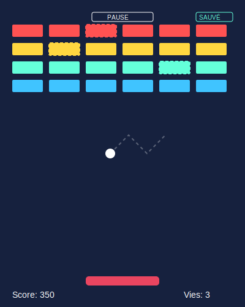

# Cahier des Charges : Arkanodi



## 1. Présentation du projet

Ce projet consiste à développer un clone simplifié du jeu classique Arkanoid, avec une fonctionnalité de sauvegarde de l'état du jeu permettant aux joueurs de reprendre leur partie ultérieurement. Ce jeu s'inspire de certaines fonctionnalités déjà développées pour Pong, mais ajoute des mécaniques supplémentaires.

## 2. Objectifs

- Créer une expérience de jeu fluide et engageante
- Implémenter les mécaniques de base d'Arkanoid
- Permettre la sauvegarde et le chargement des parties
- Offrir une interface simple et intuitive

## 3. Spécifications fonctionnelles

### 3.1 Interface utilisateur

L'interface du jeu devra comporter :
- Une zone de jeu principale rectangulaire
- Une raquette mobile en bas de l'écran
- Une balle qui rebondit
- Des briques disposées dans la partie supérieure
- Un affichage du score actuel
- Des boutons de contrôle (Démarrer, Pause, Sauvegarder, Charger)

### 3.2 Mécaniques de jeu

#### Mouvement et contrôles
- La raquette doit se déplacer horizontalement suivant le mouvement de la souris (comme cela a été fait avec Pong)
- La raquette ne doit pas pouvoir sortir des limites de la zone de jeu (comme cela a été fait avec Pong)
- La balle doit se déplacer à une vitesse constante selon un vecteur de direction (comme cela a été fait avec Pong)
- La balle doit rebondir sur les bords latéraux et supérieur de la zone de jeu (comme cela a été fait avec Pong)
- Si la balle touche le bord inférieur, le joueur perd une vie

#### Collisions et rebonds
- La balle doit rebondir sur la raquette (comme cela a été fait avec Pong)
- L'angle de rebond sur la raquette doit varier selon le point d'impact (comme cela a été fait avec Pong, mais avec une logique plus élaborée)
- La balle doit rebondir lorsqu'elle touche une brique
- La brique touchée doit disparaître et le score doit augmenter

#### Système de score et progression
- Chaque brique détruite rapporte des points (10 points par défaut)
- Le joueur dispose de 3 vies au départ
- Le niveau est terminé lorsque toutes les briques sont détruites
- Le jeu est terminé lorsque le joueur n'a plus de vies

### 3.3 Système de sauvegarde

Le jeu doit permettre de :
- Sauvegarder l'état complet d'une partie en cours
- Charger une partie sauvegardée précédemment
- Gérer plusieurs sauvegardes (optionnel)

Les données à sauvegarder comprennent :
- Le score actuel
- Le nombre de vies restantes
- La position et la vitesse de la balle
- La position de la raquette
- L'état des briques (lesquelles ont été détruites)
- L'état du jeu (en cours, en pause, etc.)

## 4. Architecture technique

### 4.1 Structure front-end

#### HTML
- Structure de base de la page
- Conteneur principal pour le jeu (comme cela a été fait avec Pong)
- Éléments visuels (raquette, balle, score)
- Boutons de contrôle

#### CSS
- Styles pour tous les éléments visuels
- Positionnement des éléments (comme cela a été fait avec Pong)
- Animations et transitions (optionnel)

#### JavaScript
- Logique de jeu principale (avec une structure similaire à celle utilisée pour Pong)
- Gestion des mouvements et collisions (en reprenant les formules mathématiques utilisées dans Pong)
- Système de score et de vies (extension du système de score de Pong)
- Communication avec le back-end pour les sauvegardes

### 4.2 Structure back-end (PHP)

- API de sauvegarde et chargement des parties
- Gestion des sessions utilisateur (optionnel)
- Stockage des données de jeu

## 5. Pseudocode des principales fonctionnalités

### Initialisation du jeu

```
Fonction InitialiserJeu()
    Définir Score = 0
    Définir Vies = 3
    Définir PositionBalle = {x: CentreFenêtre.x, y: CentreFenêtre.y}
    Définir VitesseBalle = {x: 2, y: -4}
    Définir PositionRaquette = {x: CentreFenêtre.x - LargeurRaquette/2, y: BasFenêtre - 20}
    
    Créer les briques en haut de l'écran (5 rangées de 7 briques)
    Pour chaque rangée de 0 à 4
        Pour chaque colonne de 0 à 6
            Créer une brique à la position calculée
            Définir l'état de la brique comme non détruite
    
    Dessiner tous les éléments
Fin Fonction
```

### Boucle de jeu principale

```
Fonction BoucleDeJeu()    // Structure similaire à la boucle principale de Pong
    Si le jeu est en pause OU non en cours
        Retourner
    
    Mettre à jour la position de la balle selon sa vitesse    // Comme cela a été fait avec Pong
    
    // Gestion des collisions avec les bords (comme cela a été fait avec Pong)
    Si la balle touche le bord gauche OU droit
        Inverser la composante x de la vitesse
    
    Si la balle touche le bord supérieur
        Inverser la composante y de la vitesse
    
    Si la balle touche le bord inférieur
        Perdre une vie    // Extension par rapport à Pong
        Si plus de vies
            Fin du jeu
        Sinon
            Réinitialiser la position de la balle
    
    // Collision avec la raquette (algorithme de rebond similaire à Pong)
    Si la balle entre en collision avec la raquette
        Calculer l'angle de rebond selon le point d'impact
        Modifier la trajectoire de la balle
    
    // Collision avec les briques (nouvelle fonctionnalité par rapport à Pong)
    Pour chaque brique
        Si la brique n'est pas détruite ET la balle entre en collision avec la brique
            Marquer la brique comme détruite
            Ajouter des points au score
            Inverser la trajectoire verticale de la balle
            
            Si toutes les briques sont détruites
                Niveau terminé / Victoire
    
    Redessiner tous les éléments    // Comme cela a été fait avec Pong
    
    Programmer le prochain appel de cette fonction    // Comme cela a été fait avec Pong, avec requestAnimationFrame
Fin Fonction
```

### Gestion des mouvements de la raquette

```
Fonction GérerMouvementSouris(événement)    // Adapté de la fonction similaire dans Pong
    Si le jeu est en pause OU non en cours
        Retourner
    
    PositionX = position horizontale de la souris relative à la zone de jeu    // Comme cela a été fait avec Pong
    
    // Limiter aux bords (comme cela a été fait avec Pong)
    Si PositionX < LargeurRaquette/2
        PositionX = LargeurRaquette/2
    Sinon si PositionX > LargeurFenêtre - LargeurRaquette/2
        PositionX = LargeurFenêtre - LargeurRaquette/2
    
    PositionRaquette.x = PositionX - LargeurRaquette/2
    
    Redessiner la raquette    // Comme cela a été fait avec Pong
Fin Fonction
```

### Sauvegarde de l'état du jeu (côté client)

```
Fonction SauvegarderPartie()
    Créer un objet ÉtatJeu contenant:
        - Score actuel
        - Nombre de vies
        - Position de la balle
        - Vitesse de la balle
        - Position de la raquette
        - État de chaque brique (détruite ou non)
        - État du jeu (en cours, en pause)
    
    Convertir ÉtatJeu en JSON
    
    Envoyer une requête HTTP POST au serveur avec les données JSON
    
    Si la réponse est positive
        Afficher un message de succès
    Sinon
        Afficher un message d'erreur
Fin Fonction
```

### Chargement de l'état du jeu (côté client)

```
Fonction ChargerPartie()
    Envoyer une requête HTTP GET au serveur
    
    Si la réponse est positive
        Convertir les données JSON en objet ÉtatJeu
        
        Définir Score = ÉtatJeu.Score
        Définir Vies = ÉtatJeu.Vies
        Définir PositionBalle = ÉtatJeu.PositionBalle
        Définir VitesseBalle = ÉtatJeu.VitesseBalle
        Définir PositionRaquette = ÉtatJeu.PositionRaquette
        
        Pour chaque brique dans ÉtatJeu.Briques
            Mettre à jour l'état de la brique correspondante
        
        Redessiner tous les éléments
        
        Si le jeu n'était pas en pause
            Reprendre la boucle de jeu
        
        Afficher un message de succès
    Sinon
        Afficher un message d'erreur
Fin Fonction
```

### Sauvegarde de l'état du jeu (côté serveur)

```
Fonction SauvegarderÉtatJeu()
    Récupérer l'ID de l'utilisateur depuis la session
    
    Lire les données JSON envoyées par le client
    
    Vérifier que les données sont valides
    Si non valides
        Retourner une erreur HTTP 400
    
    Créer un fichier de sauvegarde avec un nom unique pour cet utilisateur
    
    Ajouter un timestamp à la sauvegarde
    
    Écrire les données JSON dans ce fichier
    
    Si l'écriture est un succès
        Retourner un message de succès
    Sinon
        Retourner une erreur HTTP 500
Fin Fonction
```

### Chargement de l'état du jeu (côté serveur)

```
Fonction ChargerÉtatJeu()
    Récupérer l'ID de l'utilisateur depuis la session
    
    Chercher le fichier de sauvegarde correspondant
    
    Si le fichier n'existe pas
        Retourner une erreur HTTP 404
    
    Lire le contenu du fichier
    
    Vérifier que les données sont valides
    Si non valides
        Retourner une erreur HTTP 500
    
    Ajouter un timestamp de chargement aux données
    
    Retourner les données JSON au client
Fin Fonction
```

## 6. Ressources requises

### 6.1 Technologies
- HTML5 pour la structure
- CSS3 pour les styles
- JavaScript pour la logique côté client
- PHP pour le backend et la sauvegarde

### 6.2 Compétences
- Développement web front-end
- Connaissance des mécaniques de jeu basiques
- Gestion des états et sauvegarde côté serveur

## 7. Livrables attendus

- Fichiers HTML/CSS pour l'interface
- Code JavaScript pour la logique de jeu
- Scripts PHP pour la gestion des sauvegardes
- Documentation d'utilisation basique

## 8. Extensions possibles (optionnelles)

- Ajout de plusieurs niveaux avec des configurations de briques différentes
- Ajout de power-ups (agrandissement de la raquette, balles multiples, etc.)
- Système de high scores (comme cela a été fait avec Pong, mais avec des améliorations)
- Personnalisation de l'apparence (thèmes)
- Mode multijoueur (à tour de rôle, en s'inspirant de l'alternance de Pong)
- Ajout d'effets sonores (comme cela a été fait avec Pong, avec des sons différents pour chaque type de collision)