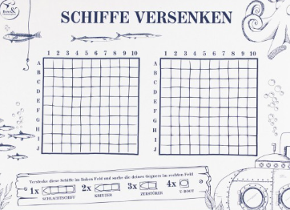

# Bataille Navale

## Description de l'exercice

1. **Objectif** : Créer un programme qui simule une version simplifiée du jeu de bataille navale. L'utilisateur doit
   essayer de couler les navires cachés sur une grille.

2. **Configuration de la grille** :
    - La grille est de taille fixe, par exemple 5x5.
    - Le programme place aléatoirement un ou plusieurs navires sur la grille. Un navire peut être simplement une seule
      case (un seul point).
    - Exemple : 3 navires cachés sur une grille de 5x5.

3. **Règles du jeu** :
    - L'utilisateur tente de deviner les positions des navires en fournissant des coordonnées sous la forme (ligne,
      colonne).
    - Si une attaque touche un navire, le programme répond "Touché !". Sinon, il répond "À l'eau !".
    - Lorsque toutes les cases d'un navire sont touchées, le programme doit indiquer "Navire coulé !".
    - Le jeu continue jusqu'à ce que tous les navires soient coulés.

4. **Entrées** :
    - Les coordonnées de tir fournies par l'utilisateur (numéro de ligne et numéro de colonne).

5. **Sorties** :
    - Un message "Touché !" ou "À l'eau !" après chaque tir.
    - Un message indiquant "Navire coulé !" lorsque toutes les cases d'un navire sont touchées.
    - Un message "Victoire !" lorsque tous les navires sont coulés.

6. **Calculs et État du jeu** :
    - Comparer les coordonnées fournies par l'utilisateur aux positions des navires.
    - Maintenir une grille d'état indiquant les tirs déjà effectués et les navires touchés.
    - Compter les tirs effectués et garder une liste des navires restants à couler.

7. **Fonctionnalité additionnelle (optionnelle)** :
    - Afficher la grille mise à jour à chaque tir (par exemple, '.' pour une case vide, 'O' pour un tir raté, 'X' pour
      un tir réussi).
    - Limiter le nombre de tirs disponibles.
    - Ajouter des navires de tailles différentes (par exemple, 1 case, 2 cases).
