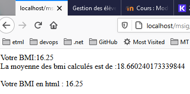

# BMI

Le BMI est un indice de calcul de masse corporelle qui est un candidat idéal pour 
un premier exercice.

## Premier formulaire
La base d'un site dynamique est fondée sur un échange entre le client et le serveur.

Une manière traditionnelle est de passer par un formulaire :

Créer un fichier HTML pour afficher le formulaire : bmi.html

Créer un fichier PHP pour réagir : bmi-action.php 

Exécuter

## Avec base de données
Pour stocker et afficher des données persistantes, on utilise une base de données.

Habituellement en WEB, on utilise MySQL ou MariaDB (dérivé de MySQL) qui sont des applications à part entières…

Une fois que vous avez installé uwamp ou easyphp (ou docker avec mysql), il faut donc :

### Créer une base de données pour stocker les BMI (avec phpmyadmin OU heidiSQL)

### Ajouter une table avec 2 colonnes

### Modifier la page BMI pour sauvegarder le BMI calculé dans la base de données

### Modifier la page BMI pour afficher une statistique des BMI calculés

### Vérifier le fonctionnement

## Améliorations
À vous de jouer désormais pour améliorer cette application :

- Arrondi
- Recommandation d'après le BMI calculé
- ...