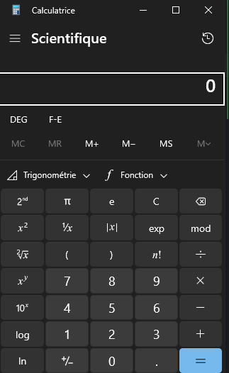

# Calculatrice
Cette fois, c’est du lourd, on va pouvoir concurrencer Microsoft :


<details>
<summary>Si nécessaire voici un peu de code pour additionner 2 nombres</summary>

# Création d'une Calculatrice Simple en C# Windows Forms

## 1. Structure de base
- Créez un nouveau projet Windows Forms dans Visual Studio
- Nommez-le "SimpleCalculator"

## 2. Design de l'interface utilisateur

Les éléments nécessaires sont :
- Une Form (fenêtre principale)
- Deux TextBox pour les nombres
- Un Button pour l'addition
- Un Label pour afficher le résultat

## 3. Code de la logique basique

```csharp
public partial class Form1 : Form
{

    public Form1()
    {
        InitializeComponent();
    }

    // Gestionnaire d'événement pour le bouton d'addition
    private void AddButton_Click(object sender, EventArgs e)
    {
        try
        {
            // Conversion des entrées en nombres
            double firstNumber = Convert.ToDouble(firstNumberTextBox.Text);
            double secondNumber = Convert.ToDouble(secondNumberTextBox.Text);

            // Calcul de la somme
            double result = firstNumber + secondNumber;

            // Affichage du résultat
            resultLabel.Text = $"Résultat : {result}";
        }
        catch (FormatException)
        {
            // Gestion des erreurs de format
            MessageBox.Show("Veuillez entrer des nombres valides", "Erreur",
                MessageBoxButtons.OK, MessageBoxIcon.Error);
        }
    }
}
```
</details>

<details>
<summary>Et si besoin une piste pour gérer le clic sur n’importe quel bouton...</summary>

```csharp
using System;
using System.Windows.Forms;
using System.Drawing;

namespace WindowsCalculator
{
    public partial class CalculatorForm : Form
    {
        // Variables pour les calculs
        private double lastNumber = 0;
        private string currentOperator = "";
        private bool isNewNumber = true;

        public void OnButtonClick(object sender)
        {
            Button clickedButton = (Button)sender;
            string buttonText = clickedButton.Text;
            // Gestion des chiffres
            if (char.IsDigit(buttonText[0]) || buttonText == ".")
            {
                if (isNewNumber)
                {
                    displayTextBox.Text = buttonText;
                    isNewNumber = false;
                }
                else
                {
                    if (displayTextBox.Text == "0" && buttonText != ".")
                        displayTextBox.Text = buttonText;
                    else
                        displayTextBox.Text += buttonText;
                }
            }
            // Gestion des opérateurs
            else if ("+-×÷".Contains(buttonText))
            {
                //TODO
            }
            // Gestion du égal
            else if (buttonText == "=")
            {
                //TODO
            }
            // Gestion du clear
            else if (buttonText == "C" || buttonText == "CE")
            {
                //TODO
            }
            // Gestion du backspace
            else if (buttonText == "⌫")
            {
                //TODO
            }
            // Gestion du changement de signe
            else if (buttonText == "±")
            {
                //TODO
            }
        }
    }
}
```
</details>