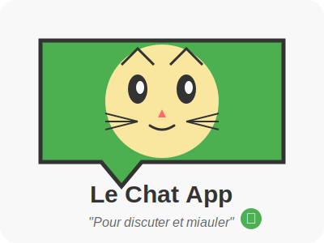

# Un chat avec HTML, CSS, JavaScript and PHP



Il est temps d’utiliser le réseau pour une application interactive de base qui permettra de multiples évolutions.

## Étape 1: Structure HTML

Commençons par créer la structure HTML de notre application de chat.

```html
<!DOCTYPE html>
<html lang="fr">
<head>
    <meta charset="UTF-8">
    <meta name="viewport" content="width=device-width, initial-scale=1.0">
    <title>Application de Chat</title>
    <link rel="stylesheet" href="style.css">
</head>
<body>
    <div class="chat-container">
        <div class="chat-header">
            <h2>Chat en direct</h2>
        </div>
        <div class="chat-messages" id="chat-messages">
            <!-- Les messages s'afficheront ici -->
        </div>
        <div class="chat-input">
            <input type="text" id="username" placeholder="Votre nom" />
            <input type="text" id="message" placeholder="Écrivez votre message..." />
            <button id="send-btn">Envoyer</button>
        </div>
    </div>
    <script src="script.js"></script>
</body>
</html>
```

## Étape 2: Stylisation avec CSS

Créons maintenant un fichier `style.css` pour rendre notre chat plus agréable visuellement.

```css
* {
    margin: 0;
    padding: 0;
    box-sizing: border-box;
    font-family: 'Arial', sans-serif;
}

body {
    background-color: #f4f4f4;
    display: flex;
    justify-content: center;
    align-items: center;
    height: 100vh;
}

.chat-container {
    width: 500px;
    height: 600px;
    background-color: #fff;
    border-radius: 10px;
    box-shadow: 0 0 10px rgba(0, 0, 0, 0.1);
    overflow: hidden;
}

.chat-header {
    background-color: #4CAF50;
    color: white;
    padding: 15px;
    text-align: center;
}

.chat-messages {
    height: 450px;
    padding: 15px;
    overflow-y: auto;
}

.message {
    margin-bottom: 15px;
    padding: 10px;
    border-radius: 5px;
    max-width: 80%;
    word-wrap: break-word;
}

.received {
    background-color: #e6e6e6;
    float: left;
    clear: both;
}

.sent {
    background-color: #4CAF50;
    color: white;
    float: right;
    clear: both;
}

.message-info {
    font-size: 0.8em;
    margin-bottom: 5px;
    color: #888;
}

.chat-input {
    padding: 15px;
    background-color: #f8f8f8;
    display: flex;
    gap: 10px;
}

.chat-input input {
    flex: 1;
    padding: 10px;
    border: 1px solid #ddd;
    border-radius: 5px;
    outline: none;
}

.chat-input button {
    padding: 10px 20px;
    background-color: #4CAF50;
    color: white;
    border: none;
    border-radius: 5px;
    cursor: pointer;
}

.chat-input button:hover {
    background-color: #45a049;
}
```

## Étape 3: JavaScript pour l'interaction côté client

Créons un fichier `script.js` pour gérer les interactions utilisateur et les requêtes AJAX vers notre backend PHP.

```javascript
document.addEventListener('DOMContentLoaded', function() {
    // Sélection des éléments DOM
    const chatMessages = document.getElementById('chat-messages');
    const usernameInput = document.getElementById('username');
    const messageInput = document.getElementById('message');
    const sendButton = document.getElementById('send-btn');

    // Fonction pour charger les messages
    function loadMessages() {
        fetch('get_messages.php')
            .then(response => response.json())
            .then(data => {
                // Effacer les messages actuels
                chatMessages.innerHTML = '';
                
                // Afficher les messages
                data.forEach(msg => {
                    displayMessage(msg.username, msg.message, msg.timestamp);
                });
                
                // Faire défiler vers le bas
                chatMessages.scrollTop = chatMessages.scrollHeight;
            })
            .catch(error => console.error('Erreur:', error));
    }

    // Fonction pour afficher un message
    function displayMessage(username, message, timestamp) {
        const messageDiv = document.createElement('div');
        const currentUser = usernameInput.value.trim();
        
        // Déterminer si le message est envoyé ou reçu
        if (username === currentUser) {
            messageDiv.className = 'message sent';
        } else {
            messageDiv.className = 'message received';
        }
        
        // Formater l'heure
        const date = new Date(timestamp * 1000);
        const formattedTime = date.toLocaleTimeString();
        
        // Construire le contenu du message
        messageDiv.innerHTML = `
            <div class="message-info">${username} - ${formattedTime}</div>
            <div class="message-text">${message}</div>
        `;
        
        chatMessages.appendChild(messageDiv);
    }

    // Fonction pour envoyer un message
    function sendMessage() {
        const username = usernameInput.value.trim();
        const message = messageInput.value.trim();
        
        if (username === '' || message === '') {
            alert('Veuillez entrer votre nom et un message');
            return;
        }
        
        // Préparer les données à envoyer
        const formData = new FormData();
        formData.append('username', username);
        formData.append('message', message);
        
        // Envoyer les données au serveur
        fetch('send_message.php', {
            method: 'POST',
            body: formData
        })
        .then(response => response.json())
        .then(data => {
            if (data.status === 'success') {
                // Effacer le champ de message
                messageInput.value = '';
                // Recharger les messages
                loadMessages();
            } else {
                alert('Erreur lors de l\'envoi du message');
            }
        })
        .catch(error => console.error('Erreur:', error));
    }

    // Écouteurs d'événements
    sendButton.addEventListener('click', sendMessage);
    
    messageInput.addEventListener('keypress', function(e) {
        if (e.key === 'Enter') {
            sendMessage();
        }
    });
    
    // Charger les messages toutes les 3 secondes
    loadMessages();
    setInterval(loadMessages, 3000);
});
```

## Étape 4: Création de la base de données

Avant de passer au PHP, nous devons créer une base de données MySQL pour stocker nos messages. Voici le script SQL pour créer la table nécessaire:

```sql
CREATE DATABASE chat_app;
USE chat_app;

CREATE TABLE messages (
    id INT AUTO_INCREMENT PRIMARY KEY,
    username VARCHAR(50) NOT NULL,
    message TEXT NOT NULL,
    timestamp INT NOT NULL
);
```

## Étape 5: Configuration de la connexion PHP à la base de données

Créons un fichier `config.php` pour gérer la connexion à la base de données:

```php
<?php
// Informations de connexion à la base de données
$host = 'localhost';
$dbname = 'chat_app';
$username = 'root';
$password = '';

try {
    // Créer une nouvelle connexion PDO
    $db = new PDO("mysql:host=$host;dbname=$dbname;charset=utf8", $username, $password);
    
    // Configurer PDO pour générer des exceptions en cas d'erreur
    $db->setAttribute(PDO::ATTR_ERRMODE, PDO::ERRMODE_EXCEPTION);
    
} catch(PDOException $e) {
    // En cas d'erreur de connexion
    die('Erreur de connexion: ' . $e->getMessage());
}
?>
```

## Étape 6: Script PHP pour récupérer les messages

Créons maintenant le fichier `get_messages.php` qui récupérera les messages de la base de données:

```php
<?php
// Inclure le fichier de configuration
require_once 'config.php';

// En-têtes pour autoriser les requêtes AJAX
header('Content-Type: application/json');
header('Access-Control-Allow-Origin: *');

try {
    // Requête pour récupérer les 50 derniers messages
    $stmt = $db->prepare("SELECT username, message, timestamp FROM messages ORDER BY timestamp DESC LIMIT 50");
    $stmt->execute();
    
    // Récupérer tous les messages
    $messages = $stmt->fetchAll(PDO::FETCH_ASSOC);
    
    // Inverser l'ordre pour afficher les plus anciens d'abord
    $messages = array_reverse($messages);
    
    // Renvoyer les messages au format JSON
    echo json_encode($messages);
    
} catch(PDOException $e) {
    // En cas d'erreur
    echo json_encode(['status' => 'error', 'message' => $e->getMessage()]);
}
?>
```

## Étape 7: Script PHP pour envoyer des messages

Enfin, créons le fichier `send_message.php` qui permettra d'ajouter de nouveaux messages:

```php
<?php
// Inclure le fichier de configuration
require_once 'config.php';

// En-têtes pour autoriser les requêtes AJAX
header('Content-Type: application/json');
header('Access-Control-Allow-Origin: *');

// Vérifier si la requête est une méthode POST
if ($_SERVER['REQUEST_METHOD'] === 'POST') {
    // Récupérer les données
    $username = filter_input(INPUT_POST, 'username', FILTER_SANITIZE_STRING);
    $message = filter_input(INPUT_POST, 'message', FILTER_SANITIZE_STRING);
    $timestamp = time();
    
    // Vérifier si les données sont valides
    if (!empty($username) && !empty($message)) {
        try {
            // Préparer la requête d'insertion
            $stmt = $db->prepare("INSERT INTO messages (username, message, timestamp) VALUES (:username, :message, :timestamp)");
            
            // Lier les paramètres
            $stmt->bindParam(':username', $username);
            $stmt->bindParam(':message', $message);
            $stmt->bindParam(':timestamp', $timestamp);
            
            // Exécuter la requête
            $stmt->execute();
            
            // Réponse de succès
            echo json_encode(['status' => 'success']);
            
        } catch(PDOException $e) {
            // En cas d'erreur
            echo json_encode(['status' => 'error', 'message' => $e->getMessage()]);
        }
    } else {
        // Si les données sont invalides
        echo json_encode(['status' => 'error', 'message' => 'Données invalides']);
    }
} else {
    // Si la méthode n'est pas POST
    echo json_encode(['status' => 'error', 'message' => 'Méthode non autorisée']);
}
?>
```

## Conclusion

Félicitations ! Vous avez maintenant une application de chat fonctionnelle avec les technologies suivantes :

- **Frontend**: HTML, CSS et JavaScript
- **Backend**: PHP avec base de données MySQL

Cette application de base peut être améliorée de plusieurs façons :

- [ ] Authentification des utilisateurs
- [ ] Salles de chat multiples
- [ ] Notifications en temps réel avec [WebSockets](websocket.md)
- [ ] Envoi de fichiers ou d'images
- [ ] Emoticons et mise en forme de texte
