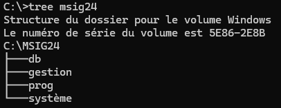

# Arborescence avec `cmd.exe`

## Objectif

Dans cet exercice, vous allez créer une structure de dossiers en utilisant `cmd.exe`. Vous allez créer les dossiers
suivants dans l'ordre indiqué :

```shell
C:\msig24
├── prog
├── db
├── gestion
└── système
```

Ensuite, vous allez lister le contenu de ces dossiers pour vérifier que tout a bien été créé.

## Étapes

### 1. Ouvrir l'Invite de Commandes
- Appuyez sur `Win + R`, tapez `cmd`, puis appuyez sur `Entrée`.
- Assurez-vous d'être sur le disque où vous souhaitez créer l'arborescence. Vous pouvez changer de disque en tapant la lettre correspondante, par exemple `C:`.

### 2. Créer le dossier racine `msig24`
Tapez la commande suivante pour créer un dossier nommé `msig24` à la racine du disque :
```shell
mkdir C:\msig24
```

### 3. Naviguer dans le dossier `msig24`

Déplacez-vous dans le dossier que vous venez de créer :

```shell
cd C:\msig24
```

### 4. Créer les sous-dossiers

À l'intérieur de `msig24`, créez les dossiers `prog`, `db`, `gestion`, et `système` :

```shell
mkdir prog db gestion système
```

### 5. Lister le contenu du dossier `msig24`

Utilisez la commande `dir` pour afficher le contenu du dossier `msig24` et vérifier que les sous-dossiers ont bien été
créés :

```shell
dir
```

Prenez une capture d'écran de cette étape pour montrer la structure des dossiers.

### 6. Explorer le dossier `msig24` avec l'Explorateur de Fichiers

Ouvrez l'Explorateur de fichiers pour visualiser la structure créée :

```shell
explorer .
```

Prenez une capture d'écran de la vue de l'Explorateur de fichiers.

## Résultat attendu

Vous devriez avoir une structure de dossiers ressemblant à ceci :

```shell
C:\msig24
    ├── prog
    ├── db
    ├── gestion
    └── système
```

> Pour voir la structure des dossiers, on peut utiliser la commande `tree`

```shell
tree msig24
```


## Amélioration
Cette structure implique qu’un seul étudiant msig pourra utiliser le dossier de l’ordinateur...

### Ajouter un dossier avec le login
Il faudrait donc corriger l’arborescence ainsi :
```shell
C:\msig24\pxzzzz\
    ├── prog
    ├── db
    ├── gestion
    └── système
```

Ainsi, plusieurs utilisateurs peuvent utiliser l’ordinateur sans écraser le travail des autres...


