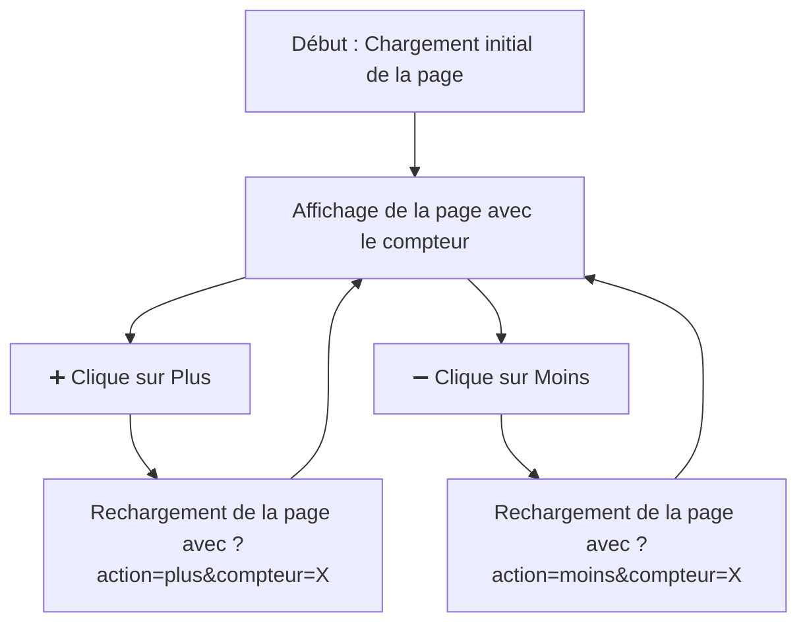

# Compteur simple

## Objectif général

0. Afficher un compteur
1. Lorsque l'utilisateur clique sur **+Augmenter+**, la valeur du compteur doit augmenter de 1.
2. Lorsque l'utilisateur clique sur **-Diminuer-**, la valeur du compteur doit diminuer de 1.

> Contrainte : Utiliser une seule page PHP

### Exemple non contractuel
- [Compteur GET](https://msig.section-inf.ch/compteur-get.php)
- [Compteur POST](https://msig.section-inf.ch/compteur-post.php)



## Version GET

### HTML de base

Créer une page **PHP** et ajouter du html contenant le compteur et 2 liens (href) :

```html
<a href="?action=plus">+Augmenter+</a>
<a href="?action=moins">-Diminuer-</a>
```

<details>
<summary>Cliquer ici pour voir le html complet</summary>

```html
<!DOCTYPE html>
<html lang="fr">
<head>
    <meta charset="UTF-8">
    <meta name="viewport" content="width=device-width, initial-scale=1.0">
    <title>Compteur PHP</title>
</head>
<body>
<h1>Compteur Simple</h1>
<p>Valeur actuelle du compteur : <strong>[1]</strong></p>
<a href="?action=plus&compteur=1">➕ Augmenter</a>
<a href="?action=moins&compteur=1">➖ Diminuer</a>
</body>
</html>
```

</details>

### Traitement en PHP
Il faut maintenant traiter les informations : 

```php
<?php
// Initialisation du compteur
$compteur = isset($_GET['compteur']) ? (int)$_GET['compteur'] : 0;

// Gestion des actions
if (isset($_GET['action'])) {
    if ($_GET['action'] === 'plus') {
        $compteur++;
    } elseif ($_GET['action'] === 'moins') {
        $compteur--;
    }
}
?>

```

<details>
<summary>Et adapter le html</summary>


```html
    <!-- ... -->
    <p>Valeur actuelle du compteur : <strong><?= $compteur ?></strong></p>
    <a href="?action=plus&compteur=<?= $compteur ?>">+Augmenter+</a>
    <a href="?action=moins&compteur=<?= $compteur ?>">-Diminuer-</a>
    <!-- ... -->
```

</details>

### GET
En mode `GET`, les éléments sont visibles dans la barre d’adresse, d’ailleurs, essayez de modifier
l’URL pour modifier le compteur, est-ce ça fonctionne ?

> Une manière de cacher cela (pas plus sécurisé) est d’utiliser le POST :

## Version POST

Pour cela, il faut adapter le HTML et le php

### HTML

```html
<p>Valeur actuelle du compteur : <strong><?= $compteur ?></strong></p>

    <!-- Formulaire pour envoyer les actions -->
    <form method="POST">
        <!-- Champ caché pour transmettre la valeur actuelle -->
        <input type="hidden" name="compteur" value="<?= $compteur ?>">
        <!-- Boutons pour augmenter ou diminuer -->
        <button type="submit" name="action" value="plus">➕ Augmenter</button>
        <button type="submit" name="action" value="moins">➖ Diminuer</button>
    </form>
```

### PHP

```php
<?php
// Initialisation du compteur
$compteur = 0;

// Gestion des actions via la méthode POST
if ($_SERVER['REQUEST_METHOD'] === 'POST') {
    if (isset($_POST['compteur'])) {
        $compteur = (int)$_POST['compteur']; // Récupérer la valeur actuelle
    }
    if (isset($_POST['action'])) {
        if ($_POST['action'] === 'plus') {
            $compteur++;
        } elseif ($_POST['action'] === 'moins') {
            $compteur--;
        }
    }
}
?>
```

