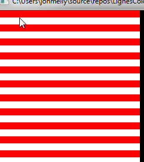

# Couleur

## Objectif

- Demander à l’utilisateur un nombre de lignes à afficher
- Demander 2 couleurs (parmi une liste d’au moins 5 couleurs)
- Afficher le "drapeau" :

## Dangers
Tenir compte d’un nombre de lignes impaires...

## Livraison
Code source avec **[entête et commenté](https://ici.section-inf.ch/cc)**, imprimé et remis à la personne
encadrante.
