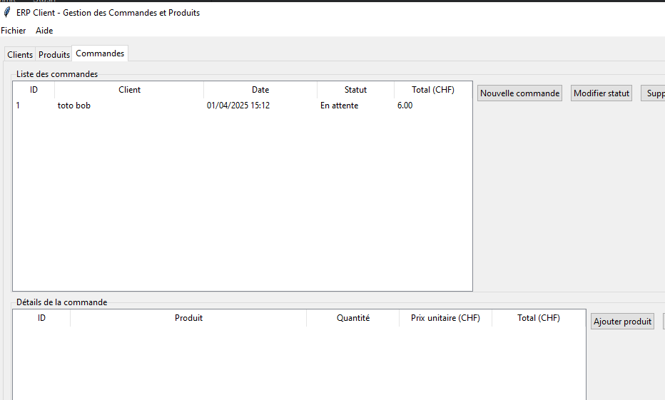

# Création d'un ERP avec Python, Tkinter et MariaDB



## Prérequis
Pour le développement de notre application ERP, nous aurons besoin d'installer plusieurs packages Python. Pip, le gestionnaire de packages de Python, sera utilisé pour faciliter cette installation. Voici un guide détaillé sur l'installation des dépendances nécessaires.

### Pip - Le gestionnaire de packages Python

Pip est l'outil standard pour installer et gérer des packages Python. Si vous avez une version récente de Python (≥ 3.4), pip est normalement déjà installé.

#### Vérification de l'installation de pip

Pour vérifier que pip est bien installé, ouvrez un terminal (ou invite de commandes) et tapez :

```shell
pip --version
```

### Packages nécessaires pour notre ERP

Voici les principaux packages dont nous aurons besoin pour développer notre application ERP :

#### 1. Connecteur MySQL/MariaDB

Le package `mysql-connector-python` nous permet de nous connecter à une base de données MySQL ou MariaDB.

```shell
pip install mysql-connector-python
```

### 2. Tkinter pour l'interface graphique

Tkinter est généralement inclus avec l'installation standard de Python.

### 3. ReportLab pour la génération de PDF

ReportLab est une bibliothèque puissante pour créer des documents PDF.

```shell
pip install reportlab
```

### 4. Pillow pour le traitement d'images

Pillow est nécessaire pour manipuler des images dans les PDF et potentiellement dans l'interface utilisateur.

```bash
pip install Pillow
```

### 5. Tkcalendar (optionnel)

Pour des widgets de calendrier avancés dans l'interface Tkinter :

```bash
pip install tkcalendar
```

### Installation de MariaDB

Notre ERP nécessite une base de données MariaDB, ce qui est déjà connu.

### Fichier requirements.txt

Pour faciliter l'installation des dépendances, créez un fichier `requirements.txt` avec le contenu suivant :

```
mysql-connector-python==8.0.32
reportlab==3.6.12
Pillow==9.4.0
tkcalendar==1.6.1
```

Puis installez toutes les dépendances en une seule commande :

```bash
pip install -r requirements.txt
```

## Vérification de l'installation

Pour vérifier que toutes les dépendances sont correctement installées, créez un script Python simple :

```python
# test_installation.py
import tkinter as tk
import mysql.connector
import reportlab
import PIL

print("Tkinter version:", tk.TkVersion)
print("mysql-connector version:", mysql.connector.__version__)
print("reportlab version:", reportlab.Version)
print("Pillow version:", PIL.__version__)

# Test de connexion à MariaDB
try:
    conn = mysql.connector.connect(
        host="localhost",
        user="utilisateur_erp",
        password="mot_de_passe_erp",
        database="erp_db"
    )
    print("Connexion à MariaDB réussie!")
    conn.close()
except Exception as e:
    print("Erreur de connexion à MariaDB:", e)

print("Toutes les dépendances sont installées correctement.")
```

Exécutez ce script pour vérifier que tout fonctionne :

```bash
python test_installation.py
```

En suivant ces étapes, vous disposerez de tous les outils nécessaires pour développer et exécuter votre application ERP avec Python, Tkinter et MariaDB.

## Pseudo-code général

```
1. ÉTABLIR connexion à la base de données MariaDB
2. CRÉER les tables si elles n'existent pas
3. INITIALISER l'interface graphique principale
4. IMPLÉMENTER les fonctionnalités CRUD clients
5. IMPLÉMENTER les fonctionnalités CRUD produits
6. IMPLÉMENTER les fonctionnalités CRUD commandes
7. IMPLÉMENTER la génération de factures PDF
8. GÉRER les erreurs et exceptions
9. LANCER la boucle principale de l'application
```

## Étape 1: Configuration initiale et connexion à la base de données

### Pseudo-code
```
1. IMPORTER les bibliothèques nécessaires (tkinter, mysql.connector, reportlab)
2. CRÉER une classe principale pour l'application
3. DÉFINIR une méthode pour établir la connexion à la base de données
   3.1. ESSAYER de se connecter avec les paramètres fournis
   3.2. GÉRER les erreurs potentielles
4. APPELER cette méthode dans le constructeur de la classe
```

### Code
```python
import tkinter as tk
from tkinter import ttk, messagebox
import mysql.connector
from mysql.connector import Error
import datetime

class ERPApplication:
    def __init__(self, root):
        self.root = root
        self.root.title("Système ERP")
        self.root.geometry("1200x700")
        
        # Établir la connexion à la base de données
        self.etablir_connexion()
        
    def etablir_connexion(self):
        try:
            self.conn = mysql.connector.connect(
                host="localhost",
                user="utilisateur_erp",
                password="mot_de_passe_erp",
                database="erp_db"
            )
            print("Connexion à la base de données établie avec succès")
        except Error as e:
            print(f"Erreur lors de la connexion à la base de données: {e}")
            messagebox.showerror("Erreur de connexion", 
                                 f"Impossible de se connecter à la base de données: {e}")
            self.root.destroy()
```

## Étape 2: Création des tables dans la base de données

### Pseudo-code
```
1. DÉFINIR une méthode pour créer les tables
2. CRÉER table clients (id, nom, adresse, téléphone, email, date_creation)
3. CRÉER table produits (id, nom, description, prix_unitaire, stock, date_creation)
4. CRÉER table commandes (id, client_id, date_commande, statut, total)
5. CRÉER table lignes_commande (id, commande_id, produit_id, quantité, prix_unitaire, sous_total)
6. VALIDER les modifications sur la base de données
```

### Code
```python
def creer_tables(self):
    cursor = self.conn.cursor()
    
    # Table Clients
    cursor.execute('''
    CREATE TABLE IF NOT EXISTS clients (
        id INT AUTO_INCREMENT PRIMARY KEY,
        nom VARCHAR(100) NOT NULL,
        adresse VARCHAR(255),
        telephone VARCHAR(20),
        email VARCHAR(100),
        date_creation DATETIME DEFAULT CURRENT_TIMESTAMP
    )
    ''')
    
    # Table Produits
    cursor.execute('''
    CREATE TABLE IF NOT EXISTS produits (
        id INT AUTO_INCREMENT PRIMARY KEY,
        nom VARCHAR(100) NOT NULL,
        description TEXT,
        prix_unitaire DECIMAL(10, 2) NOT NULL,
        stock INT DEFAULT 0,
        date_creation DATETIME DEFAULT CURRENT_TIMESTAMP
    )
    ''')
    
    # Table Commandes
    cursor.execute('''
    CREATE TABLE IF NOT EXISTS commandes (
        id INT AUTO_INCREMENT PRIMARY KEY,
        client_id INT NOT NULL,
        date_commande DATETIME DEFAULT CURRENT_TIMESTAMP,
        statut VARCHAR(20) DEFAULT 'En attente',
        total DECIMAL(10, 2) DEFAULT 0,
        FOREIGN KEY (client_id) REFERENCES clients(id) ON DELETE CASCADE
    )
    ''')
    
    # Table Lignes de commandes
    cursor.execute('''
    CREATE TABLE IF NOT EXISTS lignes_commande (
        id INT AUTO_INCREMENT PRIMARY KEY,
        commande_id INT NOT NULL,
        produit_id INT NOT NULL,
        quantite INT NOT NULL,
        prix_unitaire DECIMAL(10, 2) NOT NULL,
        sous_total DECIMAL(10, 2) DEFAULT 0,
        FOREIGN KEY (commande_id) REFERENCES commandes(id) ON DELETE CASCADE,
        FOREIGN KEY (produit_id) REFERENCES produits(id) ON DELETE CASCADE
    )
    ''')
    
    self.conn.commit()
    cursor.close()
```

## Étape 3: Configuration de l'interface utilisateur principale

### Pseudo-code
```
1. DÉFINIR une méthode pour configurer l'interface
2. CRÉER une barre de menu avec des entrées pour Fichier, Clients, Produits, Commandes, Facturation
3. CRÉER un cadre principal pour afficher les différentes sections
4. CRÉER une barre d'état pour afficher des informations de statut
5. INITIALISER l'interface avec la section d'accueil par défaut
```

### Code
```python
def setup_ui(self):
    # Barre de menu
    self.menu_bar = tk.Menu(self.root)
    self.root.config(menu=self.menu_bar)
    
    # Menu Fichier
    file_menu = tk.Menu(self.menu_bar, tearoff=0)
    file_menu.add_command(label="Quitter", command=self.root.destroy)
    self.menu_bar.add_cascade(label="Fichier", menu=file_menu)
    
    # Menus pour les différentes sections
    self.menu_bar.add_command(label="Clients", command=self.afficher_section_clients)
    self.menu_bar.add_command(label="Produits", command=self.afficher_section_produits)
    self.menu_bar.add_command(label="Commandes", command=self.afficher_section_commandes)
    self.menu_bar.add_command(label="Facturation", command=self.afficher_section_facturation)
    
    # Cadre principal
    self.main_frame = ttk.Frame(self.root, padding="10")
    self.main_frame.pack(fill=tk.BOTH, expand=True)
    
    # Barre d'état
    self.status_bar = ttk.Label(self.root, text="Prêt", relief=tk.SUNKEN, anchor=tk.W)
    self.status_bar.pack(side=tk.BOTTOM, fill=tk.X)
    
    # Afficher l'écran d'accueil par défaut
    self.afficher_accueil()
```

## Étape 4: Implémentation du CRUD pour les clients

### Pseudo-code
```
1. DÉFINIR une méthode pour afficher la section clients
   1.1. EFFACER le contenu du cadre principal
   1.2. CRÉER un tableau pour lister les clients
   1.3. AJOUTER des boutons pour Ajouter, Modifier, Supprimer
   1.4. CHARGER les données des clients depuis la base de données

2. DÉFINIR une méthode pour ajouter un client
   2.1. CRÉER une fenêtre modale avec un formulaire
   2.2. AJOUTER des champs pour nom, adresse, téléphone, email
   2.3. AJOUTER un bouton pour soumettre le formulaire
   2.4. VALIDER les données et les insérer dans la base de données

3. DÉFINIR des méthodes similaires pour modifier et supprimer un client
```

### Code
```python
def afficher_section_clients(self):
    # Vider le cadre principal
    for widget in self.main_frame.winfo_children():
        widget.destroy()
    
    # Titre de la section
    ttk.Label(self.main_frame, text="Gestion des Clients", font=("Arial", 16)).pack(pady=10)
    
    # Cadre pour les boutons d'action
    btn_frame = ttk.Frame(self.main_frame)
    btn_frame.pack(fill=tk.X, pady=5)
    
    # Boutons d'action
    ttk.Button(btn_frame, text="Ajouter", command=self.ajouter_client).pack(side=tk.LEFT, padx=5)
    self.btn_modifier = ttk.Button(btn_frame, text="Modifier", command=self.modifier_client, state=tk.DISABLED)
    self.btn_modifier.pack(side=tk.LEFT, padx=5)
    self.btn_supprimer = ttk.Button(btn_frame, text="Supprimer", command=self.supprimer_client, state=tk.DISABLED)
    self.btn_supprimer.pack(side=tk.LEFT, padx=5)
    
    # Table des clients
    columns = ("id", "nom", "adresse", "telephone", "email", "date_creation")
    self.tree_clients = ttk.Treeview(self.main_frame, columns=columns, show="headings")
    
    # Définir les en-têtes
    self.tree_clients.heading("id", text="ID")
    self.tree_clients.heading("nom", text="Nom")
    self.tree_clients.heading("adresse", text="Adresse")
    self.tree_clients.heading("telephone", text="Téléphone")
    self.tree_clients.heading("email", text="Email")
    self.tree_clients.heading("date_creation", text="Date de création")
    
    # Définir les largeurs des colonnes
    self.tree_clients.column("id", width=50)
    self.tree_clients.column("nom", width=150)
    self.tree_clients.column("adresse", width=250)
    self.tree_clients.column("telephone", width=100)
    self.tree_clients.column("email", width=150)
    self.tree_clients.column("date_creation", width=150)
    
    # Barres de défilement
    scrollbar = ttk.Scrollbar(self.main_frame, orient=tk.VERTICAL, command=self.tree_clients.yview)
    self.tree_clients.configure(yscroll=scrollbar.set)
    
    # Placement de la table et de la barre de défilement
    self.tree_clients.pack(fill=tk.BOTH, expand=True, pady=5)
    scrollbar.pack(side=tk.RIGHT, fill=tk.Y)
    
    # Sélection d'un client
    self.tree_clients.bind("<<TreeviewSelect>>", self.on_client_select)
    
    # Charger les données
    self.charger_clients()
    
    # Mise à jour de la barre d'état
    self.status_bar.config(text="Section Clients")

# Les méthodes ajouter_client, modifier_client, supprimer_client suivraient...
```

## Étape 5: Implémentation du CRUD pour les produits

Suivre une approche similaire à celle des clients, mais adaptée aux produits:

### Pseudo-code
```
1. DÉFINIR une méthode pour afficher la section produits
2. DÉFINIR des méthodes pour ajouter, modifier, et supprimer un produit
3. DÉFINIR une méthode pour charger les produits
```

## Étape 6: Implémentation du CRUD pour les commandes

### Pseudo-code
```
1. DÉFINIR une méthode pour afficher la section commandes
2. CRÉER une interface pour voir la liste des commandes
3. IMPLÉMENTER une interface pour créer une nouvelle commande:
   3.1. PERMETTRE de sélectionner un client
   3.2. PERMETTRE d'ajouter des produits avec leurs quantités
   3.3. CALCULER les sous-totaux et le total
4. IMPLÉMENTER des fonctionnalités pour modifier et annuler des commandes
```

## Étape 7: Implémentation de la génération de factures PDF

### Pseudo-code
```
1. IMPORTER les bibliothèques pour créer des PDF (reportlab)
2. DÉFINIR une méthode pour afficher la section facturation
3. PERMETTRE de sélectionner une commande à facturer
4. DÉFINIR une méthode pour générer le PDF:
   4.1. CRÉER un nouveau document PDF
   4.2. AJOUTER les informations d'en-tête (logo, coordonnées de l'entreprise)
   4.3. AJOUTER les informations du client
   4.4. AJOUTER une table avec les produits de la commande
   4.5. AJOUTER les totaux, taxes et informations de paiement
   4.6. SAUVEGARDER le PDF
5. PROPOSER d'ouvrir ou d'imprimer le PDF généré
```

## Étape 8: Finalisation et lancement de l'application

### Pseudo-code
```
1. AJOUTER une méthode pour nettoyer les ressources lors de la fermeture
2. CRÉER la fonction main pour initialiser et lancer l'application
```

### Code
```python
def on_closing(self):
    """Méthode appelée lors de la fermeture de l'application"""
    if messagebox.askokcancel("Quitter", "Voulez-vous vraiment quitter l'application?"):
        if hasattr(self, 'conn') and self.conn.is_connected():
            self.conn.close()
            print("Connexion à la base de données fermée")
        self.root.destroy()

# Point d'entrée de l'application
if __name__ == "__main__":
    root = tk.Tk()
    app = ERPApplication(root)
    root.protocol("WM_DELETE_WINDOW", app.on_closing)
    root.mainloop()
```

## Suggestions d'améliorations (sans code)

1. **Sécurité et authentification**:
    - Ajouter un système d'authentification avec différents niveaux d'accès
    - Chiffrer les mots de passe et les données sensibles
    - Implémenter une journalisation des actions

2. **Interface utilisateur**:
    - Créer un tableau de bord avec des graphiques de vente et d'inventaire
    - Ajouter des thèmes et personnalisation de l'interface
    - Implémenter une recherche avancée pour tous les modules

3. **Gestion des produits**:
    - Ajouter la gestion des catégories de produits
    - Implémenter un système d'alerte pour le stock faible
    - Ajouter la possibilité d'attacher des images aux produits

4. **Commandes et facturation**:
    - Ajouter des options de taxes et remises
    - Implémenter un système de paiement
    - Créer un historique des paiements et des factures

5. **Rapports et statistiques**:
    - Générer des rapports de vente par période
    - Créer des analyses de rentabilité par produit/client
    - Exporter les rapports en différents formats (PDF, Excel)

6. **Optimisations techniques**:
    - Implémenter un système de mise en cache pour améliorer les performances
    - Ajouter des transactions de base de données pour garantir l'intégrité des données
    - Créer un système de sauvegarde automatique

7. **Internationalisation**:
    - Ajouter le support multi-langue
    - Gérer différentes devises et formats de date

8. **Intégrations**:
    - Ajouter une API pour l'intégration avec d'autres systèmes
      - Intégrer un système de notification par email
      - Générer une [QR Facture](https://www.moneytoday.ch/lexikon/qr-rechnung)
      - Connecter à des services de livraison pour le suivi des expéditions

## Proposition de solution
<details>

<summary>Si vraiment nécessaire, cliquer ici</summary>

[possible code source](erp-python.py)

</details>