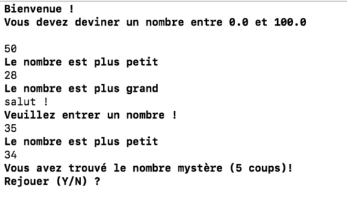

# Fourchette

## Description de l'exercice

1. **Objectif** : Créer un programme qui permet à l'utilisateur de deviner un nombre secret généré aléatoirement par 
l'ordinateur. L'utilisateur reçoit des indications pour l'aider à deviner le bon nombre.

2. **Entrées** :
    - Le programme génère un nombre secret aléatoire (par exemple, entre 1 et 100).
    - L'utilisateur doit entrer un nombre pour deviner le nombre secret.

3. **Sorties** :
    - Après chaque tentative de l'utilisateur, le programme doit indiquer si le nombre deviné est "plus grand" ou "plus
      petit" que le nombre secret.
    - Si l'utilisateur devine correctement, afficher un message de victoire indiquant le nombre de tentatives utilisées.

4. **Calculs** :
    - Comparer le nombre deviné par l'utilisateur au nombre secret.
    - Compter le nombre de tentatives faites par l'utilisateur.

5. **Fonctionnalité additionnelle (optionnelle)** :
    - Limiter le nombre de tentatives à un maximum (par exemple, 10 essais).
    - Proposer à l'utilisateur de rejouer une nouvelle partie une fois qu'il a trouvé le bon nombre ou atteint le nombre
      maximum de tentatives.
    - Après chaque victoire, le nombre maximum augmente...

