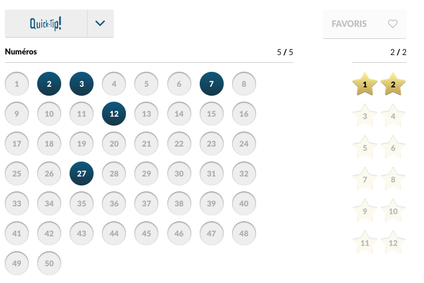

# Lotto

Vous avez maintenant les bases pour faire du WEB dynamique, soit intégrer du PHP et du HTML avec une base de données…

## Saisie du bulletin

Sur la page d'accueil, on peut saisir un bulletin similaire à l'euro-million dont voici un exemple non contractuel :

## Validation du bulletin

Quand on appuie sur le bouton de validation du bulletin, on va sur la page validation.php :
On génère un tirage (https://www.php.net/manual/en/function.rand.php) et on affiche le résultat sous la forme suivante :

- 5 nombres et 2 étoiles : Fantastique !
- 4 nombres et 2 étoiles : Bravo !
- 3 nombres et 2 étoiles : Peut faire mieux !
- Autre : pas de chance, réessayez

## Avancé

- Contrôler qu'il n'y a pas de doublon.
- Sauvegarder les tirages dans une base de données et ajouter une page qui affiche les statistiques de tirage pour
  chaque nombre
- Pimper la saisie du bulletin avec du javascript (onclick sur des images sympatiques....) : l'idée est que quand on
  clique sur une image, cela remplisse la valeur d'un champ input 'hidden'...