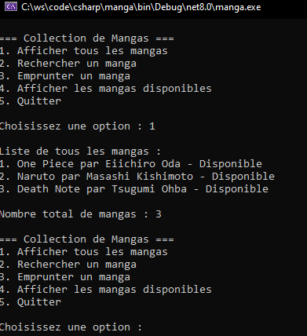

# Gestion d'une Collection de Mangas

Objectif : Créer un programme de gestion d'une collection de mangas en C# utilisant les listes.

## Contexte
Vous gérez une collection de mangas avec pour chaque manga :

- Le titre
- L'auteur (mangaka)
- Un statut d'emprunt

## Exigences

1. Créer trois listes pour stocker :
    - Les titres des mangas
    - Les mangakas
    - L'état d'emprunt
2. Pouvoir :
    - Afficher tous les mangas
    - Rechercher un manga
    - Emprunter un manga
    - Voir les mangas disponibles
   
## Exemples de données
- One Piece de Eiichiro Oda
- Naruto de Masashi Kishimoto
- Death Note de Tsugumi Ohba

## Capture d’écran non contractuelle



## Aide

<details>
<summary>À utiliser en cas d’extrême recours</summary>

```csharp
using System;
using System.Collections.Generic;

class Program
{
    static void Main(string[] args)
    {
        // Création des trois listes parallèles
        List<string> titres = new List<string>();
        List<string> mangakas = new List<string>();
        List<bool> estEmprunte = new List<bool>();

        // Ajout de quelques mangas
        titres.Add("One Piece");
        mangakas.Add("Eiichiro Oda");
        estEmprunte.Add(false);

        titres.Add("Naruto");
        mangakas.Add("Masashi Kishimoto");
        estEmprunte.Add(false);

        titres.Add("Death Note");
        mangakas.Add("Tsugumi Ohba");
        estEmprunte.Add(false);

        while (true)
        {
            Console.WriteLine("\n=== Collection de Mangas ===");
            Console.WriteLine("1. Afficher tous les mangas");
            Console.WriteLine("2. Rechercher un manga");
            Console.WriteLine("3. Emprunter un manga");
            Console.WriteLine("4. Afficher les mangas disponibles");
            Console.WriteLine("5. Quitter");

            Console.Write("\nChoisissez une option : ");
            string choix = Console.ReadLine();

            if (choix == "1") // Afficher tous les mangas
            {
                Console.WriteLine("\nListe de tous les mangas :");
                for (int i = 0; i < titres.Count; i++)
                {
                    string status = estEmprunte[i] ? "Emprunté" : "Disponible";
                    Console.WriteLine($"{i + 1}. {titres[i]} par {mangakas[i]} - {status}");
                }
                Console.WriteLine($"\nNombre total de mangas : {titres.Count}");
            }
            else if (choix == "2") // Rechercher un manga
            {
                Console.Write("\nEntrez le titre du manga à rechercher : ");
                string recherche = Console.ReadLine();

                bool trouve = false;
                for (int i = 0; i < titres.Count; i++)
                {
                    if (titres[i].ToLower() == recherche.ToLower())
                    {
                        string status = estEmprunte[i] ? "Emprunté" : "Disponible";
                        Console.WriteLine($"Manga trouvé : {titres[i]} par {mangakas[i]} - {status}");
                        trouve = true;
                        break;
                    }
                }
                if (!trouve)
                {
                    Console.WriteLine("Manga non trouvé.");
                }
            }
            else if (choix == "3") // Emprunter un manga
            {
                Console.Write("\nEntrez le titre du manga à emprunter : ");
                string titre = Console.ReadLine();

                bool trouve = false;
                for (int i = 0; i < titres.Count; i++)
                {
                    if (titres[i].ToLower() == titre.ToLower())
                    {
                        if (!estEmprunte[i])
                        {
                            estEmprunte[i] = true;
                            Console.WriteLine("Manga emprunté avec succès !");
                        }
                        else
                        {
                            Console.WriteLine("Ce manga est déjà emprunté.");
                        }
                        trouve = true;
                        break;
                    }
                }
                if (!trouve)
                {
                    Console.WriteLine("Manga non trouvé.");
                }
            }
            else if (choix == "4") // Afficher les mangas disponibles
            {
                Console.WriteLine("\nMangas disponibles :");
                bool aucunManga = true;
                
                for (int i = 0; i < titres.Count; i++)
                {
                    if (!estEmprunte[i])
                    {
                        Console.WriteLine($"{i + 1}. {titres[i]} par {mangakas[i]}");
                        aucunManga = false;
                    }
                }

                if (aucunManga)
                {
                    Console.WriteLine("Aucun manga disponible actuellement.");
                }
            }
            else if (choix == "5") // Quitter
            {
                break;
            }
            else
            {
                Console.WriteLine("Option invalide !");
            }
        }
    }
}
```

</details>

## Bonus
Faire une recherche tolérante au bruit en utilisant la 
[distance de Levenshtein](https://fr.wikipedia.org/wiki/Distance_de_Levenshtein) :

> [!WARNING]
> ⚠ Il faut .NET >= 8.0

```shell
dotnet add package Fastenshtein
```

```csharp
int distance = Fastenshtein.Levenshtein.Distance("chien", "chine");
if(distance<5 /*valeur à définir*/)
{
   //Les mots se ressemblent beaucoup (fullmatch => 0), qu’est-ce qu’on fait ?
}
```