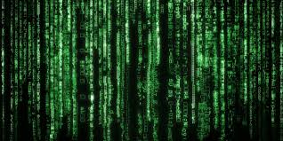
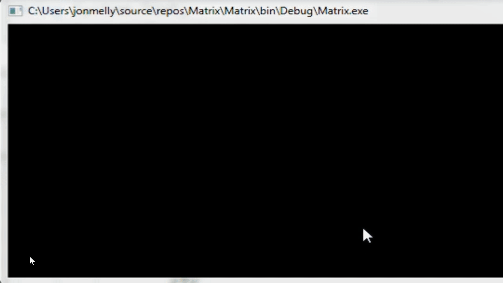

# Introduction



En référence au film "The Matrix", l'idée est d'utiliser les connaissances apprises jusque là pour remplir la console de caractères aléatoires.

# Exemple




# Aide
Pour afficher un caractère A à la position X et Y de la console, on peut écrire :
```csharp
Console.CursorLeft = x; //valeur entière selon la taille de la console
Console.CursorTop = y; //valeur entière selon la taille de la console
Console.Write("A");
```


Pour obtenir le caractère correspondant à un code ASCII numérique :
```csharp
Convert.ToChar(66); // B
Console.Write(Convert.ToChar(66)); // Affiche B
Console.Write(Convert.ToChar(variableContenantUnNombreAleatoire));
```

Rappel
Pour obtenir un nombre aléatoire entre 1 et 50 :

```csharp
Random random = new Random(); //à mettre au début du programme
random.Next(1,51); //à utiliser au besoin
```


# Livrable
Une démonstration de votre application

# Bonus pour les avancés
Ajouter de la couleur
Faire en sorte que le programme s'arrête une fois l'écran rempli
Reproduire le défilement vertical "matrix"