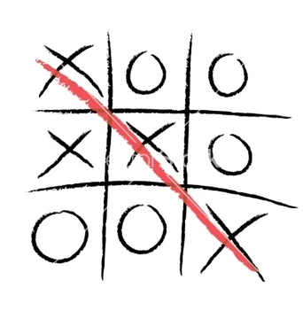

# Morpion 1



Exercice : Créer un jeu de morpion

Objectif : Créer un jeu de morpion où deux joueurs s'affrontent sur une grille de 3x3 cases. Le but du jeu est de former
une ligne horizontale, verticale ou diagonale de trois symboles identiques (X ou O).

Instructions :

1. Créer une grille de 3x3 cases.
2. Demander au premier joueur de choisir un symbole (X ou O).
3. Alterner les tours entre les deux joueurs.
4. Demander à chaque joueur de choisir une case vide sur la grille.
5. Placer le symbole du joueur dans la case choisie.
6. Vérifier si un joueur a gagné en formant une ligne horizontale, verticale ou diagonale de trois symboles identiques.
7. Continuer le jeu jusqu'à ce qu'un joueur gagne ou que la grille soit pleine.

Conseils :

* Utilisez une matrice bidimensionnelle pour représenter la grille de 3x3 cases.
* Utilisez une variable pour stocker le symbole du joueur actuel (X ou O).
* Utilisez une boucle while pour alterner les tours entre les deux joueurs.
* Utilisez des conditions if pour vérifier si un joueur a gagné ou si la grille est pleine.

Exemple de sortie :

```
Joueur 1 (X), choisissez une case : 1
Joueur 2 (O), choisissez une case : 2
Joueur 1 (X), choisissez une case : 3
Joueur 2 (O), choisissez une case : 4
Joueur 1 (X), choisissez une case : 5
Joueur 2 (O), choisissez une case : 6
Joueur 1 (X), choisissez une case : 7
Joueur 2 (O), choisissez une case : 8
Joueur 1 (X), choisissez une case : 9
Bravo Joueur 1 ! Vous avez gagné !
```