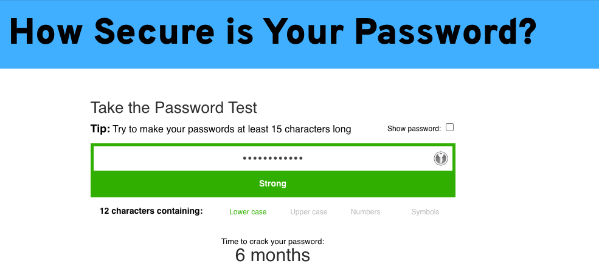
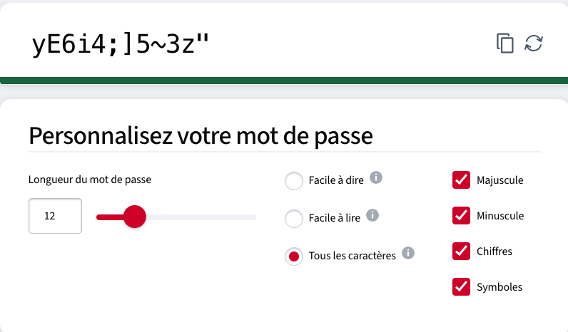

# Mot de passe



Créer un programme de validation de mot de passe

## Objectif

Créer un programme qui valide un mot de passe selon les critères suivants :

* Le mot de passe doit contenir au moins 8 caractères.
* Le mot de passe doit contenir au moins une lettre majuscule.
* Le mot de passe doit contenir au moins une lettre minuscule.
* Le mot de passe doit contenir au moins un chiffre.
* Le mot de passe doit contenir au moins un caractère spécial (par exemple, !, @, #, $, %, etc.).

Instructions :

1. Demander à l'utilisateur de saisir un mot de passe.
2. Vérifier si le mot de passe respecte les critères ci-dessus.
3. Afficher un message indiquant si le mot de passe est valide ou non.

Conseils :

* Utilisez des conditions if pour vérifier si le mot de passe respecte les critères.
* Utilisez des opérateurs logiques NOT et OR pour combiner les conditions.

Exemple de sortie :

```
Entrez un mot de passe : test123
Le mot de passe est invalide. Il doit contenir au moins 8 caractères, une lettre majuscule, une lettre minuscule, un chiffre et un caractère spécial.
Entrez un mot de passe : Test123!
Le mot de passe est valide.
```

## Aide

### Longueur d'une chaîne
```csharp
int length = "hello".Length; //5
```

### Traitement de chaque caractère

Pour parcourir chaque caractère d'une chaîne de caractères en C#, vous pouvez utiliser une boucle foreach. Voici un
exemple de code qui montre comment parcourir chaque caractère d'une chaîne de caractères :

```csharp
string motDePasse = "Test123!";
foreach (char c in motDePasse)
{
    // Faites quelque chose avec chaque caractère ici
    Console.WriteLine(c);
}
```

Dans cet exemple, la variable `motDePasse` contient la chaîne de caractères que vous souhaitez parcourir. La boucle
foreach parcourt chaque caractère de la chaîne de caractères et stocke le caractère courant dans la variable `c`. Vous
pouvez ensuite utiliser la variable `c` pour effectuer des opérations sur chaque caractère.

Si vous souhaitez vérifier si un caractère est une lettre majuscule, une lettre minuscule, un chiffre ou un caractère
spécial, vous pouvez utiliser les méthodes suivantes de la classe Char :

* `Char.IsUpper(c)` : Retourne true si le caractère `c` est une lettre majuscule.
* `Char.IsLower(c)` : Retourne true si le caractère `c` est une lettre minuscule.
* `Char.IsDigit(c)` : Retourne true si le caractère `c` est un chiffre.
* `Char.IsLetterOrDigit(c)` : Retourne true si le caractère `c` est une lettre ou un chiffre.
* `Char.IsSymbol(c)` : Retourne true si le caractère `c` est un caractère spécial.

> Attention, Char.IsSymbol() ne fait peut-être pas ce qu’on pense...
> Si besoin, voici une alternative:

```csharp
foreach(char character in "ab_cd$")
{
    if(character == '_' || character == '$')
    {
        Console.Write("_ ou $");
    }
}
```

<details>
<summary>Voir un exemple non contractuel et non garanti fonctionnel</summary>

```csharp
string motDePasse = "Test123!";
bool estValide = true;

// Vérifier si le mot de passe contient au moins 8 caractères
if (motDePasse.Length < 8)
{
    estValide = false;
}

// Vérifier si le mot de passe contient au moins une lettre majuscule
bool contientMajuscule = false;
foreach (char c in motDePasse)
{
    if (Char.IsUpper(c))
    {
        contientMajuscule = true;
        break;
    }
}
if (!contientMajuscule)
{
    estValide = false;
}

// Vérifier si le mot de passe contient au moins une lettre minuscule
bool contientMinuscule = false;
foreach (char c in motDePasse)
{
    if (Char.IsLower(c))
    {
        contientMinuscule = true;
        break;
    }
}
if (!contientMinuscule)
{
    estValide = false;
}

// Vérifier si le mot de passe contient au moins un chiffre
bool contientChiffre = false;
foreach (char c in motDePasse)
{
    if (Char.IsDigit(c))
    {
        contientChiffre = true;
        break;
    }
}
if (!contientChiffre)
{
    estValide = false;
}

// Vérifier si le mot de passe contient au moins un caractère spécial
bool contientCaractereSpecial = false;
foreach (char c in motDePasse)
{
    if (Char.IsSymbol(c))
    {
        contientCaractereSpecial = true;
        break;
    }
}
if (!contientCaractereSpecial)
{
    estValide = false;
}

// Afficher le résultat
if (estValide)
{
    Console.WriteLine("Le mot de passe est valide.");
}
else
{
    Console.WriteLine("Le mot de passe est invalide.");
}
```

Dans cet exemple, la variable `estValide` est initialisée à true. La boucle foreach parcourt chaque caractère de la
chaîne de caractères et utilise les méthodes de la classe Char pour vérifier si le caractère courant est une lettre
majuscule, une lettre minuscule, un chiffre ou un caractère spécial. Si le mot de passe ne respecte pas l'un des
critères, la variable `estValide` est mise à false. Enfin, le résultat est affiché à l'utilisateur.

</details>

## Suite avancée (optionnelle)
Changer de point de vue en proposant un **générateur de mot de passe** à l'image 
de [celui-ci](https://www.lastpass.com/fr/features/password-generator) par exemple...

