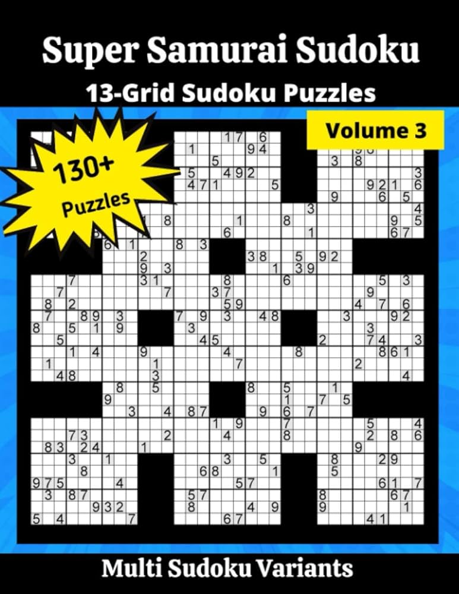
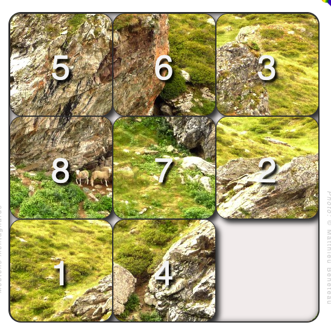

# Puzzles
Quelques sujets pour exercer la [modélisation](../../supports/pseudocode.md), cette fois-ci 
avec des [diagrammes de flux](../../supports/pseudocode.md#version-graphique).

## Sudoku

### Mission
1. Découvrir (si nécessaire) [les règles du sudoku](https://fr.wikipedia.org/wiki/Sudoku)
2. Réfléchir et créer un diagramme de flux pour 
   - une ligne de sudoku
   - un sudoku 3x3 (ne pas oublier la diagonale)
   - un sudoku NxN
3. Générer un PDF du diagramme, l’imprimer et le livrer

## Taquin

### Mission
1. Découvrir et jouer
2. Trouver une manière générique de résoudre les puzzles de ce type
3. Décrire cette manière avec [diagrammes de flux](../../supports/pseudocode.md#version-graphique)
4. Faire tester cela à une autre personne
5. Ajuster
6. Générer un PDF du diagramme, l’imprimer et le livrer

