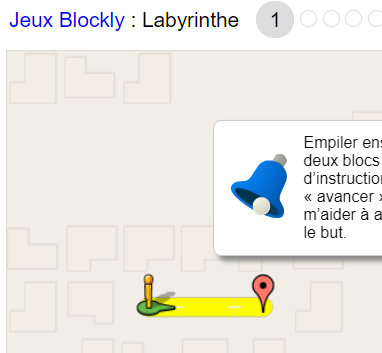
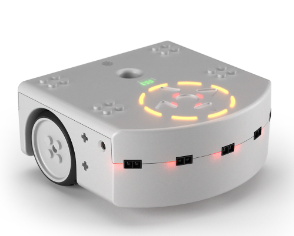

# Robot

Un autre moyen de se familiariser avec le langage des ordinateurs est de donner des ordres à un robot.

## 1. Blockly

## Mission

Se rendre sur [cette page web](https://blockly.games/maze?lang=fr&level=1) et poster (dans le devoir) un screenshot de la solution **des
blocs** pour le niveau 9 minimum.

## 2. Thymio

### Partie 1 : suivre la ligne
Se rendre sur [tutorial thymio](https://ici.section-inf.ch/robot-01) et faire une `démonstration` sur son poste.

> [Plus d’infos](http://aseba.wikidot.com/en:gettingstarted)

### Partie 2 : leds
Le robot comporte des leds activables et certaines sont [accessibles via le simulateur](http://aseba.wikidot.com/en:thymiosimulation)

Réussirez-vous à:

- Activer les leds gauche du cercle en rouge quand le robot va à gauche
- Activer les leds droite du cercle en vert quand le robot va à droite
- Faire clignoter une led quand le robot est arrêté
- Activer un mode "police" où le robot va plus vite et clignote

### Partie 3 : Compteur
On aimerait estimer le nombre de fois que le robot 

- passe par-dessus une ligne noire
- fonce dans un mur

En utilisant 3 leds comme des digits :

Digit1: Rouge

Digit2: Vert

Digit3: Bleu

| R | V | B | Valeur |
|---|---|---|--------|
| 0 | 0 | 0 | 0      |
| 0 | 0 | 1 | 1      |
| 0 | 1 | 0 | 2      |
| 0 | 1 | 1 | 3      |
| 1 | 0 | 0 | 4      |
| 1 | 0 | 1 | 5      |
| 1 | 1 | 0 | 6      |
| 1 | 1 | 1 | 7      |

Un `1` pour R,V,B correspond à la led complètement allumée...

