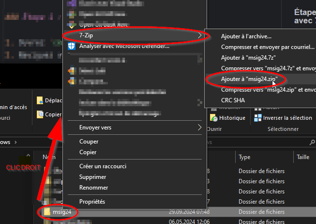

# Exercice : Sauvegarder un Dossier avec 7-Zip, `rclone`, `kopia`, et une Sauvegarde Mixte

## Objectif

Dans cet exercice, vous allez apprendre à sauvegarder un dossier de quatre façons différentes :

1. Avec 7-Zip pour compresser le dossier et ensuite le télécharger sur Office 365 (OneDrive).
2. Avec `rclone` pour synchroniser le dossier avec un stockage cloud.
3. Avec `kopia` pour effectuer une sauvegarde incrémentale.
4. Une sauvegarde mixte utilisant `kopia` pour créer une sauvegarde incrémentale, puis `rclone` pour synchroniser le
   référentiel `kopia` sur OneDrive.

## Prérequis

- Avoir `7-Zip`, `rclone`, et `kopia` installés sur votre machine.

### 7-Zip
Devrait être installé sur toute machine ETML, sinon [7zip](https://www.7-zip.org/download.html)

### Rclone et Kopia
On peut les télécharger et les installer à la main ([rclone](https://rclone.org/downloads/), [kopia](https://kopia.io/docs/installation/))
ou utiliser le gestionnaire d’application portable `Nomad`:

À lancer dans une invite de commande (cmd.exe) dans le dossier 
```shell
c:
mkdir c:\nomad
cd c:\nomad
powershell -Command Invoke-WebRequest -Uri https://github.com/jonathanMelly/nomad/raw/main/install.bat -OutFile %TEMP%\downloaded.bat && %TEMP%\downloaded.bat
```

Ensuite avec la nouvelle fenêtre lancée :

```shell
nomad install rclone kopia
```

> ATTENTION, les utilitaires `rclone` et `kopia` ne sont *PAS* ajoutés dans le `Path`, il faut donc les utiliser
> avec leur chemin absolu, soit : c:\nomad\apps\rclone\rclone et c:\nomad\apps\kopia\kopia ou les ajouter dans le [path](../../supports/path.md)

- Avoir accès à un compte Office 365 pour la sauvegarde sur OneDrive.
- Un dossier à sauvegarder (dans cet exemple, nous utiliserons `C:\msig24`).

---

## 1. Sauvegarder avec 7-Zip et télécharger sur Office 365

### Étape 1 : Compresser le dossier avec 7-Zip

1. Ouvrez `cmd.exe`.
2. Naviguez vers le dossier parent de `msig24` :
   ```cmd
   cd C:\
   ```

3. Compressez le dossier `msig24` en utilisant 7-Zip :
   En ligne de commande:
   ```cmd
   "C:\Program Files\7-Zip\7z.exe" a msig24Backup.zip C:\msig24
   ```
   Ou via l’interface graphique :
   
   

> Le fichier `msig24Backup.zip` sera créé à la racine de `C:`.

### Étape 2 : Télécharger le fichier sur Office 365 (OneDrive)

1. Connectez-vous à votre compte OneDrive via le navigateur web.
2. Téléchargez le fichier `msig24Backup.7z` sur votre OneDrive.
3. Prenez une capture d'écran pour montrer que le fichier est bien présent sur OneDrive.

---

## 2. Sauvegarder avec `rclone`

### Étape 1 : Configurer `rclone`

1. Si ce n'est pas encore fait, configurez votre accès au stockage cloud (OneDrive, Google Drive, etc.) :
   ```cmd
   rclone config
   ```
   Suivez les étapes pour ajouter votre stockage cloud en tant que "remote" (ex. `myonedrive`).

### Étape 2 : Synchroniser le dossier avec le stockage cloud

1. Utilisez la commande suivante pour synchroniser le dossier `msig24` avec votre stockage cloud :
   ```cmd
   rclone sync C:\msig24 myonedrive:/Backup/msig24
   ```
    - Remplacez `myonedrive` par le nom de votre "remote".
    - Le dossier `msig24` sera sauvegardé dans `/Backup/msig24` sur votre cloud.

2. Prenez une capture d'écran pour montrer que la synchronisation a réussi.

---

## 3. Sauvegarder avec `kopia`

### Étape 1 : Initialiser un référentiel (repository)

1. Ouvrez `cmd.exe` et créez un nouveau référentiel local pour `kopia` :
   ```cmd
   kopia repository create filesystem --path C:\BackupRepo
   ```
    - Cela créera un référentiel dans le dossier `C:\BackupRepo`.

### Étape 2 : Sauvegarder le dossier

1. Effectuez une sauvegarde simple du dossier `msig24` :
   ```cmd
   kopia snapshot create C:\msig24
   ```
    - La sauvegarde sera stockée dans le référentiel défini à l'étape précédente.

### Étape 3 : Vérifier la sauvegarde

1. Listez les sauvegardes existantes pour vérifier que la sauvegarde a bien été effectuée :
   ```cmd
   kopia snapshot list
   ```
   Prenez une capture d'écran de la liste des snapshots.

---

## 4. Sauvegarde Mixte : `kopia` + `rclone`

### Étape 1 : Sauvegarder le dossier avec `kopia`

1. Si ce n'est pas déjà fait, initialisez un référentiel `kopia` :
   ```cmd
   kopia repository create filesystem --path C:\BackupRepo
   ```
2. Sauvegardez le dossier `msig24` dans ce référentiel :
   ```cmd
   kopia snapshot create C:\msig24
   ```

### Étape 2 : Synchroniser le référentiel avec `rclone`

1. Utilisez `rclone` pour synchroniser le référentiel `kopia` avec votre stockage cloud (OneDrive) :
   ```cmd
   rclone sync C:\BackupRepo myonedrive:/BackupRepo
   ```
    - Remplacez `myonedrive` par le nom de votre "remote".
    - Le référentiel de `kopia` sera synchronisé sur OneDrive dans le dossier `/BackupRepo`.

2. Prenez une capture d'écran pour montrer que la synchronisation du référentiel `kopia` sur le stockage cloud a bien
   été effectuée.

### Étape 3 (optionnelle): Utiliser la synchronisation integrée de kopia
En s’aidant de la [documentation](https://kopia.io/docs/reference/command-line/common/repository-sync-to-rclone/),
réaliser là synchronisation de kopia vers o365 sans rclone.

---

## 5. Restauration (optionnel)

À l’aide de la [documentation](https://kopia.io/docs/reference/command-line/common/server-start/),
démarrer le serveur WEB de kopia pour visiter les snapshots et tenter une restauration.

---

## Résultats attendus

À la fin de cet exercice, vous devriez avoir :

1. Un fichier compressé `msig24Backup.zip` téléchargé sur votre OneDrive.
2. Un dossier `msig24` synchronisé sur un stockage cloud via `rclone`.
3. Un snapshot de votre dossier `msig24` sauvegardé avec `kopia`.
4. Une sauvegarde mixte avec `kopia`, suivie d'une synchronisation du référentiel sur OneDrive avec `rclone`.

Ajoutez des captures d'écran pour chaque méthode afin de prouver que les sauvegardes ont été réalisées correctement :

- **7-Zip & OneDrive :** Capture de la compression et de l'upload sur OneDrive.
- **`rclone` :** Capture de la commande `rclone sync` pour le dossier `msig24`.
- **`kopia` :** Capture de la liste des snapshots.
- **`kopia` + `rclone` :** Capture de la synchronisation du référentiel `kopia` avec `rclone`.

Bravo, vous avez effectué quatre types de sauvegardes différentes, y compris une sauvegarde mixte !
