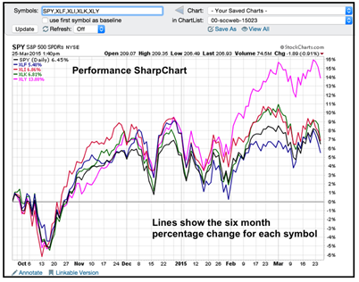
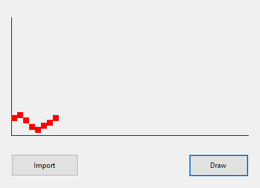
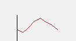

# Temperature 🌡
À l’image de ce type de graphique



Réaliser une app pour afficher des points de température :



## Aide

### Dessin 2D 🖌
Tout composant WinForms peut être "manuellement peint"... Par exemple, en ajoutant un panel
vide, on peut dessiner dedans ainsi :

```csharp
var g = aPanel.CreateGraphics();
g.FillRectangle(Brushes.Black,0,0,1,1); // Un rectangle (carré) de 1 pixel au point 0,0
```

### Conversion à la volée
Pour convertir des nombres dans un fichier avec `LINQ`, on peut s’inspirer du code suivant:
```csharp
temperatures = File.ReadAllLines("data.txt")
         .Select(temperatureStr=>Convert.ToInt32(temperatureStr)).ToList();
```

## Objectif minimum
- Import d’un fichier CSV avec un historique des températures [exemple](data.csv)
- Affichage des points [**normalisés**](https://www.datanovia.com/en/fr/blog/comment-normaliser-et-standardiser-les-donnees-dans-r-pour-une-visualisation-en-heatmap-magnifique/#:~:text=La%20normalisation%20standard%2C%20%C3%A9galement%20appel%C3%A9e,unit%C3%A9s%20d%27%C3%A9cart%2Dtype.) :

$
valeurNormalisee = \frac{cibleMinimum + (valeur−minimumParmiLesValeurs) * (cibleMaximum−cibleMinimum)}{maximumParmiLesValeurs−minimumParmiLesValeurs}
$

### Exemple
Pour répartir les données 12,10,15 sur 100 pixels de haut, on aura pour la première valeur :

$valeurNormaliseeDe12 = \frac{0 + (12−10) * (100−0)}{15−10} = \frac{200}{5} = 40$

$valeurNormaliseeDe10 = 0$

$valeurNormaliseeDe15 = \frac{0 + (15−10) * (100−0)}{15−10} = \frac{500}{5} = 100$

>Ainsi les valeurs 12,10,15 correspondront aux valeurs 40,0,100...

## Objectifs avancés
- Ajouter les détails des échelles des axes (échelons et labels)
- Dessiner une courbe avec `DrawPath`
```csharp
var path = new System.Drawing.Drawing2D.GraphicsPath();
path.AddLine(
        new Point(x1,y1), 
        new Point(x2,y2)
    );
g.DrawPath(new Pen(Brushes.Brown), path);
```



- Utiliser une librairie comme [Scottplot](https://scottplot.net/)