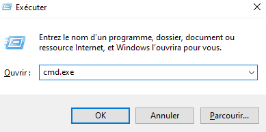

# Terminal


Le `terminal` peut paraître archaïque, il reste un outil phare de 
l’informatique moderne, car il permet d’aller là où l’interface
graphique est limitée par sa conception...

## Variations
Il existe plusieurs terminaux (en réalité ce sont des émulateurs de terminal...) et interpréteurs...

### Windows

| terminal         | interpréteurs possibles |
|------------------|-------------------------|
| cmd.exe          | bat/cmd                 |
| powershell.exe   | ps1                     |
| wsl.exe          | sh                      |
| windows terminal | bat/cmd, ps1, wsl, ...  |

#### cmd.exe

Touche Windows + R => cmd.exe


## Version basique
La plupart des terminaux vont supporter la commande suivante :

```shell
echo Bonjour
```


