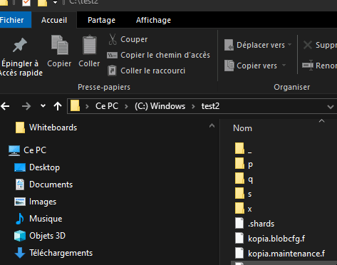

# Utilisation de `cmd.exe` pour la Navigation et la Gestion des Fichiers

## 1. Introduction à `cmd.exe`

`cmd.exe` (ou simplement "Invite de commandes") est un interpréteur de ligne de commande de Windows qui permet
d'interagir avec le système d'exploitation par des commandes textuelles.

### Démarrer CMD
Pour le lancer, plusieurs options :

- touche windows + r => cmd.exe
- touche windows => cmd [ENTER]
- écrire `cmd` dans une fenêtre d’explorateur 
- ...

## 2. Se déplacer dans les dossiers

### Changer de répertoire (`cd`)

La commande `cd` (Change Directory) permet de naviguer entre les dossiers. Voici quelques exemples :

- **Aller dans un dossier spécifique :**
    ```shell
    cd C:\Users\VotreNom\Documents
    ```
  Cela déplace le répertoire de travail actuel vers `Documents`.

- **Revenir au dossier parent :**
    ```shell
    cd ..
    ```
  Les deux points (`..`) indiquent le dossier parent, donc cette commande vous ramène d'un niveau en arrière.

- **Accéder à un dossier à partir de la racine :**
    ```shell
    cd \Dossier1\Dossier2
    ```
  Le caractère `\` au début de la commande signifie que vous partez de la racine du lecteur actuel.

- **Changer de lecteur (par exemple de `C:` à `D:`) :**
    ```shell
    D:
    ```

### Lister les fichiers et dossiers (`dir`)

La commande `dir` permet d'afficher la liste des fichiers et dossiers dans le répertoire courant.

```shell
dir
```

## 3. Lancer l'explorateur de fichiers

### Ouvrir l'explorateur dans un dossier spécifique

Pour ouvrir l'Explorateur Windows dans un dossier spécifique, utilisez la commande `explorer` :

```shell
explorer C:\Users\VotreNom\Documents
```

### Ouvrir l'explorateur dans le répertoire actuel

Vous pouvez également ouvrir l'explorateur dans le répertoire actuel en tapant simplement :

```shell
explorer .
```

Le point (`.`) fait référence au dossier dans lequel vous vous trouvez actuellement.

## 4. Créer un nouveau fichier

### Créer un fichier vide

Pour créer un fichier texte vide, utilisez la commande `type` combinée avec `nul` :

```shell
type nul > monfichier.txt
```

Cela crée un fichier nommé `monfichier.txt` dans le répertoire courant.

### Créer un fichier avec du contenu

Pour créer un fichier texte avec un contenu prédéfini, utilisez `echo` :

```shell
echo Ceci est le contenu de mon fichier > monfichier.txt
```

Cette commande crée un fichier `monfichier.txt` avec la ligne "Ceci est le contenu de mon fichier" à l'intérieur.

## 5. Ouvrir un fichier existant

Vous pouvez ouvrir un fichier texte dans l'éditeur par défaut (par exemple, le Bloc-notes) en tapant simplement son
nom :

```shell
monfichier.txt
```

Ou, pour spécifier l'application à utiliser, vous pouvez utiliser :

```shell
notepad monfichier.txt
```

## Conclusion

Avec ces commandes de base dans `cmd.exe`, vous pouvez facilement naviguer dans les dossiers, ouvrir l'explorateur, et
gérer vos fichiers. C'est un bon point de départ pour une utilisation plus avancée de l'invite de commandes.
