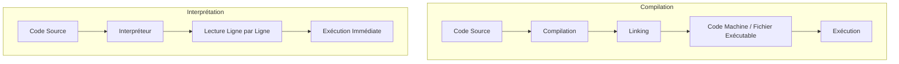

# Processus de programmation

Il y a plusieurs manières d’exécuter un programme, la compilation ou l’interprétation ou un mélange des deux...

Les deux façons ont besoin d’un code qu’on appelle `source` qui contient les instructions dans un langage
de programmation.

Ces instructions sont ensuite transformées (de 2 manières différentes) afin d’être exécutées:

## 1. **Langages Compilés (Préparation à l’avance)**

### Étape 1 : **Le Code Source - La Recette Complète**

Vous avez une recette bien détaillée écrite dans un langage de programmation (comme C# ou Go). Cette recette décrit tout
le processus pour cuisiner un plat, mais ce n'est pas encore quelque chose que vous pouvez manger.

### Étape 2 : **Compilation - Préparation des Ingrédients**

Le compilateur agit comme un chef qui prépare tous les ingrédients à l’avance. Il traduit la recette en un format que la
machine peut comprendre (code machine), c'est-à-dire qu’il découpe, mesure et prépare tout ce qui est nécessaire pour la
recette. C’est un processus complet : chaque ingrédient est préparé avant de commencer à cuisiner.

- **Code Source (Recette) → Code Machine (Ingrédients prêts)**

### Étape 3 : **Linking - Assembler le Plat**

Tous les ingrédients sont rassemblés pour former le plat final. C’est l’étape où toutes les parties du programme (
modules ou bibliothèques) sont mises ensemble pour créer un fichier exécutable, prêt à être "mangé" (exécuté).

- **Assemblage du plat → Exécutable (plat complet prêt)**

### Étape 4 : **Exécution - Cuisson et Dégustation**

L'exécutable est maintenant prêt, et l'ordinateur peut exécuter le programme en une seule fois, sans
étapes intermédiaires. C’est comme mettre le plat au four et le sortir prêt à déguster.

- **Exécution rapide et optimisée (plat déjà assemblé)**

**Avantage :** La préparation (compilation) prend du temps, mais le plat (programme) est rapide à exécuter une fois
prêt.

---

## 2. **Langages Interprétés (Cuisiner en Temps Réel)**

### Étape 1 : **Le Code Source - La Recette Directe**

Comme dans le cas des langages compilés, vous avez une recette. Cependant, dans un langage interprété (comme Python ou
JavaScript), vous n’allez pas préparer tous les ingrédients à l’avance.

### Étape 2 : **Interprétation - Cuisiner au Fur et à Mesure**

L’interpréteur est comme un cuisinier qui lit la recette ligne par ligne et cuisine au fur et à mesure. Dès qu’une étape
est lue, elle est immédiatement exécutée, sans transformation préalable en code machine. Le cuisinier (interpréteur)
*cuisine* directement chaque instruction.

- **Lecture de chaque étape → Exécution immédiate (cuisiner en direct)**

### Étape 3 : **Pas de Préparation Complète - Pas d’Exécutable Préparé**

Contrairement au langage compilé, il n’y a pas de fichier exécutable final, car tout est fait au fur et à mesure. Si
vous voulez exécuter à nouveau le programme, vous devrez relire et exécuter chaque étape de la recette.

- **Pas d’assemblage complet → exécution ligne par ligne**

### Étape 4 : **Exécution Directe - Cuisson Instantanée**

Chaque fois que vous voulez exécuter le programme, l'interpréteur lit la recette et cuisine à mesure. C'est idéal pour
tester rapidement des modifications ou goûter le plat à chaque étape.

- **Exécution flexible mais plus lente (chaque ligne doit être lue à nouveau)**

**Avantage :** Flexibilité pour tester ou changer des parties de la recette (code) à la volée, sans compilation
complète.

---

## **Comparaison des Deux Approches :**

- **Langage Compilé :** Préparation complète des ingrédients avant de cuisiner. Exécution rapide une fois prêt (comme
  une recette complètement assemblée et cuite d’un coup).
- **Langage Interprété :** Cuisiner et exécuter en temps réel sans préparation complète. Flexibilité pour modifier la
  recette à tout moment (comme cuisiner en lisant la recette pas à pas).

En résumé :

- **Compilé :** Préparation (compilation) plus longue, exécution rapide.
- **Interprété :** Pas de préparation préalable, mais exécution généralement plus lente car chaque ligne est interprétée
  à chaque exécution.

L'analogie est donc :

- **Compilation :** Préparez et cuisinez tout en une fois pour déguster rapidement.
- **Interprétation :** Cuisine instantanée au fur et à mesure de la lecture de la recette, avec plus de flexibilité pour
  changer en cours de route.

## Et cosmos alors ?

Suite à ces explications, [cosmos](https://github.com/jonathanMelly/cosmos) est il interprété ou compilé à votre avis ?

Cliquer pour voir la réponse

Interprété
> En effet, on lance `cosmos MonProgramme` et le programme est interprété en direct d’après le fichier source...
> Si cosmos était compilé, on devrait d’abord compiler le programme pour ensuite le lancer... ce qui sera le cas avec C#...

