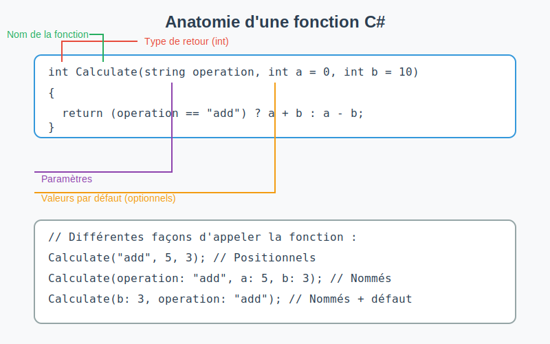

# Les Fonctions en C#



## 1. Introduction aux Fonctions

Une fonction est un bloc de code réutilisable qui effectue une tâche spécifique. En C#, les fonctions peuvent avoir
différentes formes selon :

- Le type de retour (void, int, string, etc.)
- Les paramètres (avec ou sans paramètres)

## 2. Types de Fonctions

### 2.1 Fonction void sans paramètre

Cette fonction ne retourne aucune valeur et n'accepte aucun paramètre.

```csharp
public void ShowMessage()
{
    Console.WriteLine("Bonjour à tous!");
}

// Appel de la fonction
ShowMessage();  // Affiche : Bonjour à tous!
```

### 2.2 Fonction void avec paramètres

Cette fonction ne retourne aucune valeur mais accepte des paramètres. Les paramètres peuvent avoir des valeurs par
défaut.

```csharp
public void WriteColor(string message, ConsoleColor color = ConsoleColor.White, bool isUpperCase = false)
{
    ConsoleColor originalColor = Console.ForegroundColor;
    Console.ForegroundColor = color;
    Console.WriteLine(isUpperCase ? message.ToUpper() : message);
    Console.ForegroundColor = originalColor;
}

// Appels de la fonction avec différentes combinaisons de paramètres
WriteColor(message: "Attention!");  // Utilise la couleur par défaut (blanc)
WriteColor(message: "Erreur!", color: ConsoleColor.Red);  // Message en rouge
WriteColor(message: "Important!", color: ConsoleColor.Yellow, isUpperCase: true);  // Message en jaune et en majuscules

// Les arguments nommés permettent aussi de changer l'ordre
WriteColor(color: ConsoleColor.Blue, message: "Info");  // Ordre différent mais fonctionne
```

### 2.3 Fonction avec retour sans paramètre

Cette fonction retourne une valeur mais n'accepte aucun paramètre.

```csharp
// La variable random doit être déclarée comme champ statique de la classe
private static Random random = new Random();

public int GetCurrentHour()
{
    return DateTime.Now.Hour;
}

public int GetRandomNumber()
{
    return random.Next(1, 101);  // Retourne un nombre entre 1 et 100
}

// Appels des fonctions
int hour = GetCurrentHour();
Console.WriteLine($"Il est {hour} heures");

int number = GetRandomNumber();
Console.WriteLine($"Nombre aléatoire : {number}");
```

### 2.4 Fonction avec retour et paramètres

Cette fonction retourne une valeur et accepte des paramètres.

```csharp
public int Add(int a, int b)
{
    return a + b;
}

// Appel de la fonction
int result = Add(5, 3);  // result vaut 8
```

### 2.5 Exemple complet avec IsPrime

```csharp
public bool IsPrime(int number)
{
    if (number <= 1) return false;
    if (number == 2) return true;
    
    for (int i = 2; i <= Math.Sqrt(number); i++)
    {
        if (number % i == 0)
            return false;
    }
    
    return true;
}

// Utilisation
bool isPrime = IsPrime(17);  // Retourne true
Console.WriteLine($"17 est premier ? {isPrime}");
```

## 3. Glossaire des Termes

### Type de retour

Le type de données que la fonction renvoie. Il peut être :

- `void` : aucune valeur retournée
- Un type spécifique (`int`, `string`, `bool`, etc.)
- Un type personnalisé (classe, structure)

### Signature de fonction

La combinaison unique du nom de la fonction et de ses paramètres. Elle inclut :

- Le nom de la fonction
- Le nombre et les types des paramètres
- L'ordre des paramètres

Exemple : `void WriteColor(string message, ConsoleColor color)`

### Paramètre

Variable déclarée dans la définition de la fonction qui reçoit une valeur lors de l'appel.

```csharp
public void WriteColor(string message, ConsoleColor color = ConsoleColor.White)  // message et color sont des paramètres, color a une valeur par défaut
```

### Paramètre optionnel (avec valeur par défaut)

Paramètre qui possède une valeur par défaut et peut être omis lors de l'appel de la fonction.

```csharp
public void ShowMessage(string text, bool isUpperCase = false)  // isUpperCase est optionnel
{
    Console.WriteLine(isUpperCase ? text.ToUpper() : text);
}

// Appels possibles :
ShowMessage("Hello");  // Utilise la valeur par défaut false
ShowMessage("Hello", true);  // Spécifie une valeur différente
```

### Argument
Valeur réelle passée à la fonction lors de son appel. Les arguments peuvent être :
- Positionnels (dans l'ordre de déclaration des paramètres)
- Nommés (précédés du nom du paramètre et de ":")

```csharp
// Arguments positionnels
WriteColor("Attention!", ConsoleColor.Red);

// Arguments nommés
WriteColor(message: "Attention!", color: ConsoleColor.Red);

// Mélange (les arguments nommés doivent venir après les positionnels)
WriteColor("Attention!", color: ConsoleColor.Red);

// Les arguments nommés permettent de changer l'ordre
WriteColor(color: ConsoleColor.Red, message: "Attention!");
```

### Corps de fonction
Le bloc de code entre accolades qui contient les instructions à exécuter.

### Instruction return
- Termine l'exécution de la fonction
- Renvoie une valeur (sauf pour les fonctions void)
- Peut apparaître plusieurs fois dans une fonction

## 4. Bonnes Pratiques

1. Nommage :
   - Utilisez des noms descriptifs
   - Commencez par une majuscule (convention C#)
   - Utilisez des verbes pour les actions

2. Responsabilité unique :
   - Une fonction doit faire une seule chose
   - Elle doit le faire bien
   - Elle doit être facilement compréhensible

3. Longueur :
   - Gardez les fonctions courtes (idéalement < 20 lignes)
   - Si une fonction devient trop longue, envisagez de la diviser

## 5. Exercices Suggérés

1. Créez une fonction `void` qui affiche une ligne de caractères répétés
2. Créez une fonction qui retourne la somme des chiffres d'un nombre
3. Modifiez la fonction `WriteColor` pour accepter un paramètre qui transforme en majuscule
4. Implémentez une fonction qui vérifie si une année est bissextile