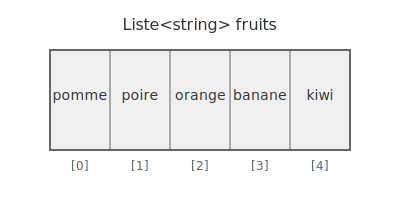

# Les Listes en C#

Une liste est comme une boîte dans laquelle on peut ranger plusieurs éléments du même type. C'est comparable à un casier avec
plusieurs compartiments numérotés.



```csharp
// Créer une nouvelle liste de nombres
List<int> nombres = new List<int>() { 1, 2, 3, 4, 5 };

// Ajouter un élément
nombres.Add(6);                // Ajoute 6 à la fin

// Supprimer un élément
nombres.Remove(3);             // Supprime le premier 3 trouvé
nombres.RemoveAt(0);           // Supprime l'élément à la position 0

// Accéder à un élément
int premier = nombres[0];      // Obtient le premier élément
```

# LINQ - La boîte à outils magique 🛠

LINQ permet de manipuler facilement les listes. Voici les opérations les plus utiles :

## Calculs avec LINQ 📊

```csharp
// Liste de notes
List<double> grades = new List<double> { 12.5, 15.0, 9.5, 17.0, 14.0 };

// Calcul de la moyenne
double average = grades.Average();
// Résultat : 13.6

// Calcul de la somme
double sum = grades.Sum();
// Résultat : 68.0

// Exemples plus complexes
List<int> numbers = new List<int> { 1, 2, 3, 4, 5, 6, 7, 8, 9, 10 };

```

### Bonnes pratiques pour Sum et Average ⚠️

```csharp
// Vérification de sécurité avant Average
if (grades.Any())
{
    double average = grades.Average();
}

// Utilisation de DefaultIfEmpty pour éviter les exceptions
double safeAverage = grades
    .DefaultIfEmpty()
    .Average();
// Retourne 0 si la liste est vide

// Combinaison avec d'autres opérations LINQ
double highGradesAverage = grades
    .Where(g => g >= 10)
    .DefaultIfEmpty()
    .Average();
```

Les points importants à retenir :

1. `Average()` retourne toujours un `double`
2. `Sum()` retourne le même type que les éléments de la liste
3. Ces méthodes peuvent être utilisées après d'autres opérations LINQ
4. `Average()` sur une liste vide génère une exception (utiliser `DefaultIfEmpty()`)
5. Ces méthodes sont très utiles pour les calculs statistiques simples

## Filtrer (Where)

Un peu comme en SQL, le filtrage permet de conserver certains éléments seulement...

```csharp
List<int> nombres = new List<int>() { 1, 2, 3, 4, 5, 6 };

// Trouver tous les nombres pairs
var nombresPairs = nombres.Where(number => number % 2 == 0);
// Résultat : 2, 4, 6
```

## Transformer (Select)

```csharp
List<string> names = new List<string>() { "Alex", "Marie", "Tom" };

// Mettre tous les prénoms en majuscules
var upperNames = names.Select(name => name.ToUpper());
// Résultat : "ALEX", "MARIE", "TOM"
```

## Trier (OrderBy)

```csharp
List<string> fruits = new List<string>() { "banane", "pomme", "orange" };

// Trier par ordre alphabétique
var fruitsTries = fruits.OrderBy(fruit => fruit);
// Résultat : "banane", "orange", "pomme"
```

# Vérification rapide avant d'utiliser une liste

```csharp
List<string> maListe = new List<string>();

// Vérifier si la liste est vide
if (maListe.Count == 0)
{
    Console.WriteLine("La liste est vide !");
}

// Vérifier si un élément existe
if (maListe.Contains("Mario"))
{
    Console.WriteLine("Mario est dans la liste !");
}
```

# Exemple avec Random et List 🎲

```csharp
// Création d'une liste de cartes
List<string> cards = new List<string>()
{
    "Ace of hearts", "King of spades", "Queen of diamonds", 
    "Jack of clubs", "10 of hearts"
};

// Création d'un générateur de nombres aléatoires
Random random = new Random();

// Tirer une carte au hasard
int randomIndex = random.Next(0, cards.Count);
string randomCard = cards[randomIndex];
// Exemple : peut afficher "Queen of diamonds"

// Mélanger toute la liste
List<string> shuffledCards = cards
    .OrderBy(c => random.Next())
    .ToList();

// Tirer plusieurs cartes aléatoires (par exemple 2 cartes)
List<string> hand = cards
    .OrderBy(c => random.Next())
    .Take(2)
    .ToList();

// Exemple plus complexe : Simulation de dés 🎲
List<int> results = new List<int>();
for (int i = 0; i < numberOfDice; i++)
{
    results.Add(random.Next(1, numberOfFaces + 1));
}
// Exemple : peut donner [4, 2, 6]

// Calcul de la somme avec LINQ
int sum = results.Sum();
// Exemple : 12

// Vérifier s'il y a un double ou un triple
bool hasDouble = results
    .GroupBy(r => r)
    .Any(g => g.Count() >= 2);

// Trouver la plus grande valeur
int highestValue = results.Max();
```

> [!WARNING]
> N'oubliez pas que `Random` devrait généralement être créé une seule fois et réutilisé, plutôt que d'être créé à chaque
utilisation, pour une meilleure qualité de nombres aléatoires.

# Conseils pratiques 💡

1. Une liste commence toujours à l'index 0
2. Il est important de vérifier si la liste contient des éléments avant de l'utiliser
3. LINQ utilise beaucoup les expressions lambda (=>), qui sont comme des mini-fonctions
4. Il est possible d'enchaîner plusieurs opérations LINQ