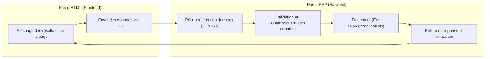

# HTML et PHP

## Introduction

Dans une application web, HTML et PHP travaillent ensemble pour gérer l'interface utilisateur (frontend) et la logique
serveur (backend).  
Un formulaire HTML permet à l'utilisateur de saisir des données, et PHP permet de traiter ces données côté serveur.

---

## HTML : La Vue

HTML (HyperText Markup Language) est utilisé pour construire la structure et le contenu d'une page web.

### Exemple d'un formulaire HTML

```html
<!DOCTYPE html>
<html lang="fr">
<head>
    <meta charset="UTF-8">
    <meta name="viewport" content="width=device-width, initial-scale=1.0">
    <title>Formulaire Exemple</title>
</head>
<body>
<h1>Formulaire d'inscription</h1>
<form action="traitement.php" method="post">
    <label for="nom">Nom :</label>
    <input type="text" id="nom" name="nom" required>
    <br>
    <label for="email">Email :</label>
    <input type="email" id="email" name="email" required>
    <br>
    <label for="age">Âge :</label>
    <input type="number" id="age" name="age">
    <br>
    <button type="submit">Envoyer</button>
</form>
</body>
</html>
```

### Explication

- Le formulaire utilise l'attribut `action` pour indiquer où les données seront envoyées (`traitement.php` dans cet
  exemple).
- L'attribut `method="post"` spécifie que les données seront transmises via la méthode HTTP POST.


## PHP : Le `Backend`

PHP (Hypertext Preprocessor) est un langage de script côté serveur utilisé pour traiter les données reçues d'un
formulaire.

### Exemple de traitement PHP

```php
<?php
// traitement.php

// Vérification si les données sont bien transmises
if ($_SERVER["REQUEST_METHOD"] === "POST") {
    $nom = htmlspecialchars($_POST['nom']);  // Protège contre les injections XSS
    $email = htmlspecialchars($_POST['email']);
    $age = isset($_POST['age']) ? (int)$_POST['age'] : null;

    // Traitement des données
    echo "<h1>Résumé des informations</h1>";
    echo "<p>Nom : $nom</p>";
    echo "<p>Email : $email</p>";
    echo "<p>Âge : " . ($age ? $age : "Non spécifié") . "</p>";
} else {
    echo "Aucune donnée reçue.";
}
?>
```

### Explication

- `$_POST` permet d'accéder aux données envoyées via la méthode POST.
- La fonction `htmlspecialchars()` est utilisée pour sécuriser les données en évitant les injections XSS.
- Les données sont affichées ou traitées comme nécessaire.


## Lien entre HTML et PHP

1. **Frontend (HTML)**
    - Le formulaire collecte les données saisies par l'utilisateur.

2. **Backend (PHP)**
    - PHP récupère les données transmises et les traite.

### Flux d'exécution

