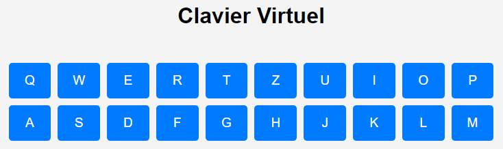
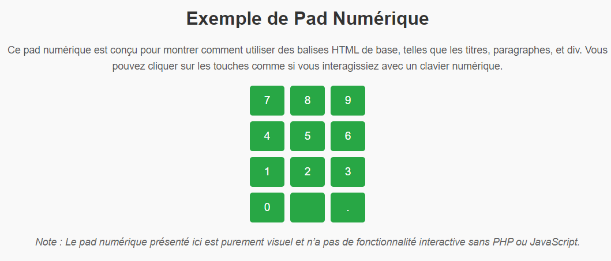

# HTML et CSS

## Introduction

HTML (HyperText Markup Language) est un langage utilisé pour structurer le contenu des pages web. CSS (Cascading Style
Sheets) est utilisé pour styliser ces pages. Ce support couvre les bases pour créer une page simple et élégante, sans
JavaScript.

## Structure d'une Page HTML

Chaque page HTML commence par un `DOCTYPE` et est structurée en deux parties principales :

- **`<head>`** : Contient des métadonnées et des informations sur la page.
- **`<body>`** : Contient le contenu visible de la page.

### Exemple :

```html
<!DOCTYPE html>
<html lang="fr">
<head>
    <meta charset="UTF-8">
    <meta name="viewport" content="width=device-width, initial-scale=1.0">
    <title>Clavier Virtuel</title>
    <style>
        /* On peut inclure ici du CSS de base */
    </style>
</head>
<body>
<!-- Contenu de la page ici -->
</body>
</html>
```

## Exemple : Clavier Virtuel

Nous allons créer un clavier virtuel composé de boutons avec HTML.

### HTML

```html
<!DOCTYPE html>
<html lang="fr">
<head>
    <meta charset="UTF-8">
    <meta name="viewport" content="width=device-width, initial-scale=1.0">
    <title>Clavier Virtuel</title>
</head>
<body>
<h1>Clavier Virtuel</h1>
<div>
    <!-- Les touches du clavier -->
    <button>Q</button>
    <button>W</button>
    <button>E</button>
    <button>R</button>
    <button>T</button>
    <button>Z</button>
    <button>U</button>
    <button>I</button>
    <button>O</button>
    <button>P</button>
    <button>A</button>
    <button>S</button>
    <button>D</button>
    <button>F</button>
    <button>G</button>
    <button>H</button>
    <button>J</button>
    <button>K</button>
    <button>L</button>
    <button>M</button>
</div>
</body>
</html>
```

#### Explications

1. **Le DOCTYPE et `<head>` :**
    - `<!DOCTYPE html>` : Déclare que le document est en HTML5.
    - `<meta charset="UTF-8">` : Définit l'encodage en UTF-8 pour supporter les caractères spéciaux.
    - `<meta name="viewport" content="width=device-width, initial-scale=1.0">` : Rendre la page responsive sur les
      petits écrans.

2. **Le `<body>` :**
    - Un titre avec `<h1>`.

### CSS

Chaque élément (balise) HTML peut avoir un attribut `class` dans lequel on peut spécifier une ou plusieurs classes CSS :

```html
<style>
   .hello{
      color:red;
   }
   .world{
      color:green;
   }
</style>

<div class="hello">ROUGE</div>
<div class="world">VERT</div>
<div class="hello world">ROUGE OU VERT ?</div>

```

#### Couleur et alignement du clavier
Pour aligner et donner un peu de couleur, on peut rajouter des éléments de style :

```html
    <style>
        body {
            font-family: Arial, sans-serif;
            text-align: center;
            margin: 0;
            padding: 0;
            background-color: #f4f4f4;
        }

        .keyboard {
            display: grid;
            grid-template-columns: repeat(10, 1fr);
            gap: 10px;
            margin: 50px auto;
            width: 80%;
        }

        .key {
            padding: 15px;
            background-color: #007BFF;
            color: white;
            border: none;
            border-radius: 5px;
            font-size: 1.2em;
            cursor: pointer;
            transition: background-color 0.3s ease; /*Délai de transition en lien avec la spécification suivante (.key:hover)*/
        }

        .key:hover {
            background-color: #0056b3;
        }
    </style>
```

##### Explications

- **`body`** : Définit un arrière-plan clair et centre le contenu.
- **`.keyboard`** : Utilise `grid-template-columns` pour créer une grille de 10 colonnes. `1fr` veut dire *une fraction*
                     soit que chaque bouton utilise le même espace de la grille...
- **`.key`** : Stylise les boutons (couleur, taille, arrondi) et ajoute un effet visuel au survol (`hover`).

> Toutefois, cela ne marche complètement, en effet, hormis les styles standards (par exemple body ici) il faut lier les
> styles aux balises HTML correspondantes :

```html
<body>
<h1>Clavier Virtuel</h1>
<div class="keyboard">
   <!-- Les touches du clavier -->
   <button class="key">A</button>
   <button class="key">Z</button>
   <button class="key">E</button>
   <button class="key">R</button>
   <button class="key">T</button>
   <button class="key">Y</button>
   <button class="key">U</button>
   <button class="key">I</button>
   <button class="key">O</button>
   <button class="key">P</button>
   <button class="key">Q</button>
   <button class="key">S</button>
   <button class="key">D</button>
   <button class="key">F</button>
   <button class="key">G</button>
   <button class="key">H</button>
   <button class="key">J</button>
   <button class="key">K</button>
   <button class="key">L</button>
   <button class="key">M</button>
</div>
</body>

```


### **5. Résultat Attendu**

La page affiche un clavier avec des touches alignées en grille. Chaque touche est un bouton interactif qui change
légèrement de couleur lorsqu’on passe la souris dessus.



---


## Introduction aux Éléments HTML de Base

Voici maintenant une présentation des principaux éléments HTML :

- **`<p>`** : Balise de paragraphe.
- **`<div>`** : Conteneur générique.
- **`<h1>` à `<h6>`** : Titres de niveaux différents.
- **`<br>`** : Saut de ligne.
- **`&nbsp;`** : Espace insécable.
- **`<a>`** : Lien hypertexte (avec la propriété `href`)
- **``** : Afficher une image (avec la propriété `src` et `alt`)

### Exemple : Pad Numérique

### Code

```html
<!DOCTYPE html>
<html lang="fr">
<head>
    <meta charset="UTF-8">
    <meta name="viewport" content="width=device-width, initial-scale=1.0">
    <title>Pad Numérique</title>
    <style>
        body {
            font-family: Arial, sans-serif;
            text-align: center;
            margin: 0;
            padding: 20px;
            background-color: #f9f9f9;
        }

        h1, h2 {
            color: #333;
        }

        p {
            font-size: 1.1em;
            color: #555;
            line-height: 1.6;
        }

        .pad {
            display: grid;
            grid-template-columns: repeat(3, 1fr);
            gap: 10px;
            margin: 20px auto;
            width: 200px;
        }

        .key {
            padding: 15px;
            background-color: #28a745;
            color: white;
            border: none;
            border-radius: 5px;
            font-size: 1.2em;
            cursor: pointer;
            transition: background-color 0.3s ease;
        }

        .key:hover {
            background-color: #218838;
        }

        .footer-text {
            margin-top: 20px;
            font-style: italic;
            color: #666;
        }
    </style>
</head>
<body>
<h1>Exemple de Pad Numérique</h1>
<p>
    Ce pad numérique est conçu pour montrer comment utiliser des balises HTML de base,
    telles que les titres, paragraphes, et div. Vous pouvez cliquer sur les touches
    comme si vous interagissiez avec un clavier numérique.
</p>

<div class="pad">
    <!-- Les touches du pad numérique -->
    <button class="key">7</button>
    <button class="key">8</button>
    <button class="key">9</button>
    <button class="key">4</button>
    <button class="key">5</button>
    <button class="key">6</button>
    <button class="key">1</button>
    <button class="key">2</button>
    <button class="key">3</button>
    <button class="key">0</button>
    <button class="key">&nbsp;</button>
    <button class="key">.</button>
</div>

<p class="footer-text">
    Note : Le pad numérique présenté ici est purement visuel et n’a pas de
    fonctionnalité interactive sans <a href="https://php.net">PHP</a> ou JavaScript.
</p>

<p>
    Et voici un joli clavier
      
</p>

</body>
</html>
```

### Explications du Code

1. **`<h1>` et `<h2>` :**
    - Utilisés pour afficher des titres. `<h1>` est le titre principal, tandis que `<h2>` est utilisé pour des
      sous-sections.

2. **`<p>` :**
    - Utilisé pour afficher du texte descriptif. Les paragraphes permettent de structurer le contenu textuel.

3. **`<div>` :**
    - Utilisé comme conteneur générique pour organiser les boutons du pad.

4. **`<br>` :**
    - Non utilisé directement ici, mais peut être ajouté pour forcer un saut de ligne si nécessaire.

5. **`&nbsp;` :**
    - Utilisé dans le bouton central vide pour maintenir un espace insécable.
   
6. **`<a href="https://php.net">` :**
   - Pour aller directement sur le site de PHP

7. **CSS :**
    - Le design est simple : une grille de 3 colonnes, des boutons arrondis, et des effets au survol.

### Résultat Attendu

