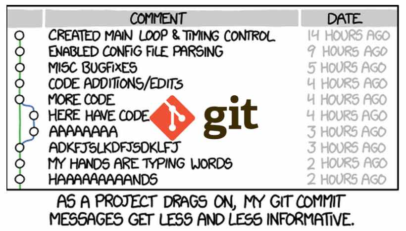
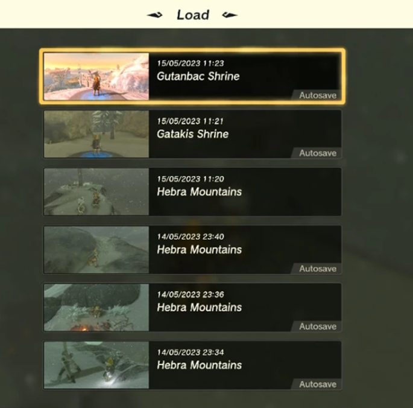
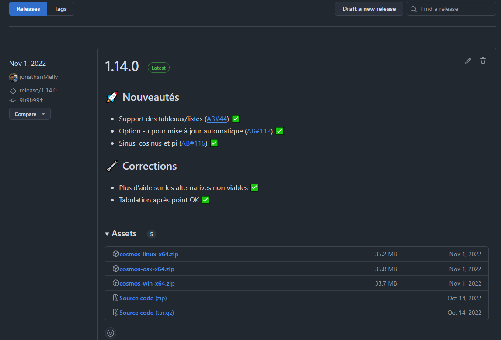

# 🧬 Cycle de vie d’une application

Une application passe par différentes étapes clés qu’il s’agit d’appréhender.
Voici donc une liste simplifiée d’étapes élémentaires :

1. Définition des besoins
2. Écriture
3. Tests
3. Release

## Définiton des besoins

C’est la construction d’un cahier des charges élaboré à partir des besoins du client.

> Cela peut inclure un ou plusieurs prototypes afin de vérifier l’adéquation avec les besoins du client :


## 🖍 Écriture

C’est le moment où le programme est écrit. Puisque le code évolue beaucoup et que la collaboration
est nécessaire pour réaliser de grands projets, on apprécie d’utiliser un système de versioning, comme
[GIT](https://git-scm.com/).

### GIT

Git est un système de versioning populaire qui permet de sauvegarder "toute l’histoire du code".
Autrement dit, `Git` est une sorte de `kopia` avec, en plus, un **suivi des modifications**.  
Ainsi à chaque *snapshot* (point de sauvegarde) est associé un **message** plus ou moins détaillé qui indique ce qui a été fait.
On peut donc **tracer** l'évolution de documents numériques comme le montre l'image suivante :



Peut-être le screenshot suivant sera plus parlant :



L'historique Git fonctionne de manière similaire à un système de sauvegarde automatique dans un jeu vidéo. Lorsqu'on
travaille sur un projet, il est possible de créer des "sauvegardes" à des moments clés, appelées **commits**. Chaque
commit enregistre l'état exact des fichiers, `de la même manière qu'une sauvegarde dans un jeu capture la progression,
les objets et la position` ainsi qu'un message décrivant les modifications effectuées.

Git conserve une trace de toutes ces "sauvegardes", permettant ainsi de **revenir à un état antérieur à tout moment**,
comme
si `on rechargeait une ancienne partie`. Si une erreur survient ou si des modifications non désirées ont été apportées,
il est possible de restaurer une version précédente sans perdre les autres progrès réalisés.

> Git fonctionne en conservant un historique du projet, avec des points de restauration, et offre la possibilité de
> naviguer entre différentes versions, un peu à l'image des sauvegardes automatiques dans un jeu vidéo.

Pour bien comprendre et intégrer le concept, voici un exemple pratique pour *activer* un dépôt avec GIT partant du 
principe que l’outil a déjà été installé (si ce n'est pas le cas se référer à [GIT](https://git-scm.com/downloads)).

#### Étape 1 : Créer un dépôt local

1. **Créer un répertoire pour ton projet :**
   ```shell
   mkdir mon_projet
   cd mon_projet
   ```

2. **Initialiser un dépôt Git :**
   ```shell
   git init
   ```

#### Étape 2 : Ajouter 1-2 fichiers et faire un commit

1. **Créer un fichier dans ce répertoire :**
   Par exemple, un fichier `README.md` :
   ```shell
   echo "# Mon Projet" > README.md
   git status
   ```

2. **Ajouter un deuxième fichier :**
   ```shell
   echo "Ceci est un fichier texte." > fichier.txt
   git status
   ```

3. **Ajouter ces fichiers à l'index Git :**
   ```shell
   git add README.md fichier.txt
   ```

4. **Faire un commit :**
   ```shell
   git commit -m "Ajout de README et fichier.txt"

   ```

> `git status` permet de voir l’état des lieux des modifications en cours...

#### Étape 3 : Ajouter un remote GitHub

1. **Créer un dépôt vide sur GitHub** (sans README, .gitignore, etc.).

2. **Ajoute le dépôt GitHub en tant que remote :**
   Remplacer `URL_DU_DEPOT_GITHUB` par l'URL du dépôt GitHub (par ex :
   `https://github.com/ton-utilisateur/mon_projet.git`).
   ```shell
   git remote add origin https://github.com/ton-utilisateur/mon_projet.git
   ```

> [!TIP]  
> En cas d’erreur de manipulation, pour détruire une mauvaise remote la commande est `git remote remove origin`

#### Étape 4 : Faire un push vers GitHub

1. **Pousse le commit vers GitHub :**
   ```shell
   git push -u origin main
   ```

   Cela envoie le commit local sur la branche `main` (ou `master`) de GitHub.

> [!WARNING]  
> Selon la version ou la configuration de GIT, le nom par défaut est `master` ou `main`. Github ayant choisi
> `main` par défaut, il faut potentiellement renommer `master` en `main` en cas d’erreur: `git branch -M main`

#### Étape 5 : Tag

1. **Pour ajouter un tag (sorte de raccourci sur une version) :**
   ```shell
   git tag v1.0.0
   ```

> [!WARNING]  
> Pour que les tags soient synchronisés, il faut ajouter une option au `push`: `git push --tags`

#### Étape 6 : Cloner le dépôt depuis GitHub

1. **Cloner le dépôt sur un autre répertoire (ou une autre machine) :**
   ```shell
   git clone https://github.com/ton-utilisateur/mon_projet.git
   ```

Cela va créer un répertoire `mon_projet` dans le dossier actuel avec tout le contenu du dépôt GitHub.

#### Résumé des commandes :

```shell
# Créer un répertoire et initialiser Git
mkdir mon_projet
cd mon_projet
git init

# Ajouter des fichiers et faire un commit
echo "# Mon Projet" > README.md

#Vérifier l’état
git status
echo "Ceci est un fichier texte." > fichier.txt
git add README.md fichier.txt

#Vérifier l’état
git status
git commit -m "Ajout de README et fichier.txt"

# Ajouter un remote et faire un push vers GitHub
git remote add origin https://github.com/ton-utilisateur/mon_projet.git
git push -u origin main

#Tag
git tag v1.0.0
git push --tags

# Cloner le dépôt depuis GitHub
git clone https://github.com/ton-utilisateur/mon_projet.git
```

#### Schéma récapitulatif des opérations basiques

```mermaid
graph TD
subgraph Local [Actions Locales]
A[Créer un répertoire local]
B["Initialiser un dépôt Git
'git init .'
__"]
C[Créer/Modifier des fichiers]
ADD[Ajouter des fichiers à l'index
'git add ...'
__
]
COMMIT["Faire un commit local
'git commit -m 'feat(login): added help button''"
__
]
GHREPOEXIST{"Dépôt déjà créé sur github ?"}
G["Ajouter un remote vers GitHub
'git remote add origin $REPO_URL'
__"
]
PUSH["Pousser les commits vers GitHub
'git push' ou 'git push -u origin' (1ère fois)"
__
]

I[Ajouter un tag pour une release
'git tag v1.0.0'
__
]
J[Pousser le tag vers GitHub
'git push tag v1.0.0'
]
end

subgraph Remote ["Actions Distantes (GitHub)"]
GH[Créer un dépôt GitHub]

end

A --> B
B --> C
C --> ADD
ADD --> COMMIT
COMMIT --> GHREPOEXIST
COMMIT --> C
GHREPOEXIST-- oui --> PUSH
GHREPOEXIST-- non --> GH
GH --> G
G --> PUSH
PUSH --> C
PUSH --> I
I --> J
J --> C

style A fill: #045, stroke: #333, stroke-width: 4px
style GH fill: #055, stroke: #333, stroke-width: 4px
style Remote fill: #505, stroke: #333, stroke-width: 4px
style J fill: #505, stroke: #333, stroke-width: 4px
style PUSH fill: #505, stroke: #333, stroke-width: 4px

```



#### 📚 Historique

Voici maintenant un exemple sur l’utilisation de l’historique.

Imaginons qu'un projet ait trois commits successifs avec les messages suivants :

1. **Commit 1** : "Ajout du fichier README.md"
2. **Commit 2** : "Ajout du fichier de configuration"
3. **Commit 3** : "Correction d'un bug dans le code"

##### Étape 1 : Vérifier l'historique des commits

Pour voir l'historique des commits, on peut utiliser la commande suivante :

```shell
git log
```

Cela affichera une liste des commits avec leur identifiant (hash), l'auteur, la date, et le message associé. Voici un
exemple de ce à quoi cela peut ressembler :

```shell
commit 3f5e1bc... (HEAD -> master)
Author: Nom Auteur <email@example.com>
Date:   Lun Oct 9 14:30 2024

    Correction d'un bug dans le code

commit 6a1f2de...
Author: Nom Auteur <email@example.com>
Date:   Lun Oct 9 13:00 2024

    Ajout du fichier de configuration

commit f2c7a12...
Author: Nom Auteur <email@example.com>
Date:   Lun Oct 9 12:00 2024

    Ajout du fichier README.md
```

##### Étape 2 : Naviguer vers un commit précédent

Si on souhaite revenir à l'état du projet tel qu'il était après le **Commit 2**, on peut utiliser la commande suivante
pour "vérifier" cet ancien commit :

```shell
git switch --detach 6a1f2de
```

Là, Git place le projet dans l'état exact où il se trouvait après le commit "Ajout du fichier de configuration". À ce
stade, l'historique reste intact, mais on est temporairement sur un commit spécifique. On peut explorer ou vérifier les
fichiers comme ils étaient à ce moment-là.

##### Étape 3 : Revenir à l'état actuel du projet

Pour revenir à l'état actuel du projet (la dernière version), il suffit de revenir à la branche principale (généralement
appelée `master` ou `main`) :

```shell
git switch main
```

> [!TIP]  
> Historiquement la commande `checkout` était utilisée mais désormais `switch` et `restore` la remplacent...

Ainsi, on retourne à l'état le plus récent du projet, tout en ayant navigué temporairement dans l'historique.

##### Conflits avec des modifications en cours

Si des modifications sont en cours, `git switch` pourrait être problématique et il existe une autre manière
de faire.

Voici donc un exemple montrant comment utiliser **`git worktree`** pour accéder à un tag (sachant que c’est la même chose
pour un commit), travailler dessus, et ensuite effacer le worktree une fois le travail terminé.

###### Contexte :

Vous devez accéder à une ancienne version d'un projet, marquée par un **tag** (par exemple `v1.0.0`), et une fois votre
travail ou inspection terminé, vous souhaitez supprimer ce répertoire temporaire.

::: tip
Au lieu d’un tag, un ID de commit va aussi
:::

###### Étape 1 : Créer un worktree basé sur un tag

Vous pouvez créer un nouveau répertoire de travail à partir du tag `v1.0.0` en utilisant la commande suivante :

```shell
git worktree add ../v1.0.0-worktree v1.0.0
```

- **`../v1.0.0-worktree`** : Le chemin où le nouveau répertoire sera créé.
- **`v1.0.0`** : Le tag que vous voulez consulter ou modifier.

###### Étape 2 : Travailler sur la version taguée

Ensuite, accédez au nouveau répertoire contenant la version du projet correspondant au tag `v1.0.0` :

```shell
cd ../v1.0.0-worktree
```

Vous pouvez maintenant examiner ou modifier les fichiers de cette version, sans perturber votre répertoire de travail
principal.

###### Étape 3 : Supprimer le worktree une fois terminé

Une fois votre travail terminé sur la version taguée, vous pouvez revenir à votre répertoire principal et supprimer le
worktree pour éviter d'encombrer votre disque :

1. Revenez à votre répertoire principal :
   ```shell
   cd ../mon_projet
   ```

2. Supprimez le worktree :
   ```shell
   git worktree remove ../v1.0.0-worktree
   ```

Cette commande supprime le lien du worktree avec Git, et le répertoire `v1.0.0-worktree` est supprimé du disque.

### 🧾 Résumé des commandes :

```shell
# Créer un nouveau worktree basé sur le tag v1.0.0
git worktree add ../v1.0.0-worktree v1.0.0

# Aller dans le répertoire du worktree
cd ../v1.0.0-worktree

# Revenir au répertoire principal une fois terminé
cd ../mon_projet

# Supprimer le worktree
git worktree remove ../v1.0.0-worktree
```

###### Conclusion :

**`git worktree`** permet de créer des répertoires temporaires basés sur des tags (ou des commits) pour explorer ou modifier des versions
spécifiques du projet sans perturber le répertoire de travail principal. Une fois le travail terminé, le worktree peut
être facilement supprimé avec `git worktree remove` pour maintenir un environnement propre et éviter d'encombrer votre
espace disque.

##### Conclusion

Avec Git, il est possible de naviguer entre différentes versions du projet en utilisant les identifiants de commit, et
de revenir facilement à l'état actuel. C'est comme consulter d'anciennes "sauvegardes" du projet sans perdre les
modifications récentes.

#####  

## 🧪 Tests

Même si elle est aussi testée durant l’écriture (notamment avec des tests unitaires et/ou d’intégration automatisés),
une application doit être validée avant de partir en production, pour cela, on utilise un
[protocole de test](./TestsFonctionnelsSucrerie.docx).

## Release

Le système de versioning peut aider dans cette étape, notamment au travers d’une plateforme comme
[github](https://github.com/) qui permet de faire
une [release](https://docs.github.com/en/repositories/releasing-projects-on-github/managing-releases-in-a-repository).



Dans tous les cas, un `tag` est bienvenue si pas nécessaire :

### Étape 1 : Ajouter un tag localement

1. **Créer un tag pour la release**  
   Par exemple, pour la première version `v1.0.0` :
   ```shell
   git tag -a v1.0.0 -m "Première release de mon projet"
   ```

    - `-a v1.0.0` : Crée un tag annoté appelé `v1.0.0`.
    - `-m "message"` : Ajoute un message à la création du tag.

2. **Vérifier les tags existants**  
   Pour voir si le tag a bien été créé :
   ```shell
   git tag
   ```

   Cette commande liste tous les tags disponibles dans le dépôt.

### Étape 2 : Pousser le tag vers GitHub

1. **Pousser le tag sur le dépot distant** :
   ```shell
   git push origin v1.0.0
   ```

   Cette commande pousse le tag `v1.0.0` vers le dépôt distant.

2. **Pousser tous les tags d'un coup (optionnel)**  
   S’il y a plusieurs tags à pousser, une commande peut le faire en une fois :
   ```shell
   git push --tags
   ```

   Cela va pousser tous les tags locaux qui n'ont pas encore été envoyés vers GitHub.

### Étape 3 : Vérifier sur GitHub

- Une fois le tag poussé, on peut le voir sur GitHub sous l'onglet **"Releases"** ou **"Tags"** dans le dépôt.

### Résumé des commandes :

```shell
# Créer un tag pour la première release
git tag -a v1.0.0 -m "Première release de mon projet"

# Pousser le tag vers GitHub
git push origin v1.0.0

# (Optionnel) Pousser tous les tags d'un coup
git push --tags
```

> Cela permet de marquer une version stable du projet et de la rendre accessible aux collaborateurs ou à d'autres
> utilisateurs directement via GitHub.

### Déploiement

Il faut aussi penser au déploiement via un [assistant d’installation](https://installforge.net/) si possible.

#### Suppression

Sans oublier la `désinstallation` du logiciel (prise en charge par l’assistant à priori)

## Conclusion

Le développement d’application comporte plus que la *simple écriture de code* et ces étapes doivent être prises en
compte notamment durant la phase de planification afin d’éviter d’avoir du retard...


