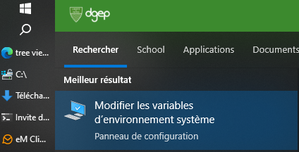

# Chemins d’une arborescence

## Chemins absolus et relatifs

### 1. Chemins absolus

#### Dans le monde humain

Imaginez que vous souhaitiez rendre visite à un ami qui habite dans une autre ville. Un chemin absolu est comme si vous
donniez son adresse complète pour le GPS : **"Rue de la Liberté 32, 1298 Combles, Suisse"**.

Peu importe où vous vous trouvez actuellement, cette adresse est complète et vous y mènera directement. Elle est
universelle et ne dépend pas de votre position actuelle.

#### En informatique

Un chemin absolu est une adresse complète qui mène directement à un fichier ou un dossier, en partant de la racine du
système de fichiers (comme le disque dur).

- Sur Windows, un chemin absolu commence généralement par la lettre d'un lecteur suivie de deux points et d'un
  antislash (`\`).
- Exemples de chemins absolus :
    - `C:\Utilisateurs\MonDossier\Document.txt`
    - `D:\Projets\Code\script.py`

Un chemin absolu est universel ; peu importe l'endroit d'où vous l'appelez, il vous mènera toujours à la même
destination.

### 2. Chemins relatifs

#### Dans le monde humain

Imaginez maintenant que vous êtes déjà dans la même ville que votre ami, disons à quelques rues seulement de chez lui.
Plutôt que de donner son adresse complète, il pourrait vous dire : **"Depuis là où tu es, prends la première à gauche,
puis la deuxième à droite, et tu es chez moi."**

Ce chemin est relatif à votre emplacement actuel. Il ne fonctionne que si vous êtes déjà proche de chez lui et que vous
savez où vous vous trouvez au départ. Le chemin n'a de sens que dans le contexte de votre position actuelle.

#### En informatique

Un chemin relatif, comme son nom l'indique, est relatif à l'emplacement courant (le répertoire dans lequel vous vous
trouvez). Au lieu de commencer par la racine du disque, il indique simplement comment se déplacer à partir de
l'emplacement actuel.

- Symboles utilisés dans les chemins relatifs :
    - `.` (un point) : représente le dossier courant.
    - `..` (deux points) : représente le dossier parent (un niveau au-dessus).

- Exemples de chemins relatifs :
    - `.\fichier.txt` : le fichier `fichier.txt` dans le dossier courant.
    - `..\MonDossier\fichier.txt` : le fichier `fichier.txt` dans le dossier `MonDossier`, situé un niveau au-dessus de
      l'emplacement courant.

Les chemins relatifs sont utiles lorsque vous travaillez dans une structure de dossiers où le chemin complet pourrait
être long ou susceptible de changer.

### Synthèse des chemins absolus et relatifs

| A/R     | Humain                                                                                                                                                | Informatique                                                                     |
|---------|-------------------------------------------------------------------------------------------------------------------------------------------------------|----------------------------------------------------------------------------------|
| Absolu  | Une adresse postale complète, qui peut être utilisée à partir de n'importe quel point de départ pour arriver à destination.                           | `C:\Utilisateurs\Marie\Documents\Rapport.docx`                                   |
| Relatif | Des indications de direction qui ne sont valides que si vous êtes déjà dans la même zone,  et qui sont données par rapport à votre emplacement actuel | `..\Documents\Rapport.docx` (à partir d'un dossier parent du répertoire courant) |

Le choix entre un chemin absolu et un chemin relatif dépend souvent de votre point de départ. Un chemin
absolu est universel et précis, alors qu'un chemin relatif est contextuel et dépend de votre position actuelle dans la
structure de fichiers (ou dans la ville, pour le monde humain).

## La variable système PATH sur Windows

La variable système **PATH** est une variable d'environnement qui indique au système d'exploitation où trouver les
exécutables (commandes, programmes, scripts) nécessaires.

### 1. Utilité de la variable PATH

Lorsque vous tapez une commande dans la console (cmd, PowerShell), le système d'exploitation recherche d'abord dans le
dossier courant. Si la commande n'est pas trouvée, il parcourt ensuite les chemins répertoriés dans la variable `PATH`.
Si la commande se trouve dans l'un de ces dossiers, elle sera exécutée.

Cela permet d'exécuter des programmes sans avoir à fournir leur chemin complet. Par exemple :

- Si `python.exe` se trouve dans `C:\Python39`, il suffit d'ajouter `C:\Python39` à la variable `PATH`. Ensuite, en
  tapant `python` dans le terminal, le système saura où trouver l'exécutable Python.

### 2. Modification de la variable PATH

Pour modifier ou ajouter un chemin à la variable `PATH` sur Windows :

1. **Accéder aux variables d'environnement** :
    - Faites un clic droit sur "Ce PC" ou "Ordinateur", puis cliquez sur "Propriétés" (ou touche windows =>
      saisir `path` [enter]).
    - Allez dans "Paramètres système avancés".
    - Cliquez sur "Variables d'environnement".

2. **Modifier la variable `PATH`** :
    - Dans la section "Variables système", recherchez la variable `Path` et sélectionnez-la.
    - Cliquez sur "Modifier".
    - Ajoutez le nouveau chemin (par exemple, `C:\MonProgramme\Bin`) en cliquant sur "Nouveau" et en saisissant le
      chemin.

3. **Enregistrer et redémarrer** :
    - Cliquez sur "OK" pour valider les changements.
    - Il est parfois nécessaire de redémarrer votre terminal ou votre ordinateur pour que les modifications prennent
      effet.

---

### Exemple d'utilisation

Supposons que vous ayez un utilitaire `kopia.exe` dans le dossier `C:\nomad\apps\kopia`. Si vous voulez pouvoir
exécuter `kopia.exe` depuis n'importe quel répertoire sans indiquer son chemin complet, vous pouvez :

1. Ajouter `C:\nomad\apps\kopia` à la variable `PATH`.
2. Ensuite, il suffit de taper `kopia` dans n'importe quel terminal, et le script sera trouvé et exécuté.

---

### Résumé

- **Chemin absolu** : chemin complet à partir de la racine du système de fichiers.
- **Chemin relatif** : chemin à partir de l'emplacement courant.
- **Variable `PATH`** : liste de dossiers où Windows recherche les exécutables.

En comprenant ces notions, vous pourrez mieux naviguer dans votre système de fichiers et utiliser efficacement la ligne
de commande sur Windows.

