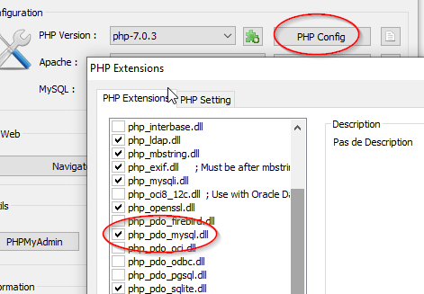

# Base de donnée et PHP

Petit exemple d’utilisation d’une base de données avec PHP et HTML...

## Configuration de l'environnement UwAmp

1. **Lancez UwAmp** : Démarrez UwAmp pour activer le serveur Apache et MySQL.
2. Vérifier que PDO est disponible/actif

3. **Accédez à phpMyAdmin** :  
   Ouvrez [http://localhost/phpmyadmin](http://localhost/phpmyadmin).

3. **Créer une base de données** :
    - Allez dans **phpMyAdmin**.
    - Cliquez sur **Nouvelle base de données** et nommez-la `garage`.
    - Validez.


## Création d'une table `cars`

Dans **phpMyAdmin**, exécutez la requête SQL suivante pour créer une table appelée `cars` :

```sql
CREATE TABLE cars
(
    id    INT AUTO_INCREMENT PRIMARY KEY,
    brand  VARCHAR(50)    NOT NULL,
    model VARCHAR(50)    NOT NULL,
    year  INT            NOT NULL,
    price DECIMAL(10, 2) NOT NULL
);
```

Ajoutez quelques données dans cette table avec la requête suivante :

```sql
INSERT INTO cars (brand, model, year, price)
VALUES ('Toyota', 'Corolla', 2020, 20000.00),
       ('Honda', 'Civic', 2019, 18000.00),
       ('Ford', 'Focus', 2021, 22000.00),
       ('BMW', 'Series 3', 2022, 35000.00);
```


## Page PHP/HTML pour se connecter et afficher les données

Créez un fichier `cars.php` dans le dossier `www` d'UwAmp :

```php
<?php
// Paramètres de connexion à la base de données
$host = "127.0.0.1";
$dbname = "garage";
$username = "root";
$password = "";

// Connexion à MySQL avec PDO
try {
    $pdo = new PDO("mysql:host=$host;dbname=$dbname;charset=utf8", $username, $password);
    $pdo->setAttribute(PDO::ATTR_ERRMODE, PDO::ERRMODE_EXCEPTION);
} catch (PDOException $e) {
    die("Erreur de connexion : " . $e->getMessage());
}

// Requête pour récupérer les données
$query = "SELECT * FROM cars";
$stmt = $pdo->query($query);
$cars = $stmt->fetchAll(PDO::FETCH_ASSOC);
?>

<!DOCTYPE html>
<html lang="fr">
<head>
    <meta charset="UTF-8">
    <meta name="viewport" content="width=device-width, initial-scale=1.0">
    <title>Liste des Voitures</title>
    <style>
        table {
            border-collapse: collapse;
            width: 60%;
            margin: 20px auto;
        }
        th, td {
            border: 1px solid #ddd;
            padding: 8px;
            text-align: center;
        }
        th {
            background-color: #f2f2f2;
        }
    </style>
</head>
<body>
    <h2 style="text-align: center;">Liste des Voitures</h2>
    <table>
        <thead>
            <tr>
                <th>ID</th>
                <th>Marque</th>
                <th>Modèle</th>
                <th>Année</th>
                <th>Prix (CHF)</th>
            </tr>
        </thead>
        <tbody>
            <?php foreach ($cars as $car): ?>
                <tr>
                    <td><?= htmlspecialchars($car['id']) ?></td>
                    <td><?= htmlspecialchars($car['brand']) ?></td>
                    <td><?= htmlspecialchars($car['model']) ?></td>
                    <td><?= htmlspecialchars($car['year']) ?></td>
                    <td><?= htmlspecialchars(number_format($car['price'], 2)) ?></td>
                </tr>
            <?php endforeach; ?>
        </tbody>
    </table>
</body>
</html>
```


### Explications du Code PHP

1. **Connexion à MySQL** : Utilise **PDO** pour se connecter à la base de données.
    - `mysql:host` : L'hôte (ici, `127.0.0.1`).
    - `dbname` : Le nom de la base de données (`garage`).
    - `username` : Par défaut, avec UwAmp, c'est `root`.
    - `password` : Aucun mot de passe par défaut.

2. **Requête SQL** : La requête `SELECT * FROM cars` récupère toutes les lignes de la table `cars`.

3. **Rendu HTML** : Les données sont affichées dynamiquement dans un tableau HTML grâce à une boucle `foreach`.

4. **Sécurité** :
    - `htmlspecialchars()` est utilisé pour protéger contre les injections XSS.
    - Les prix sont formatés avec `number_format()` pour afficher 2 décimales.


### Résultat Attendu

Un tableau HTML centré contenant les informations des voitures :

| ID | Marque | Modèle   | Année | Prix (CHF) |
|----|--------|----------|-------|------------|
| 1  | Toyota | Corolla  | 2020  | 20,000.00  |
| 2  | Honda  | Civic    | 2019  | 18,000.00  |
| 3  | Ford   | Focus    | 2021  | 22,000.00  |
| 4  | BMW    | Series 3 | 2022  | 35,000.00  |


### Conseils

- **Erreur possible** : Si vous avez une erreur `Connection refused`, vérifiez que MySQL est activé.
- **Personnalisation** : Vous pouvez ajouter des styles CSS pour rendre le tableau plus esthétique.