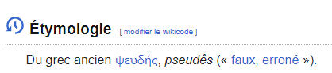
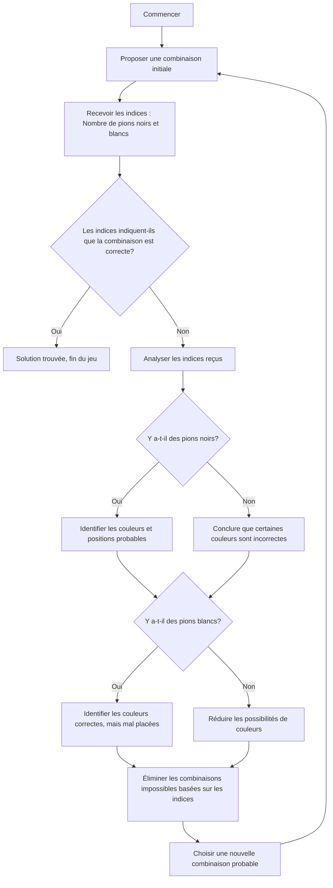

# Pseudo code



Lorsque l'on parle de pseudocode, il s'agit d'une façon simplifiée de représenter la logique d'un algorithme sans se
préoccuper de la syntaxe d'un langage de programmation spécifique. Le pseudocode utilise un mélange de langage naturel (
comme le français) et de structures de contrôle de programmation (comme les boucles, les conditions, etc.) pour
expliquer comment un programme fonctionne ou doit fonctionner. C'est un outil de conception très utile pour planifier le
code avant de le mettre en œuvre dans un langage de programmation particulier.

Voici quelques caractéristiques importantes du pseudocode :

1. **Lisibilité** : Le pseudocode doit être facile à lire et à comprendre pour toute personne ayant des connaissances de
   base en programmation ou en logique algorithmique.
2. **Clarté** : Chaque étape de l'algorithme doit être clairement définie et expliquée pour éviter toute ambiguïté.
3. **Simplicité** : Le pseudocode n'a pas besoin d'inclure des détails spécifiques à un langage de programmation (comme
   les types de données ou les conventions de syntaxe). Il se concentre sur la logique de l'algorithme.


## Éléments clés

Pour écrire un pseudo-code, on doit d’abord savoir quelles sont les primitives qu’on peut imaginer
trouver sur n’importe quel ordinateur.

---

### 1. Entrées (Input)

Les **entrées** représentent les données que le programme reçoit de l'utilisateur ou d'une autre source. Dans le
pseudocode, elles sont souvent représentées par des instructions comme "Lire" ou "Demander à l'utilisateur".

**Exemple** :

```
Afficher "Entrez un nombre :"
Lire nombre
```

Dans cet exemple, le programme demande à l'utilisateur d'entrer un nombre, qui est ensuite stocké dans une variable
nommée `nombre`.

---

### 2. Sorties (Output)

Les **sorties** sont les informations que le programme renvoie à l'utilisateur, généralement sous forme de texte ou de
résultats de calculs. Elles sont représentées par des instructions comme "Afficher" ou "Écrire".

**Exemple** :

```
Afficher "Le résultat est : ", resultat
```

Ici, le programme affiche à l'utilisateur le contenu de la variable `resultat`.

---

### 3. Calculs arithmétiques (Calculations)

Les **calculs arithmétiques** sont les opérations mathématiques que le programme effectue, telles que l'addition, la
soustraction, la multiplication ou la division. Ils permettent de manipuler les données d'entrée pour obtenir des
résultats.

**Exemple** :

```
somme ← nombre1 + nombre2
produit ← nombre1 * nombre2
```

Dans cet exemple, deux calculs sont effectués :

- `somme` stocke le résultat de l'addition de `nombre1` et `nombre2`.
- `produit` stocke le résultat de leur multiplication.

---

### 4. Conditions (Conditions)

Les **conditions** sont des instructions qui permettent au programme de prendre des décisions basées sur certains
critères. Elles sont généralement représentées par des structures `Si`, `Sinon Si`, et `Sinon`.

**Exemple** :

```
Si nombre > 0
    Afficher "Le nombre est positif."
Sinon Si nombre < 0
    Afficher "Le nombre est négatif."
Sinon
    Afficher "Le nombre est zéro."
Fin Si
```

Ici, le programme vérifie si `nombre` est positif, négatif ou égal à zéro, et affiche un message correspondant.

---

### 5. Répétitions (Loops)

Les **répétitions** permettent d'exécuter une ou plusieurs instructions plusieurs fois, jusqu'à ce qu'une certaine
condition soit remplie. Dans le pseudocode, elles peuvent être représentées par des boucles `Pour` (for
loops), `Tant que` (while loops), ou `Répéter...Jusqu'à`.

**Exemple** d'une boucle `Pour` :

```
Pour i allant de 1 à 10
    Afficher "Le nombre est : ", i
Fin Pour
```

Cette boucle `Pour` exécute le bloc d'instructions 10 fois, en affichant les nombres de 1 à 10.

**Exemple** d'une boucle `Tant que` :

```
Tant que nombre ≠ 0
    Afficher "Entrez un nombre (0 pour arrêter) :"
    Lire nombre
Fin Tant que
```

Cette boucle continue à demander un nombre à l'utilisateur tant que la valeur entrée n'est pas égale à 0.

---

### Synthèse des clés d’un pseudo-code

Le pseudocode utilise des **entrées** pour récupérer des données, des **sorties** pour fournir des informations à
l'utilisateur, des **calculs arithmétiques** pour manipuler ces données, des **conditions** pour prendre des décisions,
et des **répétitions** pour exécuter des blocs d'instructions plusieurs fois. C'est une manière simple et claire de
décrire un algorithme avant de le traduire en code réel.

### Exemple complet

Voici un exemple qui combine tous ces éléments :

```
Début
    // Entrées : demander deux nombres
    Afficher "Entrez le premier nombre :"
    Lire nombre1
    Afficher "Entrez le deuxième nombre :"
    Lire nombre2
    
    // Calcul arithmétique : additionner les deux nombres
    somme ← nombre1 + nombre2
    
    // Condition : vérifier si la somme est supérieure à 100
    Si somme > 100
        Afficher "La somme est supérieure à 100."
    Sinon
        Afficher "La somme est inférieure ou égale à 100."
    Fin Si
    
    // Répétition : afficher la somme 5 fois
    Pour i allant de 1 à 5
        Afficher "La somme est : ", somme
    Fin Pour
Fin
```

Dans cet exemple :

1. **Entrées** : Le programme demande à l'utilisateur de saisir deux nombres.
2. **Calculs arithmétiques** : Il additionne ces deux nombres.
3. **Condition** : Il vérifie si la somme est supérieure à 100.
4. **Répétition** : La somme est affichée 5 fois.

---


## Exemple 2 : comparaison de nombre
Voici un autre exemple commenté pour illustrer

---

**Titre** : *Pseudocode pour trouver le plus grand de deux nombres*

```
Début
    // Demander à l'utilisateur d'entrer le premier nombre
    Afficher "Entrez le premier nombre :"
    Lire nombre1
    
    // Demander à l'utilisateur d'entrer le deuxième nombre
    Afficher "Entrez le deuxième nombre :"
    Lire nombre2
    
    // Comparer les deux nombres
    Si nombre1 > nombre2
        Afficher "Le plus grand nombre est : ", nombre1
    Sinon Si nombre2 > nombre1
        Afficher "Le plus grand nombre est : ", nombre2
    Sinon
        Afficher "Les deux nombres sont égaux."
    Fin Si
Fin
```

---

### Explication du pseudocode

1. **Lecture des entrées** :
   - Le programme demande d'abord à l'utilisateur de saisir le premier nombre (`nombre1`).
   - Ensuite, il demande de saisir un deuxième nombre (`nombre2`).

2. **Comparaison des deux nombres** :
   - Une condition `Si` est utilisée pour comparer les deux nombres :
      - Si `nombre1` est supérieur à `nombre2`, le pseudocode affiche que `nombre1` est le plus grand.
      - Si `nombre2` est supérieur à `nombre1`, le pseudocode affiche que `nombre2` est le plus grand.
      - Si les deux nombres sont égaux, un message spécifique est affiché pour indiquer cette égalité.

3. **Affichage du résultat** :
   - En fonction du résultat de la comparaison, le programme affiche lequel des deux nombres est le plus grand ou s'ils
     sont égaux.

---

## Exemple 3 : conversion de devise
Enfin, un dernier exemple afin de se familiariser avec le pseudo-code

---

**Titre** : *Pseudocode pour la conversion de devise*

```
Début
    Afficher "Bienvenue dans le convertisseur de devises"
    
    Afficher "Entrez le montant à convertir :"
    Lire montant
    
    Afficher "Entrez le taux de conversion (1 unité de devise source vers devise cible) :"
    Lire taux_conversion
    
    montant_converti ← montant * taux_conversion
    
    Afficher "Le montant converti est : ", montant_converti
    
    Afficher "Merci d'avoir utilisé le convertisseur de devises"
Fin
```

---

### Explication du pseudocode

1. **Début et Fin** : Ces mots délimitent les sections du pseudocode pour indiquer où commence et où se termine le
   programme.
2. **Saisie des données utilisateur** :
   - Le programme demande d'abord à l'utilisateur de saisir le montant à convertir.
   - Ensuite, il demande le taux de conversion (le taux de change entre les deux devises).
3. **Calcul du montant converti** :
   - Le pseudocode effectue une simple opération mathématique : il multiplie le montant par le taux de conversion pour
     obtenir le montant converti.
4. **Affichage du résultat** :
   - Le montant converti est affiché à l'utilisateur.
5. **Conclusion** : Un message final est affiché pour remercier l'utilisateur.


## Version graphique
On peut écrire du pseudo-code et on peut aussi le *dessiner* :



### Explication détaillée des étapes :

1. **Commencer** : Démarrer le jeu.
2. **Proposer une combinaison initiale** : Faire une première proposition de couleurs.
3. **Recevoir les indices** : Recevoir le retour de l’autre joueur, composé de :
    - **Pions noirs** : Couleur correcte à la bonne position.
    - **Pions blancs** : Couleur correcte mais mal placée.
4. **Les indices indiquent-ils que la combinaison est correcte ?** : Vérifier si les indices signifient que la proposition est entièrement correcte.
    - Si oui, **Solution trouvée, fin du jeu** : La combinaison a été trouvée.
    - Si non, procéder à une analyse plus approfondie des indices.
5. **Analyser les indices reçus** : Analyser les pions noirs et blancs pour obtenir des informations.
6. **Y a-t-il des pions noirs ?** : Y a-t-il des pions noirs parmi les indices ?
    - Si oui, **Identifier les couleurs et positions probables** : Identifier quelles couleurs et positions sont probablement correctes.
    - Si non, **Conclure que certaines couleurs sont incorrectes** : Déduire que certaines couleurs ne font pas partie de la solution et les éliminer des futures propositions.
7. **Y a-t-il des pions blancs ?** : Y a-t-il des pions blancs parmi les indices ?
    - Si oui, **Identifier les couleurs correctes, mais mal placées** : Identifier quelles couleurs sont correctes mais ne sont pas à la bonne position.
    - Si non, **Réduire les possibilités de couleurs** : Restreindre les couleurs restantes possibles.
8. **Éliminer les combinaisons impossibles basées sur les indices** : Utiliser les indices pour éliminer les combinaisons qui ne peuvent pas être la solution.
9. **Choisir une nouvelle combinaison probable** : Faire une nouvelle proposition basée sur l’analyse des indices et les possibilités restantes.
10. Revenir à **Proposer une combinaison** jusqu'à ce que la combinaison correcte soit trouvée.


## Conclusion

Le pseudocode est donc une étape essentielle dans la conception et la planification d'un programme, car il permet de
définir la logique de manière claire et compréhensible avant de se plonger dans la programmation proprement dite.
L'exemple de conversion de devise illustre bien la manière dont un pseudocode peut servir à détailler chaque étape de
l'algorithme et à s'assurer que la logique globale est correcte et bien définie.