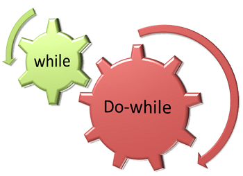
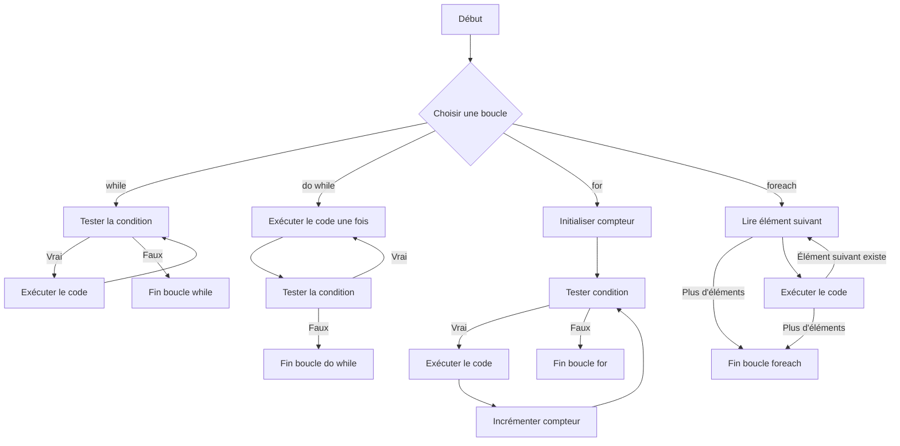

# Répétitions



Voici un petit guide sur les boucles en C#.

## Boucle `while`

La boucle `while` exécute son bloc tant qu'une condition est vraie.

### Exemple

Affichage d'un montant en CHF jusqu'à atteindre une valeur maximale.

```csharp
double montant = 10.00; // en CHF
while (montant <= 50.00)
{
    Console.WriteLine($"Montant actuel : {montant} CHF");
    montant += 10.00; // ajoute 10 CHF à chaque itération
}
```

## Boucle `do while`

La boucle `do while` fonctionne de la même manière que `while`, mais elle garantit que le bloc de code est exécuté au
moins une fois, car la condition est vérifiée après une première éxécution du corps.

### Exemple

Simulons un paiement en CHF qui continue jusqu'à un plafond, en s'assurant qu'un montant est affiché au moins une fois.

```csharp
double paiement = 5.00; // en CHF
do
{
    Console.WriteLine($"Paiement en cours : {paiement} CHF");
    paiement += 5.00; // ajoute 5 CHF à chaque itération
} while (paiement <= 25.00);
```

## Boucle `for`

La boucle `for` est utile pour des exécutions avec un nombre fixe d'itérations.

### Exemple

Supposons que l'on veut afficher une série de transactions de 5 CHF chacune, cinq fois.

```csharp
for (int i = 1; i <= 5; i++)
{
    Console.WriteLine($"Transaction {i}: 5 CHF");
}
```

## Boucle `foreach`

Bien que `foreach` soit principalement utilisée avec des collections, on peut simuler un contexte simple en l'utilisant
avec un bloc de texte comme exemple.

### Exemple

Afficher chaque mot d'une phrase.

```csharp
string phrase = "Les boucles en C# sont pratiques";
foreach (char c in phrase)
{
    Console.Write($"{c} ");
}
Console.WriteLine();
```

## Diagramme de flux



## Manipulations avancées

Les mots-clés `break` et `continue` en C# permettent de contrôler le flux à l'intérieur des boucles, mais ils doivent
être utilisés avec précaution pour éviter de rendre le code difficile à comprendre.

### `break`

Le mot-clé `break` permet de quitter une boucle immédiatement, même si la condition n'est pas remplie.

#### Exemple

Ici, la boucle s'arrête dès qu’un montant supérieur ou égal à 30 CHF est atteint.

```csharp
double montant = 10.00;
while (montant <= 50.00)
{
    if (montant >= 30.00)
    {
        break; // Quitte la boucle immédiatement
    }
    Console.WriteLine($"Montant actuel : {montant} CHF");
    montant += 10.00;
}
```

> **Avertissement :** Utiliser `break` de manière excessive peut rendre le flux de la boucle difficile à suivre.
> Assurez-vous qu'il est justifié pour que la logique reste claire.

### `continue`

Le mot-clé `continue` permet de passer immédiatement à l'itération suivante de la boucle, en sautant le code restant
dans le bloc de la boucle pour cette itération.

#### Exemple

Dans cet exemple, si le montant est de 20 CHF, on le saute pour passer directement à l’itération suivante.

```csharp
double montant = 10.00;
while (montant <= 50.00)
{
    if (montant == 20.00)
    {
        montant += 10.00;
        continue; // Passe à l'itération suivante
    }
    Console.WriteLine($"Montant actuel : {montant} CHF");
    montant += 10.00;
}
```

> **Avertissement :** L'utilisation de `continue` peut nuire à la lisibilité du code si elle est utilisée de manière
> excessive ou non nécessaire. Elle peut introduire des comportements inattendus, surtout si le code qui suit est
> important pour le traitement de la boucle.
