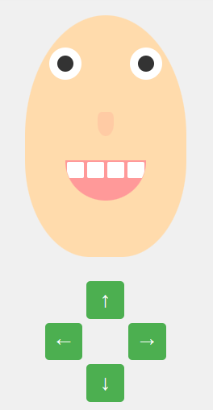
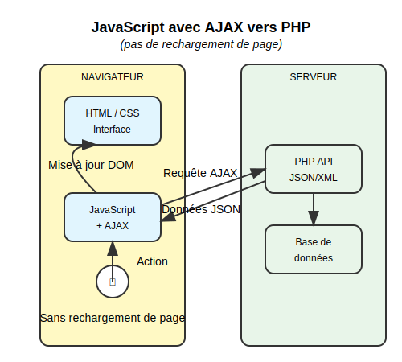

# Création d'un visage interactif avec CSS Flexbox, Grid et JavaScript

## Introduction aux technologies web

Avant de commencer, voici un rappel des technologies que nous allons utiliser :

- **HTML** : Structure le contenu de la page web
- **CSS** : Définit l'apparence des éléments HTML
- **JavaScript** : Rend les pages interactives (côté client)
- **PHP** (pour comparaison) : Génère du HTML dynamiquement (côté serveur)

Contrairement au PHP qui s'exécute sur le serveur avant d'envoyer le HTML au navigateur, notre démonstration utilise uniquement des technologies côté client (HTML/CSS/JavaScript) pour créer une interface interactive.

### Javascript client


### PHP serveur avec rechargement


### Javascript vers PHP sans rechargement


## Les unités en CSS

Avant d'aller plus loin, il est important de comprendre les différentes unités utilisées en CSS :

- **px (pixels)** : Unité fixe, 1px correspond généralement à un point sur l'écran
- **% (pourcentage)** : Relatif à l'élément parent
- **em** : Relatif à la taille de police de l'élément
- **rem** : Relatif à la taille de police de l'élément racine (html)
- **vw/vh** : Relatif à la largeur/hauteur de la fenêtre (viewport)
- **fr (fraction)** : Spécifique à CSS Grid, représente une fraction de l'espace disponible

### Focus sur l'unité fr

L'unité `fr` est particulièrement utile dans CSS Grid :
- Elle représente une fraction de l'espace disponible dans le conteneur
- Permet une distribution proportionnelle de l'espace
- Contrairement aux pourcentages, les fractions s'adaptent à l'espace restant après avoir tenu compte des éléments de taille fixe

Exemple :
```css
grid-template-columns: 1fr 2fr 1fr;
```
Dans cet exemple :
- La colonne du milieu obtient 2 fois plus d'espace que les autres
- Si le conteneur fait 400px, et sans gap, la répartition sera : 100px, 200px, 100px
- Si on ajoute un élément fixe : `grid-template-columns: 100px 1fr 2fr 1fr;`, les fractions se partageront les 300px restants

## Étape 1 : Structure HTML de base

Commençons par créer la structure HTML qui servira de fondation à notre visage :

```html
<div class="face-container" id="face">
    <!-- La structure sera complétée progressivement -->
</div>
```

## Étape 2 : Création du visage - Structure principale avec Grid

Définissons d'abord le conteneur principal du visage en utilisant CSS Grid :

```html
<div class="face-container" id="face">
    <!-- Contenu à venir -->
</div>
```

```css
.face-container {
    display: grid;
    grid-template-columns: 1fr;
    grid-template-rows: 2fr 1fr 2fr;
    width: 200px;
    height: 300px;
    background-color: #ffdbac;
    border-radius: 50% 50% 40% 40%;
    position: relative;
    transition: all 0.3s ease;
}
```

Cette configuration CSS crée :
- Une grille avec 3 rangées (pour les yeux, le nez et la bouche)
- Les rangées du haut et du bas sont deux fois plus grandes que celle du milieu (`2fr 1fr 2fr`)
- La forme ovale du visage avec `border-radius`

### Explication de border-radius

La propriété `border-radius` permet d'arrondir les coins d'un élément :

```css
border-radius: 50% 50% 40% 40%;
```

Ces quatre valeurs correspondent aux coins dans cet ordre :
1. Haut-gauche (50%)
2. Haut-droit (50%)
3. Bas-droit (40%)
4. Bas-gauche (40%)

Dans notre visage :
- Les coins supérieurs sont plus arrondis (50%) pour créer le haut du crâne
- Les coins inférieurs sont moins arrondis (40%) pour former le menton

On peut également l'écrire ainsi pour plus de clarté :
```css
border-radius: 50% 50% 40% 40%;
/* Équivalent à : */
border-top-left-radius: 50%;
border-top-right-radius: 50%;
border-bottom-right-radius: 40%;
border-bottom-left-radius: 40%;
```

Quand `border-radius` est exprimé en pourcentage :
- Pour les coins horizontaux : pourcentage relatif à la largeur de l'élément
- Pour les coins verticaux : pourcentage relatif à la hauteur de l'élément

Un `border-radius: 50%` sur un carré crée un cercle parfait.

## Étape 3 : Ajout des yeux avec Flexbox

Ajoutons les yeux en utilisant Flexbox pour les aligner horizontalement :

```html
<div class="face-container" id="face">
    <div class="eyes">
        <div class="eye">
            <div class="pupil"></div>
        </div>
        <div class="eye">
            <div class="pupil"></div>
        </div>
    </div>
</div>
```

```css
.eyes {
    display: flex;
    justify-content: space-around;
    align-items: center;
    grid-row: 1;
}

.eye {
    width: 40px;
    height: 40px;
    background-color: white;
    border-radius: 50%;
    display: flex;
    justify-content: center;
    align-items: center;
}

.pupil {
    width: 20px;
    height: 20px;
    background-color: #333;
    border-radius: 50%;
}
```

L'utilisation de Flexbox ici est parfaite car :
- Nous avons besoin d'aligner les yeux sur une seule dimension
- `justify-content: space-around` distribue l'espace autour des yeux
- `align-items: center` les centre verticalement
- Chaque œil contient lui-même un élément pupille, également centré avec Flexbox

Notez que pour les yeux et les pupilles, nous utilisons `border-radius: 50%`. Comme ces éléments ont la même largeur et hauteur (respectivement 40px et 20px), cela crée des cercles parfaits.

## Étape 4 : Ajout du nez

Ajoutons maintenant le nez au milieu du visage :

```html
<div class="face-container" id="face">
    <div class="eyes">
        <!-- Code des yeux (voir ci-dessus) -->
    </div>
    
    <div class="nose"></div>
</div>
```

```css
.nose {
    grid-row: 2;
    justify-self: center;
    width: 20px;
    height: 30px;
    background-color: #ffcba4;
    border-radius: 30% 30% 60% 60%;
}
```

Le nez est positionné dans la deuxième rangée de notre grille (`grid-row: 2`) et centré horizontalement avec `justify-self: center`.

Pour le nez, nous utilisons un `border-radius` asymétrique (30% en haut, 60% en bas) pour créer une forme arrondie qui ressemble à un nez.

## Étape 5 : Ajout de la bouche avec des dents (Grid imbriqué)

Complétons notre visage avec une bouche contenant des dents, en utilisant Grid à l'intérieur de Grid :

```html
<div class="face-container" id="face">
    <div class="eyes">
        <!-- Code des yeux -->
    </div>
    
    <div class="nose"></div>
    
    <div class="mouth">
        <div class="tooth"></div>
        <div class="tooth"></div>
        <div class="tooth"></div>
        <div class="tooth"></div>
    </div>
</div>
```

```css
.mouth {
    grid-row: 3;
    width: 100px;
    height: 50px;
    background-color: #ff9999;
    border-radius: 0 0 50px 50px;
    justify-self: center;
    align-self: start;
    overflow: hidden;
    display: grid;
    grid-template-columns: repeat(4, 1fr);
    grid-template-rows: 1fr;
}

.tooth {
    background-color: white;
    height: 20px;
    margin: 2px;
    border-radius: 2px;
}
```

Cette configuration :
- Place la bouche dans la troisième rangée de la grille principale
- Utilise une grille imbriquée pour aligner les dents côte à côte
- Les 4 dents sont réparties uniformément grâce à `grid-template-columns: repeat(4, 1fr)`

Pour la bouche, nous utilisons un `border-radius` uniquement en bas : `border-radius: 0 0 50px 50px`.
Cette syntaxe est un raccourci pour :
```css
border-top-left-radius: 0;
border-top-right-radius: 0;
border-bottom-right-radius: 50px;
border-bottom-left-radius: 50px;
```

Nous utilisons ici des `px` plutôt que des `%` pour avoir un contrôle plus précis sur la courbure.

## Étape 6 : Ajout des contrôles avec Grid

Créons une grille de boutons pour contrôler le visage :

```html
<div class="controls">
    <button id="up">↑</button>
    <button id="left">←</button>
    <button id="right">→</button>
    <button id="down">↓</button>
</div>
```

```css
.controls {
    display: grid;
    grid-template-columns: repeat(3, 1fr);
    grid-template-rows: repeat(3, 1fr);
    gap: 5px;
    width: 150px;
    height: 150px;
}

#up {
    grid-column: 2;
    grid-row: 1;
}

#left {
    grid-column: 1;
    grid-row: 2;
}

#right {
    grid-column: 3;
    grid-row: 2;
}

#down {
    grid-column: 2;
    grid-row: 3;
}
```

Grid est idéal ici pour créer un layout en croix, en positionnant précisément chaque bouton. Nous utilisons `1fr` pour chaque colonne et rangée, ce qui garantit que tous les boutons ont la même taille et que l'espace est réparti équitablement.

La fonction `repeat(3, 1fr)` est un raccourci pour `1fr 1fr 1fr`.

## Étape 7 : La propriété transform expliquée

Avant d'ajouter l'interactivité, expliquons comment fonctionne la propriété CSS `transform` avec la fonction `translate()` :

```css
/* Exemple de transformation */
.element {
    transform: translate(10px, 20px);
}
```

La fonction `translate(x, y)` déplace un élément selon deux axes :
- **X** : déplacement horizontal
    - Valeurs positives → déplacement vers la droite
    - Valeurs négatives → déplacement vers la gauche
- **Y** : déplacement vertical
    - Valeurs positives → déplacement vers le bas
    - Valeurs négatives → déplacement vers le haut

Avantages par rapport à `position: relative` :
- Meilleures performances (utilise l'accélération matérielle)
- Ne perturbe pas le flux du document
- Plus adapté aux animations fluides

## Étape 8 : Animation avec JavaScript

Ajoutons maintenant l'interactivité avec JavaScript.
Pour commencer, on doit pouvoir identifier les boutons :

```javascript
// 1. Sélection des éléments du DOM
const face = document.getElementById('face');
const upBtn = document.getElementById('up');
const leftBtn = document.getElementById('left');
const rightBtn = document.getElementById('right');
const downBtn = document.getElementById('down');

```

### Sélection d'éléments en JavaScript

La sélection d'éléments du DOM est une opération fondamentale en JavaScript. Il existe plusieurs méthodes pour sélectionner des éléments, mais `getElementById()` et `querySelector()` sont parmi les plus utilisées et importantes.

## getElementById vs querySelector

### document.getElementById()

`getElementById()` est la méthode traditionnelle et la plus ancienne pour sélectionner un élément HTML par son attribut `id`.

```javascript
const element = document.getElementById('monId');
```

**Caractéristiques :**
- Sélectionne **uniquement** par ID
- Retourne un seul élément (ou `null` si aucun élément ne correspond)
- Légèrement plus rapide que `querySelector()` car très spécialisée
- Disponible dans tous les navigateurs, même très anciens
- Ne nécessite pas de préfixe pour l'ID (pas besoin d'écrire `#monId`)

**Exemple :**
```html
<div id="visage">...</div>

<script>
const visage = document.getElementById('visage');
// Manipuler l'élément visage
</script>
```

### document.querySelector()

`querySelector()` est une méthode plus récente et plus polyvalente qui permet de sélectionner des éléments avec la syntaxe des sélecteurs CSS.

```javascript
const element = document.querySelector('#monId');  // Par ID
const premierParagraphe = document.querySelector('p');  // Premier élément <p>
const boutonActif = document.querySelector('.bouton.actif');  // Classe
```

**Caractéristiques :**
- Peut sélectionner n'importe quel élément avec la syntaxe des sélecteurs CSS (id, classe, attribut, pseudo-classe, etc.)
- Retourne le premier élément correspondant (ou `null` si aucun élément ne correspond)
- Légèrement moins performant que `getElementById()` pour les sélections par ID
- Nécessite la syntaxe complète du sélecteur CSS (avec `#` pour les ID, `.` pour les classes)
- Plus flexible et puissant pour des sélections complexes

**Exemple :**
```html
<div class="container">
  <div id="visage">...</div>
  <button class="controle actif">Haut</button>
  <button class="controle">Bas</button>
</div>

<script>
const visage = document.querySelector('#visage');
const boutonActif = document.querySelector('.controle.actif');
const premierBouton = document.querySelector('button');
const boutonDansContainer = document.querySelector('.container button');
</script>
```

### document.querySelectorAll()

Pour sélectionner plusieurs éléments, `querySelectorAll()` est le pendant de `querySelector()`.

```javascript
const tousLesBoutons = document.querySelectorAll('button');
```

**Caractéristiques :**
- Retourne un NodeList contenant tous les éléments correspondants
- Permet d'itérer sur tous les éléments sélectionnés avec une boucle ou `.forEach()`

**Exemple :**
```javascript
const boutons = document.querySelectorAll('.controle');
boutons.forEach(bouton => {
  bouton.addEventListener('click', function() {
    // Code pour chaque bouton
  });
});
```

## Tableau comparatif

| Méthode | Sélectionne par | Retourne | Performance | Syntaxe | Compatibilité |
|---------|-----------------|----------|-------------|---------|---------------|
| getElementById() | ID uniquement | Un seul élément | Très rapide | Sans préfixe (`'monId'`) | Excellente, tous navigateurs |
| querySelector() | Tout sélecteur CSS | Premier élément correspondant | Bonne | Avec préfixe (`'#monId'`) | Tous navigateurs modernes |
| querySelectorAll() | Tout sélecteur CSS | Liste de tous les éléments | Bonne | Avec préfixe | Tous navigateurs modernes |

## Bonnes pratiques

1. **Pour une sélection par ID simple** : Préférez `getElementById()` pour une légère amélioration des performances.

2. **Pour des sélections complexes** : Utilisez `querySelector()` ou `querySelectorAll()` avec des sélecteurs CSS spécifiques.

3. **Pour améliorer les performances** :
  - Limitez la portée des sélections en les appliquant à un parent plutôt qu'au document entier
   ```javascript
   // Au lieu de:
   const elements = document.querySelectorAll('.item');
   
   // Préférez, si possible:
   const container = document.getElementById('container');
   const elements = container.querySelectorAll('.item');
   ```

4. **Stockez les références** aux éléments que vous utilisez fréquemment plutôt que de les resélectionner à chaque utilisation.

5. **Utilisez des ID uniques** dans votre document pour éviter toute ambiguïté lors de l'utilisation de `getElementById()`.

## Exemple pratique dans notre visage interactif

Dans notre exemple de visage interactif, nous avons utilisé `getElementById()` pour sélectionner les éléments essentiels :

```javascript
// Sélection par ID pour les éléments uniques principaux
const face = document.getElementById('face');
const upBtn = document.getElementById('up');
const leftBtn = document.getElementById('left');
const rightBtn = document.getElementById('right');
const downBtn = document.getElementById('down');
const talkBtn = document.getElementById('talk');

// Alternative avec querySelector
// const face = document.querySelector('#face');
// const upBtn = document.querySelector('#up');
// etc.

// Pour sélectionner toutes les dents, on utiliserait querySelectorAll
// const teeth = document.querySelectorAll('.tooth');
```

Cette comparaison montre comment les deux méthodes peuvent être utilisées de manière interchangeable pour la sélection d'éléments par ID, mais `querySelector` et `querySelectorAll` offrent plus de flexibilité pour des sélections plus complexes.

### Gestion des états

```javascript

// 2. Création d'un état pour suivre la position
let position = {
    x: 0,
    y: 0
};

```

### Mise à jour de la position et déplacement
```javascript


// 3. Fonction pour mettre à jour la position du visage
function updateFacePosition() {
    face.style.transform = `translate(${position.x}px, ${position.y}px)`;
}

// 4. Gestion des événements pour les boutons
upBtn.addEventListener('click', function() {
    position.y -= 10;  // Déplacement vers le haut (Y négatif)
    updateFacePosition();
});

leftBtn.addEventListener('click', function() {
    position.x -= 10;  // Déplacement vers la gauche (X négatif)
    updateFacePosition();
});

rightBtn.addEventListener('click', function() {
    position.x += 10;  // Déplacement vers la droite (X positif)
    updateFacePosition();
});

downBtn.addEventListener('click', function() {
    position.y += 10;  // Déplacement vers le bas (Y positif)
    updateFacePosition();
});
```

Ce code suit un modèle de programmation fondamental :
1. Sélectionner les éléments HTML à manipuler
2. Gérer l'état avec des variables JavaScript
3. Créer une fonction pour mettre à jour l'interface
4. Ajouter des écouteurs d'événements pour réagir aux actions de l'utilisateur

## Étape 9 : Ajout d'un bouton pour faire parler le visage

Ajoutons un bouton supplémentaire pour faire "parler" notre visage :

```html
<button id="talk">Faire parler</button>
```

```javascript
const talkBtn = document.getElementById('talk');

talkBtn.addEventListener('click', function() {
    const message = prompt("Que voulez-vous que le visage dise ?", "Bonjour !");
    if (message !== null && message.trim() !== "") {
        alert("Le visage dit : " + message);
    }
});
```

Ce code utilise deux fonctions JavaScript intégrées :
- `prompt()` : Affiche une boîte de dialogue avec un champ de saisie
- `alert()` : Affiche un message dans une boîte de dialogue

## Conclusion

Ce tutoriel pas à pas a montré comment :
1. Structurer un visage avec HTML
2. Utiliser Grid pour organiser les éléments du visage sur deux dimensions
3. Utiliser Flexbox pour aligner les éléments sur une dimension
4. Comprendre et appliquer la propriété `transform` avec `translate()`
5. Ajouter de l'interactivité avec JavaScript
6. Créer une expérience utilisateur simple avec `prompt()` et `alert()`

Les unités CSS comme `fr` et `%` et les propriétés comme `border-radius` nous permettent de créer des layouts flexibles et des formes organiques, tandis que JavaScript nous permet d'ajouter une couche d'interactivité par-dessus cette structure.

## [Glossaire](web2-glossaire1.md)