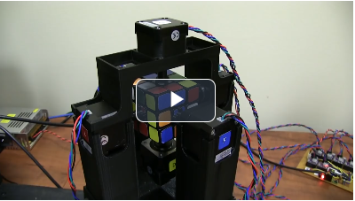
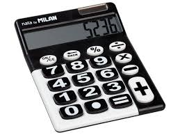

# Comment parler à la machine


[Vidéo](https://eduvaud-my.sharepoint.com/:v:/g/personal/jonathan_melly_eduvaud_ch/ESmtQhzVVR9ChKSak6woE3IBEpystLAglCJnCffN9PV7BQ?e=hYpaKj)

## Supports
- [Algorithmie](../supports/algorithmes.md)
- [Pseudo-code](../supports/pseudocode.md)

## Activités

1. [ ] [Décomposer](../activites/decomposer/README.md)
2. [ ] [Scoubidou](../activites/scoubidou/README.md)
3. [ ] [Robots](../activites/robot/README.md)
4. [ ] [Puzzles](../activites/puzzles/README.md)
5. [ ] [Calculatrice FDP](#projet-calculatrice-fdp)

---

## Projet Calculatrice FDP




Réaliser un pseudo-code pour un programme de calculatrice simple sur une feuille de papier en s’inspirant de celui-ci 
sur le calcul du BMI :

```text
Début
    Afficher "Bienvenue dans le calculateur de BMI"
    
    Afficher "Entrez votre poids en kilogrammes :"
    Lire poids
    
    Afficher "Entrez votre taille en mètres :"
    Lire taille
    
    Si taille > 0
        bmi ← poids / (taille * taille)
        
        Afficher "Votre BMI est : ", bmi
        
        Si bmi < 18.5
            Afficher "Vous êtes en insuffisance pondérale."
        Sinon Si bmi >= 18.5 et bmi < 25
            Afficher "Vous avez un poids normal."
        Sinon Si bmi >= 25 et bmi < 30
            Afficher "Vous êtes en surpoids."
        Sinon
            Afficher "Vous êtes obèse."
        Fin Si
    Sinon
        Afficher "Erreur : la taille doit être supérieure à 0."
    Fin Si
    
    Afficher "Merci d'avoir utilisé le calculateur de BMI."
Fin

```

Les fonctions de la calculatrice sont au moins :
- addition
- soustraction
- multiplication
- division
- racine
- puissance
- pourcent
