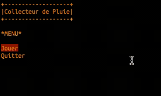

# Cosmos

Après le [pseudo-code](../supports/pseudocode.md) et avant d’entrer dans un langage syntaxiquement éloigné du 
français et plutôt technique (CSharp), voici un langage qui va permettre de coder avec une certaine
ressemblance au pseudo-code pour découvrir et apprendre les concepts de bases liés à la programmation.

## Supports

- [Processus de compilation](../supports/compilation.md)
- Pour le reste, la théorie laisse la place à la pratique, hormis peut-être en ce qui concerne encore
la [cheat sheet](https://raw.githubusercontent.com/jonathanMelly/cosmos/integration/doc/cheatsheet.pdf)

## Activités
1. [X] [HelloCosmos](https://labs.section-inf.ch/codelabs/cosmos-base-00-hello/index.html?index=..%2F..msig)
2. [X] [Million](https://labs.section-inf.ch/codelabs/cosmos-base-01-million/index.html?index=..%2F..msig)
3. [ ] [Animation](https://labs.section-inf.ch/codelabs/cosmos-base-02-animation/index.html?index=..%2F..msig)
4. [ ] [Pluie](https://labs.section-inf.ch/codelabs/cosmos-base-03-raincollector/index.html?index=..%2F..msig)
5. [ ] [Fourchette](../activites/fourchette/README.md)
6. [ ] [Formes](../activites/formes/README.md)
7. [ ] [ToucherCouler](../activites/bataille-navale/README.md)
8. [ ] [Commandes](../activites/commandes1/README.md)

## Projet phare : Calculatrice
Il est temps de reprendre [l’exercice de la calculatrice](../thematiques/01-algorithmie.md#projet-calculatrice-fdp)
et l’implémenter sur cosmos avec les fonctionnalités suivantes :

- Demander à l’utilisateur l’opération qu’il veut faire parmi
  - Addition
  - Soustraction
  - Multiplication
  - Division
  - Inversion (1/x)
  - Racine carrée
  - Puissance
  - Pourcentage (x/100)

- Demander à l’utilisateur les opérandes nécessaires
- Afficher le résultat sous la forme `a + b = c`, par exemple `1 + 2 = 3`

### Fonctions avancées
Ensuite, ajouter les fonctionnalités suivantes :
 - Mémoire
   - possibilité de sauvegarder le résultat dans une mémoire
   - quand on demande un opérande, `#m#` indique qu’on veut utiliser la valeur stockée en mémoire
 - Conversion binaire (demande un opérande en base 10 et affiche sa valeur en binaire)

## Outils
[Cosmos](cosmos-win-x64.zip)