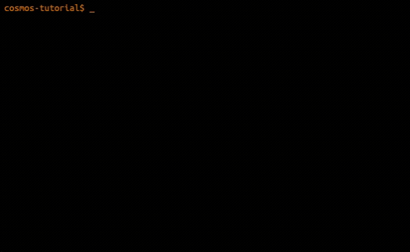

# Cosmos

Après le [pseudo-code](../supports/pseudocode.md) et avant d’entrer dans un langage syntaxiquement éloigné du 
français et plutôt technique (CSharp), voici un langage qui va permettre de coder avec une certaine
ressemblance au pseudo-code pour découvrir et apprendre les concepts de bases liés à la programmation.

## Supports
Cette fois-ci la théorie laisse la place à la pratique, hormis peut-être en ce qui concerne 
la [cheat sheet](https://raw.githubusercontent.com/jonathanMelly/cosmos/integration/doc/cheatsheet.pdf)

## Activités
1. [ ] [HelloCosmos](https://labs.section-inf.ch/codelabs/cosmos-base-00-hello/index.html?index=..%2F..msig)
2. [ ] [Million](https://labs.section-inf.ch/codelabs/cosmos-base-01-million/index.html?index=..%2F..msig)
3. [ ] [Animation](https://labs.section-inf.ch/codelabs/cosmos-base-02-animation/index.html?index=..%2F..msig)
4. [ ] [Pluie](https://labs.section-inf.ch/codelabs/cosmos-base-03-raincollector/index.html?index=..%2F..msig)