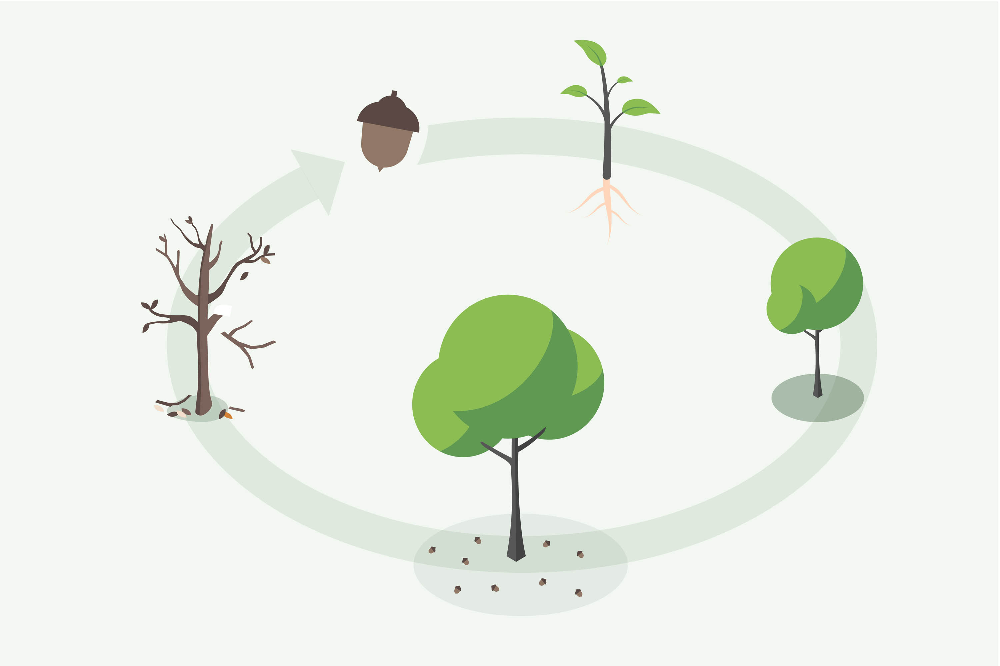
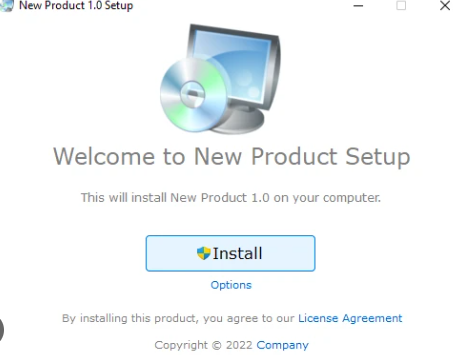

# Cycle de vie d’une application

Tout est dans le [support](../supports/lifecycle.md)

## Activités

### Projet phare : release avec installateur
Reprendre un projet cosmos (par exemple la [calculatrice](../thematiques/03-cosmos.md#projet-phare--calculatrice)) et
- créer un [protocole de test](../supports/lifecycle.md#tests) et le faire vérifier par un camarade
- intégrer le code dans un [dépôt GIT/Github](../supports/lifecycle.md#git)
- faire un [tag](../supports/lifecycle.md#étape-1--ajouter-un-tag-localement) et une release sur GitHub
- créer un [assistant d’installation](../supports/lifecycle.md#déploiement) et l’intégrer à la release

