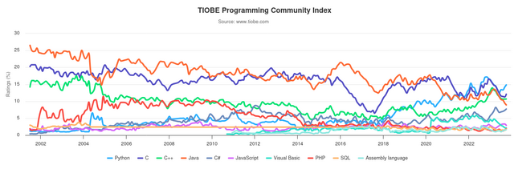

# CSharp

Après un premier tour d'horizon il est temps de se lancer dans la programmation avec un langage plus 
riche et plus complexe, il s'agit du `C#`.

## Supports théoriques 📖

### Introduction
- [Bases C#](../supports/csharp-voc-type-expr)
- [CheatSheet Cosmos/Csharp](https://raw.githubusercontent.com/jonathanMelly/cosmos/integration/doc/cheatsheet-csharp.pdf)

### Bases

<a href="/msig24/slides/csharp1/">Slides</a>

- [Gestion mémoire](../supports/variables1.md)
- [Entrées / Sorties / Aléatoire](../supports/input-output-random.md)
- [Logique et conditions](../supports/logique-conditions.md)
- Répétitions

## Activités 🚝

### Intro
- Bye bye Cosmos, Hello C# : Écrire un programme qui dit bonjour

#### Flashback
À l'aide de la [CheatSheet Cosmos/CSharp](https://raw.githubusercontent.com/jonathanMelly/cosmos/integration/doc/cheatsheet-csharp.pdf)
refaire le [Million](https://labs.section-inf.ch/codelabs/cosmos-base-01-million/index.html?index=..%2F..msig) (avec min 5 questions)

### Bases
- [ ] [Rayon](../activites/cercle1/README.md)
- [ ] [PileOuFace](../activites/pileface/README.md)
- [ ] [Mot de passe](../activites/motdepasse1/README.md)
- [ ] [Fourchette](../activites/fourchette/README.md)
- ...

#### Avancés
- [ ] [Formes](../activites/formes/README.md)
- [ ] [ToucherCouler](../activites/bataille-navale/README.md)
- [ ] [Morpion1](../activites/morpion1/README.md)
- ...