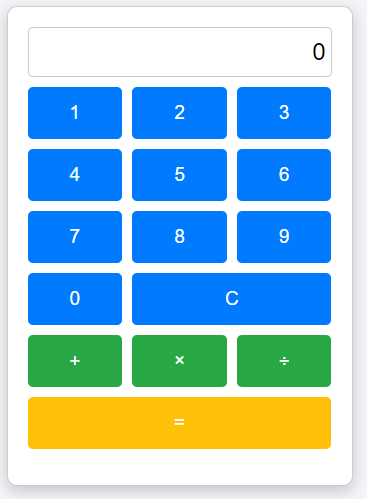
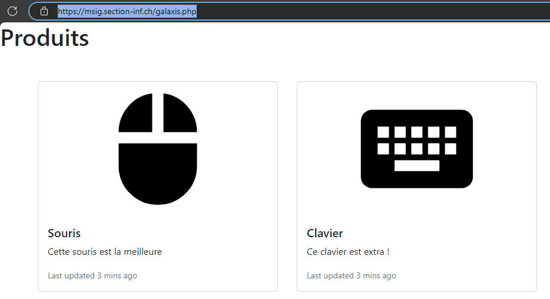
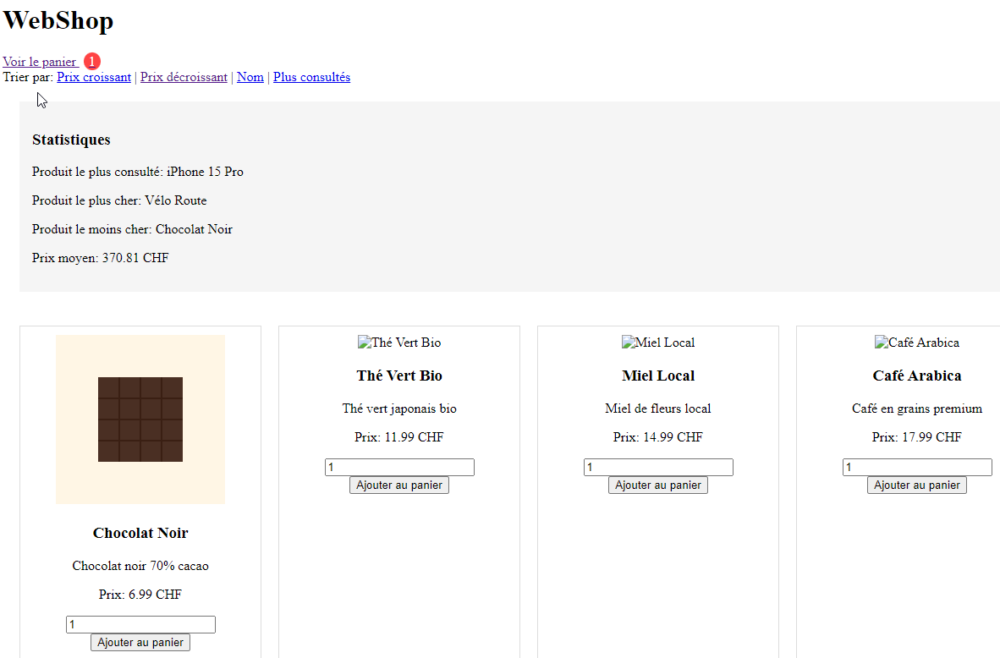
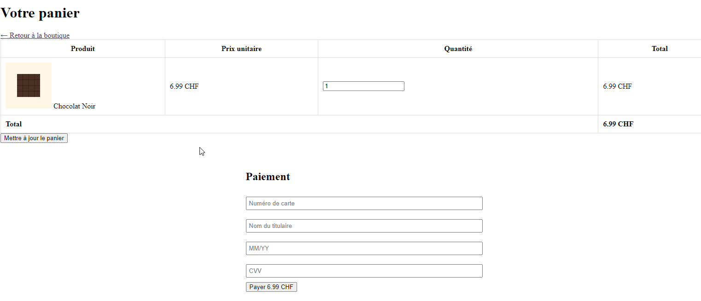

# WEB 2.0

Le WEB a beaucoup évolué, il sera peut-être même la plateforme de convergence pour
la majorité de l'informatique...

Lié surtout au HTML (et CSS) ainsi qu'au javascript c'est un domaine relativement
complexe qui implique bien d'autres langages et technologies...

Dans le cadre de [WEB1](#web-20), PHP et HTML seront les langages principaux.

## Théorie

- [HTML et PHP](../supports/html-php.md)
- [Listes, debug et aléatoire](../supports/php-array-random.md)
- [Tableau associatif](../supports/php-array2.md)
- [HTML](../supports/html.md)
- [Sauvegarde / Restauration / Intro fonction](../supports/php-json-func.md)

### Slides
- [Slides HTML/CSS](https://jonathanmelly.github.io/msig24/slides/html0/)
- [PPT Récap](../slides/web-recap1.pptx)

## Théorie par la pratique
- [HelloWeb](../activites/helloWEB/README.md)
- [Compteur](/activites/compteur/README.md)
- [Cars](../supports/php-db.md)
  - [Kahoot](https://create.kahoot.it/share/html-db/eb2b4f7c-be93-4cd4-acae-0cf5a3cd212f)

## Pratique
- [BMI](../activites/bmi/README.md)
- [Convertisseur](../activites/convertisseur/README.md)
- [TodoList](../activites/php-todo/README.md)
- [Lotto](../activites/lotto/README.md)

## Projets phares

### Calculatrice 🧮
Encore une calculatrice dont [voici un exemple non contractuel (cliquer pour tester)](https://msig.section-inf.ch/calc.php)

### Webshop

[Galaxis : cahier des charges](assets/webshop1.pdf){target="_blank"}

#### Fonctions optionnelles
- gestion du panier
  - via la base de données
  - via la 'variable' $_SESSION
- champ de recherche
- filtre par catégorie
- graphique pour l’évolution des prix
- paiement avec [Stripe](https://docs.stripe.com/get-started/development-environment?lang=php)
- tri par prix croissant ou décroissant
- tri par date d’ajout
- backend
  - ajout de produit
  - archivage de produit (ajouter un champ 'archived'...)
  - mise à jour de produit
- ...

#### Solution possible
Voici une version avec `shopping cart`, prix, tri et pseudo-paiement.

[Galaxis : zip d’une solution à télécharger](assets/galaxis.zip)