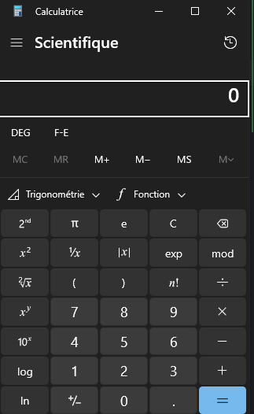
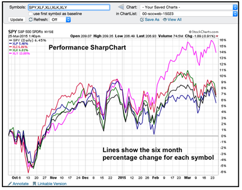

# CSharp avancé

Retour aux sources avec plein de nouveautés concernant le C#:

- Enumerable (tableaux, listes et plus encore)
- Orienté objet : modéliser son monde pour coder plus aisément
- GUI : adieu la console et bonjour l’interface graphique avec `Forms`

Le tout dans une sauce fonctionnelle ;-)

## Théorie
- [Des listes...](../supports/csharp-list.md)
- [Orienté objet](../supports/csharp-oo.md)

### Slides
- [Slides Listes](https://jonathanmelly.github.io/msig24/slides/csharp2-list/)
- [Slides WinForms](https://jonathanmelly.github.io/msig24/slides/csharp2-forms/)

## Pratique
- [ ] [Mangaka](../activites/mangaka/README.md)


- [ ] [Bibliothèque](../activites/mangaka/biblio.md)
- [ ] [EscargOO 🐌](../activites/snail/README.md)


- [ ] [WinForms : HelloWorld](https://learn.microsoft.com/fr-ch/visualstudio/ide/create-csharp-winform-visual-studio?toc=%2Fvisualstudio%2Fget-started%2Fcsharp%2Ftoc.json&bc=%2Fvisualstudio%2Fget-started%2Fcsharp%2Fbreadcrumb%2Ftoc.json&view=vs-2022&WT.mc_id=email&sharingId=B032694AB452ABFB)
- [ ] [WinForms : ImageViewer](https://learn.microsoft.com/fr-ch/visualstudio/get-started/csharp/tutorial-windows-forms-picture-viewer-layout?view=vs-2022)
- [ ] [WinForms : MathQuiz](https://learn.microsoft.com/fr-ch/visualstudio/get-started/csharp/tutorial-windows-forms-math-quiz-create-project-add-controls?view=vs-2022)
- [ ] [WinForms: Memory](https://learn.microsoft.com/fr-ch/visualstudio/get-started/csharp/tutorial-windows-forms-create-match-game?view=vs-2022)

## Projets phare

### Calculatrice
Cette fois c’est du lourd, on va pouvoir concurrencer Microsoft :


<details>
<summary>Si nécessaire voici un peu de code pour additionner 2 nombres</summary>

# Création d'une Calculatrice Simple en C# Windows Forms

## 1. Structure de base
- Créez un nouveau projet Windows Forms dans Visual Studio
- Nommez-le "SimpleCalculator"

## 2. Design de l'interface utilisateur

Les éléments nécessaires sont :
- Une Form (fenêtre principale)
- Deux TextBox pour les nombres
- Un Button pour l'addition
- Un Label pour afficher le résultat

### Configuration des propriétés

```csharp
// Form
this.Text = "Calculatrice Simple"; // Titre de la fenêtre
this.Size = new Size(300, 200);    // Taille de la fenêtre

// TextBox pour le premier nombre
private TextBox firstNumberTextBox;
firstNumberTextBox.Location = new Point(20, 20);
firstNumberTextBox.Size = new Size(100, 20);
firstNumberTextBox.Name = "firstNumberTextBox";

// TextBox pour le deuxième nombre
private TextBox secondNumberTextBox;
secondNumberTextBox.Location = new Point(20, 50);
secondNumberTextBox.Size = new Size(100, 20);
secondNumberTextBox.Name = "secondNumberTextBox";

// Button pour l'addition
private Button addButton;
addButton.Text = "+";
addButton.Location = new Point(130, 35);
addButton.Size = new Size(50, 23);
addButton.Name = "addButton";

// Label pour le résultat
private Label resultLabel;
resultLabel.Text = "Résultat : ";
resultLabel.Location = new Point(20, 90);
resultLabel.Size = new Size(200, 20);
resultLabel.Name = "resultLabel";
```

## 3. Code de la logique

```csharp
public partial class Form1 : Form
{
    // Déclaration des variables globales
    private TextBox firstNumberTextBox;
    private TextBox secondNumberTextBox;
    private Button addButton;
    private Label resultLabel;

    public Form1()
    {
        InitializeComponent();
        InitializeUI();
    }

    private void InitializeUI()
    {
        // Configuration de la fenêtre
        this.Text = "Calculatrice Simple";
        this.Size = new Size(300, 200);

        // Initialisation des contrôles
        // Premier TextBox
        firstNumberTextBox = new TextBox();
        firstNumberTextBox.Location = new Point(20, 20);
        firstNumberTextBox.Size = new Size(100, 20);
        this.Controls.Add(firstNumberTextBox);

        // Deuxième TextBox
        secondNumberTextBox = new TextBox();
        secondNumberTextBox.Location = new Point(20, 50);
        secondNumberTextBox.Size = new Size(100, 20);
        this.Controls.Add(secondNumberTextBox);

        // Bouton d'addition
        addButton = new Button();
        addButton.Text = "+";
        addButton.Location = new Point(130, 35);
        addButton.Size = new Size(50, 23);
        addButton.Click += new EventHandler(AddButton_Click); // Événement de clic
        this.Controls.Add(addButton);

        // Label de résultat
        resultLabel = new Label();
        resultLabel.Text = "Résultat : ";
        resultLabel.Location = new Point(20, 90);
        resultLabel.Size = new Size(200, 20);
        this.Controls.Add(resultLabel);
    }

    // Gestionnaire d'événement pour le bouton d'addition
    private void AddButton_Click(object sender, EventArgs e)
    {
        try
        {
            // Conversion des entrées en nombres
            double firstNumber = Convert.ToDouble(firstNumberTextBox.Text);
            double secondNumber = Convert.ToDouble(secondNumberTextBox.Text);

            // Calcul de la somme
            double result = firstNumber + secondNumber;

            // Affichage du résultat
            resultLabel.Text = $"Résultat : {result}";
        }
        catch (FormatException)
        {
            // Gestion des erreurs de format
            MessageBox.Show("Veuillez entrer des nombres valides", "Erreur",
                MessageBoxButtons.OK, MessageBoxIcon.Error);
        }
    }
}
```
</details>

<details>
<summary>Et si besoin un début plus ressemblant à ce qui est attendu</summary>

```csharp
using System;
using System.Windows.Forms;
using System.Drawing;

namespace WindowsCalculator
{
    public partial class CalculatorForm : Form
    {
        // Variables pour les calculs
        private double lastNumber = 0;
        private string currentOperator = "";
        private bool isNewNumber = true;

        // Constructeur
        public CalculatorForm()
        {
            InitializeComponents();
        }

        private void InitializeComponents()
        {
            // Configuration de la fenêtre principale
            this.Text = "Calculatrice";
            this.Size = new Size(300, 400);
            this.BackColor = Color.FromArgb(240, 240, 240);
            this.FormBorderStyle = FormBorderStyle.FixedSingle;
            this.MaximizeBox = false;

            // Création de l'écran d'affichage
            TextBox displayTextBox = new TextBox();
            displayTextBox.Size = new Size(260, 50);
            displayTextBox.Location = new Point(10, 10);
            displayTextBox.TextAlign = HorizontalAlignment.Right;
            displayTextBox.Font = new Font("Segoe UI", 20F);
            displayTextBox.Text = "0";
            displayTextBox.ReadOnly = true;
            this.Controls.Add(displayTextBox);

            // Création des boutons
            string[,] buttonTexts = new string[,] {
                { "CE", "C", "⌫", "÷" },
                { "7", "8", "9", "×" },
                { "4", "5", "6", "-" },
                { "1", "2", "3", "+" },
                { "±", "0", ".", "=" }
            };

            for (int row = 0; row < 5; row++)
            {
                for (int col = 0; col < 4; col++)
                {
                    Button btn = new Button();
                    btn.Size = new Size(60, 60);
                    btn.Location = new Point(10 + col * 70, 70 + row * 65);
                    btn.Text = buttonTexts[row, col];
                    btn.Font = new Font("Segoe UI", 12F);
                    btn.FlatStyle = FlatStyle.Flat;
                    
                    // Style des boutons
                    if (char.IsDigit(btn.Text[0]) || btn.Text == ".")
                    {
                        btn.BackColor = Color.White;
                    }
                    else if (btn.Text == "=")
                    {
                        btn.BackColor = Color.FromArgb(120, 162, 255);
                        btn.ForeColor = Color.White;
                    }
                    else
                    {
                        btn.BackColor = Color.FromArgb(230, 230, 230);
                    }

                    // Événements des boutons
                    btn.Click += (sender, e) =>
                    {
                        Button clickedButton = (Button)sender;
                        string buttonText = clickedButton.Text;

                        // Gestion des chiffres
                        if (char.IsDigit(buttonText[0]) || buttonText == ".")
                        {
                            if (isNewNumber)
                            {
                                displayTextBox.Text = buttonText;
                                isNewNumber = false;
                            }
                            else
                            {
                                if (displayTextBox.Text == "0" && buttonText != ".")
                                    displayTextBox.Text = buttonText;
                                else
                                    displayTextBox.Text += buttonText;
                            }
                        }
                        // Gestion des opérateurs
                        else if ("+-×÷".Contains(buttonText))
                        {
                            //TODO
                        }
                        // Gestion du égal
                        else if (buttonText == "=")
                        {
                            //TODO
                        }
                        // Gestion du clear
                        else if (buttonText == "C" || buttonText == "CE")
                        {
                            //TODO
                        }
                        // Gestion du backspace
                        else if (buttonText == "⌫")
                        {
                            //TODO
                        }
                        // Gestion du changement de signe
                        else if (buttonText == "±")
                        {
                            //TODO
                        }
                    };

                    this.Controls.Add(btn);
                }
            }
        }
    }
}
```
</details>

### SmartTrader
Faire des graphiques à partir d’informations sur les cryptomonnaies :


À vous de jouer en utilisant :
- [Scottplot](https://scottplot.net/)
- [Crypto dataset](https://www.kaggle.com/datasets/kaushiksuresh147/top-10-cryptocurrencies-historical-dataset)

#### Objectif minimum
- Afficher 3 courbes de crypto différentes sur le graphique
- Filtrage par date

#### Objectifs avancés
- Crypto à choix selon une liste
- Voir le détail d’une valeur en passant le curseur de la souris